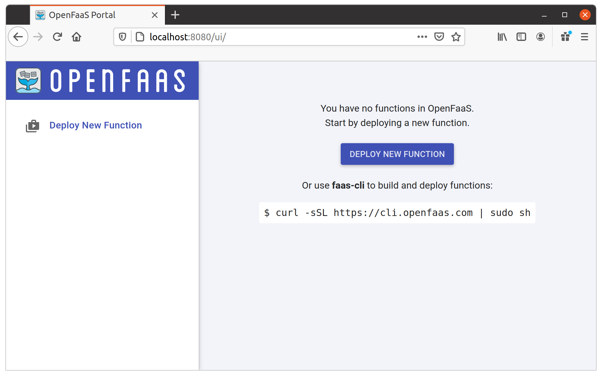
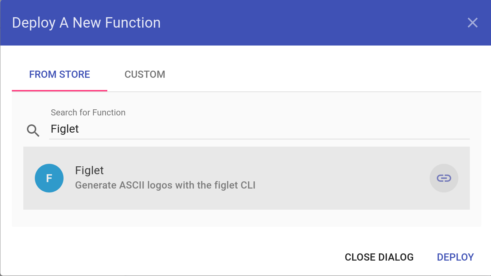
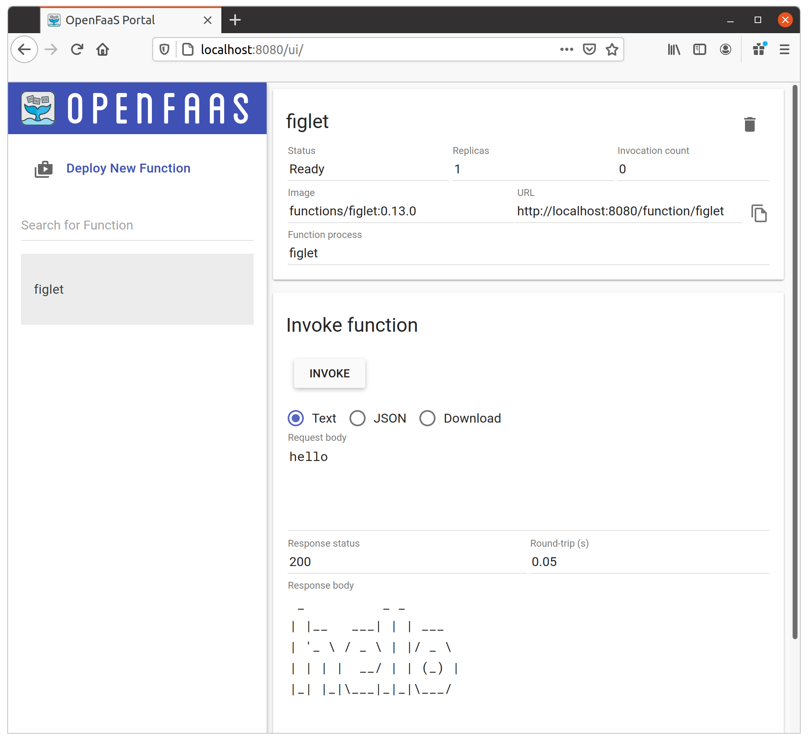

# OpenFaaS, K3D Quickstart

[English version](README.md)

這是一個自主學習的lab系列文章，主要學習如何使用OpenFaas來構建，部署和運行serverless的function。

## OpenFaaS brief introduciton


OpenFaaS使開發人員可以輕鬆地將事件驅動的function和微服務部署到Kubernetes，而無需重複的去寫許多樣板程式碼。

我們可以將程式碼或現有的己編譯好的程式打包進Docker映像中，以獲得具有自動縮放和可大規模擴展的function端點(更好的是OpenFaas有內建監控這些function運行狀態的指標)。

## How to start quickly?

這是一個如何使用[K3D](https://k3d.io/)來創建[K3S](https://k3s.io/)群集, 並啟動[OpenFaas](https://www.openfaas.com/)的快速簡單範例。

### Pre-reqs:

1) Docker
2) [K3d](https://github.com/rancher/k3d/releases)
3) The Openfaas [CLI tool](https://github.com/openfaas/faas-cli#get-started-install-the-cli). 
4) The [arkade](https://github.com/alexellis/arkade) CLI
5) The [kubectl](https://kubernetes.io/docs/tasks/tools/install-kubectl/) CLI

### 1. Install **K3D** cluster

使用以下命令創建k3d集群：

```bash
$ k3d cluster create
```

你應該看到類似的console輸出。

```bash
INFO[0000] Created network 'k3d-k3s-default'            
INFO[0000] Created volume 'k3d-k3s-default-images'      
INFO[0001] Creating node 'k3d-k3s-default-server-0'     
INFO[0007] Creating LoadBalancer 'k3d-k3s-default-serverlb' 
INFO[0008] (Optional) Trying to get IP of the docker host and inject it into the cluster as 'host.k3d.internal' for easy access 
INFO[0011] Successfully added host record to /etc/hosts in 2/2 nodes and to the CoreDNS ConfigMap 
INFO[0011] Cluster 'k3s-default' created successfully!  
INFO[0011] You can now use it like this:                
kubectl cluster-info
```

上面的命令將在本機上創建一個名為“k3s-default”的k3d集群。

### 2. Install **OpenFaas** using **arkade** cli

使用[arkade](https://github.com/alexellis/arkade)是在kubernetes中安裝OpenFaas的一個簡單方法(也是現在官方建議的手法)。

```bash
$ arkade install openfaas
```

arkade完成安裝OpenFaas後，將顯示以下信息。

```bash
Using kubeconfig: /home/witlab/.kube/config
Node architecture: "amd64"
Client: "x86_64", "Linux"
2020/10/30 07:15:52 User dir established as: /home/witlab/.arkade/
"openfaas" has been added to your repositories

VALUES values.yaml
Command: /home/witlab/.arkade/bin/helm [upgrade --install openfaas openfaas/openfaas --namespace openfaas --values /tmp/charts/openfaas/values.yaml --set gateway.directFunctions=true --set openfaasImagePullPolicy=IfNotPresent --set faasnetes.imagePullPolicy=Always --set gateway.replicas=1 --set ingressOperator.create=false --set queueWorker.maxInflight=1 --set basic_auth=true --set serviceType=NodePort --set clusterRole=false --set operator.create=false --set basicAuthPlugin.replicas=1 --set queueWorker.replicas=1]
Release "openfaas" does not exist. Installing it now.
NAME: openfaas
LAST DEPLOYED: Fri Oct 30 07:15:56 2020
NAMESPACE: openfaas
STATUS: deployed
REVISION: 1
TEST SUITE: None
NOTES:
To verify that openfaas has started, run:

  kubectl -n openfaas get deployments -l "release=openfaas, app=openfaas"
=======================================================================
= OpenFaaS has been installed.                                        =
=======================================================================

# Get the faas-cli
curl -SLsf https://cli.openfaas.com | sudo sh

# Forward the gateway to your machine
kubectl rollout status -n openfaas deploy/gateway
kubectl port-forward -n openfaas svc/gateway 8080:8080 &

# If basic auth is enabled, you can now log into your gateway:
PASSWORD=$(kubectl get secret -n openfaas basic-auth -o jsonpath="{.data.basic-auth-password}" | base64 --decode; echo)
echo -n $PASSWORD | faas-cli login --username admin --password-stdin

faas-cli store deploy figlet
faas-cli list

# For Raspberry Pi
faas-cli store list \
 --platform armhf

faas-cli store deploy figlet \
 --platform armhf

# Find out more at:
# https://github.com/openfaas/faas

Thanks for using arkade!

```

### Connect to OpenFaas via UI

你可以通過CLI或UI來訪問OpenFaaS網關的REST API。


#### 1.Proxy OpenFaaS Gateway service

將網關的網路端口映對到本機的特定網路端口。

```bash
# Forward the gateway to your machine
$ kubectl port-forward -n openfaas svc/gateway 8080:8080 &
```

#### 2.Retrieve OpenFaas userid & password credential

在`arcade` CLI安裝OpenFaaS時，它將在創建用戶`admin`時隨機生成一個密碼。讓我們將密碼導出到環境變量。

```bash
# If basic auth is enabled, you can now log into your gateway:
$ PASSWORD=$(kubectl get secret -n openfaas basic-auth -o jsonpath="{.data.basic-auth-password}" | base64 --decode; echo)

# Print out the password from environment
$ echo $PASSWORD
{YOUR_PASSWORD}
```

#### 3.Login OpenFaas UI

打開Web瀏覽器，訪問"http://localhost:8080"，然後輸入帳密：
* User Name: `admin`
* Password: `{YOUR_PASSWORD}`



你可以在OpenFaaS用戶界面裡來嘗試各種範例function。例如我們來部建一個function `figlet`：

1) Click the "Deploy New Function" button
2) Search for "Figlet" and click it.
3) Click "Deploy"



該function應該會出現在左側菜單上，點擊它，然後等待狀態更改為“Ready”。然後在“Request Body”字段中輸入"hello"，然後點擊“Invoke”。



你應該能夠在"Response body"中看到執行後的結果:

```bash
 _          _ _       
| |__   ___| | | ___  
| '_ \ / _ \ | |/ _ \ 
| | | |  __/ | | (_) |
|_| |_|\___|_|_|\___/ 
                      

```

### Connect to OpenFaas via CLI

按照以下做法安裝`faas-cli`。如果你使用的是MacOS，並且已經安裝了`homebrew`，則安裝過程非常簡單:

```bash
brew install faas-cli
```

對於手動安裝，可以使用以下命令:

```bash
curl -sSL https://cli.openfaas.com | sudo sh
```

#### Configure faas-cli

設定faas-cli來連接本機的OpenFaaS集群,需要兩個環境變量:
* OPENFAAS_UR
* PASSWORD

```bash
$ export OPENFAAS_URL=http://localhost:8080
$ echo $PASSWORD | faas-cli login --password-stdin
```

#### List deployed function

列出OpenFaas中當前己部署的function:

```bash
$ faas-cli list

Function                      	Invocations    	Replicas
figlet                        	0              	1  
```

#### Invoke deployed function via CLI

使用`faas-cli`來觸發某一個己部署的function:

```bash
$ echo "hello" | faas-cli invoke figlet

 _          _ _       
| |__   ___| | | ___  
| '_ \ / _ \ | |/ _ \ 
| | | |  __/ | | (_) |
|_| |_|\___|_|_|\___/ 
```

### Destroy & clean up

要清理整個lab的環境可執行下列命令:

```bash
$ k3d cluster delete
```

就這樣, 你可開始使用OpenFaaS來體驗所謂Serverless或Fn-as-service是怎樣的概念。

### Hey, I am interested

要了解更多有關如何使用OpenFaas來設計/部署serverless functions的信息，可以繼續閱讀[labs introduction](lab-introduction_zh-tw.md)和精心設計的labs：

* [Lab 1 - Prepare for OpenFaaS](./lab1.md)
* [Lab 2 - Test things out](./lab2.md)
* [Lab 3 - Introduction to Functions](./lab3.md)
* [Lab 4 - Go deeper with functions](./lab4.md)
* [Lab 5 - Create a GitHub bot](./lab5.md)
* [Lab 6 - HTML for your functions](./lab6.md)
* [Lab 7 - Asynchronous Functions](./lab7.md)
* [Lab 8 - Advanced Feature - Timeouts](./lab8.md)
* [Lab 9 - Advanced Feature - Auto-scaling](./lab9.md)
* [Lab 10 - Advanced Feature - Secrets](./lab10.md)
* [Lab 11 - Advanced feature - Trust with HMAC](./lab11.md) 

