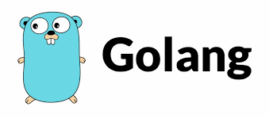
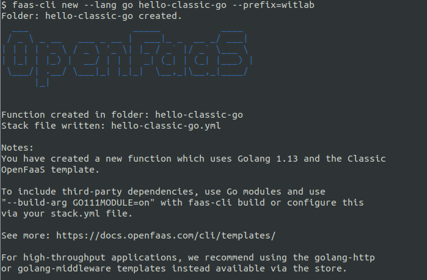

# Lab 3 - Introduction to functions

[Chinses version](lab3_zh-tw.md)

</img>

</img>

Before starting this lab, create a new folder for your files:

```sh
$ mkdir -p lab3 \
   && cd lab3
```

## Creating a new function

There are two ways to create a new function:

* scaffold a function using a built-in or community code template (default)
* take an existing binary and use it as your function (advanced)

### Scaffold or generate a new function

Before creating a new function from a template make sure you pull the [templates from GitHub](https://github.com/openfaas/templates):

```sh
$ faas-cli template pull

Fetch templates from repository: https://github.com/openfaas/templates.git at master
Attempting to expand templates from https://github.com/openfaas/templates.git
Fetched 12 template(s) : [csharp dockerfile go java11 java11-vert-x node node12 php7 python python3 python3-debian ruby] from https://github.com/openfaas/templates.git

```

After that, to find out which languages are available type in:

```sh
$ faas-cli new --list

Languages available as templates:
- csharp
- dockerfile
- go
- java11
- java11-vert-x
- node
- node12
- php7
- python
- python3
- python3-debian
- ruby
```

Or alternatively create a folder containing a `Dockerfile`, then pick the "Dockerfile" lang type in your YAML file.

If you are curious about how these tempates works, you can check the directory after template pulling. You can find `template` folder is created with below directory tree structure:

```sh
template
    ├── csharp
    ├── dockerfile
    ├── go
    ├── java11
    ├── java11-vert-x
    ├── node
    ├── node12
    ├── php7
    ├── python
    ├── python3
    ├── python3-debian
    └── ruby

```

Look into each language folder and get a sense of how `faas-cli` scaffolding works.

Let's take a deeper look into `template\go` folder:

```sh
go
├── Dockerfile
├── function
│   └── handler.go
├── go.mod
├── main.go
└── template.yml
```

* main.go - the entry point of function which take stdin as input and dispatch to `handler.go`, then print the result to stdout
* Dockerfile - How the function is packaged

At this point you can create a new function for Python, Python 3, Ruby, Go, Node, CSharp etc.

### Hello world in Go (classic template)

We will create a hello-world function in Go (classic template), then move onto new more efficient Go template(http template).

* Scaffold the function

```sh
$ faas-cli new --lang go hello-classic-go --prefix="<your-docker-username-here>"
```


The `--prefix` parameter will update `image: ` value in `hello-classic-go.yml` with a prefix which should be your Docker Hub account. For [OpenFaaS](https://hub.docker.com/r/functions) this is `image: functions/hello-classic-go` and the parameter will be `--prefix="functions"`.

If you don't specify a prefix when you create the function then edit the YAML file after creating it.

This will create two files and a directory:

```sh
hello-classic-go
└── handler.go

hello-classic-go.yml
```

The YAML (.yml) file is used to configure the CLI for building, pushing and deploying your function.

> Note: Whenever you need to deploy a function on Kubernetes or on a remote OpenFaaS instance you must always push your function after building it. In this case you can also override the default gateway URL of `127.0.0.1:8080` with an environmental variable: `export OPENFAAS_URL=127.0.0.1:8080`.

Here's the contents of the YAML file (`hello-classic-go.yml`):

```yaml
version: 1.0
provider:
  name: openfaas
  gateway: http://127.0.0.1:8080
functions:
  hello-classic-go:
    lang: go
    handler: ./hello-classic-go
    image: <your-docker-username>/hello-classic-go:latest
```

* The name of the function is represented by the key under `functions` i.e. `hello-classic-go`
* The language is represented by the `lang` field
* The folder used to build from is called `handler`, this must be a folder not a file
* The Docker image name to be used is under the field `image`

Remember that the `gateway` URL can be overriden in the YAML file (by editing the `gateway:` value under `provider:`) or on the CLI (by using `--gateway` or setting the `OPENFAAS_URL` environment variable).

Here is the contents of the `handler.go` file:

```golang
package function

import (
	"fmt"
)

// Handle a serverless request
func Handle(req []byte) string {
	return fmt.Sprintf("Hello, Go. You said: %s", string(req))
}

```

This function will return the input using STRING FORMAT: `Hello, Go. You said: %s`.

Any values returned to stdout will subsequently be returned to the calling program. Alternatively a `fmt.Print()` statement could be employed which would exhibit a similar flow through to the calling program.

This is the local developer-workflow for functions:

```sh
$ faas-cli up -f hello-classic-go.yml

[0] > Building hello-classic-go.
Clearing temporary build folder: ./build/hello-classic-go/
Preparing: ./hello-classic-go/ build/hello-classic-go/function
Building: witlab/hello-classic-go:latest with go template. Please wait..
Sending build context to Docker daemon  8.704kB
Step 1/35 : FROM --platform=${TARGETPLATFORM:-linux/amd64} openfaas/classic-watchdog:0.18.18 as watchdog
 ---> 8aa8fb60b8b9
Step 2/35 : FROM --platform=${BUILDPLATFORM:-linux/amd64} golang:1.13-alpine3.12 as builder
 ---> 5863598a981a
...
...
Step 35/35 : CMD ["./fwatchdog"]
 ---> Using cache
 ---> 2506ebf6ef4c
Successfully built 2506ebf6ef4c
Successfully tagged witlab/hello-classic-go:latest
Image: witlab/hello-classic-go:latest built.
[0] < Building hello-classic-go done in 11.17s.
[0] Worker done.

Total build time: 11.17s

[0] > Pushing hello-classic-go [witlab/hello-classic-go:latest].
The push refers to repository [docker.io/witlab/hello-classic-go]
...
...
latest: digest: sha256:dc9e15dbd905c398879aba7efac4a4fe59bb98bbe7a6060936687e0d74a5b206 size: 1577
[0] < Pushing hello-classic-go [witlab/hello-classic-go:latest] done.
[0] Worker done.

Deploying: hello-classic-go.
WARNING! Communication is not secure, please consider using HTTPS. Letsencrypt.org offers free SSL/TLS certificates.

Deployed. 202 Accepted.
URL: http://127.0.0.1:8080/function/hello-classic-go.openfaas-fn
```

Verify if the docker iamge has been built and pushed to docker hub:


Verify if the `hello-classic-go` function has been deployed to OpenFaaS:


> Note: Please make sure that you have logged in to docker registry with `docker login` command before running this command.

> Note: `faas-cli up` command combines build, push and deploy commands of `faas-cli` in a single command.

Followed by invoking the function via the UI, CLI, `curl` or another application.

The function will always get a route, for example:

```sh
$OPENFAAS_URL/function/<function_name>
$OPENFAAS_URL/function/figlet
$OPENFAAS_URL/function/hello-classic-go
```

> Pro-tip: if you rename your YAML file to `stack.yml` then you need not pass the `-f` flag to any of the commands.

Functions can be invoked via a `GET` or `POST` method only.

* Invoke your function

Test out the function with `faas-cli invoke`, check `faas-cli invoke --help` for more options.

```sh
$ echo "try me!" | faas-cli invoke hello-classic-go

Hello, Go. You said: try me!
```


### Hello world in Go (HTTP template)

Previous function:`hello-classic-go` uses the classic Golang template to construct. The classic Golang template for OpenFaaS forks one process for every incoming request meaning that state is not retained between invocations. This is a similar model to cgi-bin and uses UNIX STDIO pipes to send the request to the function and to retrieve the response.

A newer template was developed to give full access and control to the underlying HTTP request and response which enable OpenFaaS to support below features:

* Keep function process warm for lower latency / caching / persistent connections through using HTTP
* Enable streaming of large responses from functions, beyond the RAM or disk capacity of the container
* Cleaner abstractions for each "mode"

To use this template just pull it from the template store.

```sh
$ faas-cli template store pull golang-http
```


* Scaffold the function

```sh
$ faas-cli new --lang golang-http hello-http-go --prefix="<your-docker-username-here>"
```


This will create a file and a directory:

```sh
hello-http-go
└── handler.go
```

The YAML (.yml) file is used to configure the CLI for building, pushing and deploying your function.

> Note: Whenever you need to deploy a function on Kubernetes or on a remote OpenFaaS instance you must always push your function after building it. In this case you can also override the default gateway URL of `127.0.0.1:8080` with an environmental variable: `export OPENFAAS_URL=127.0.0.1:8080`.

Here's the contents of the YAML file (`hello-http-go.yml`):

```yaml
version: 1.0
provider:
  name: openfaas
  gateway: http://127.0.0.1:8080
functions:
  hello-http-go:
    lang: golang-http
    handler: ./hello-http-go
    image: <your-docker-username>/hello-http-go:latest
```

* The name of the function is represented by the key under `functions` i.e. `hello-http-go`
* The language is represented by the `lang` field
* The folder used to build from is called `handler`, this must be a folder not a file
* The Docker image name to be used is under the field `image`

Remember that the `gateway` URL can be overriden in the YAML file (by editing the `gateway:` value under `provider:`) or on the CLI (by using `--gateway` or setting the `OPENFAAS_URL` environment variable).

Here is the contents of the `handler.go` file:

```golang
package function

import (
	"fmt"
	"net/http"

	handler "github.com/openfaas/templates-sdk/go-http"
)

// Handle a function invocation
func Handle(req handler.Request) (handler.Response, error) {
	var err error

	message := fmt.Sprintf("Hello world, input was: %s", string(req.Body))

	return handler.Response{
		Body:       []byte(message),
		StatusCode: http.StatusOK,
	}, err
}
```

This function will return the input using STRING FORMAT: `Hello world, input was: %s`.

To know more details of the `go-http` template, check below directory:

```sh
template/golang-http/
├── Dockerfile
├── function
│   └── handler.go
├── go.mod
├── go.sum
├── main.go
├── template.yml
└── vendor
    ├── github.com
    │   └── openfaas
    │       └── templates-sdk
    │           ├── go-http
    │           │   ├── handler.go
    │           │   └── README.md
    │           └── LICENSE
    └── modules.txt
```

This is the local developer-workflow for functions:

```sh
$ faas-cli up -f hello-http-go.yml
```


* Invoke your function

Test out the function with `faas-cli invoke`:

```sh
$ echo "try me again!" | faas-cli invoke hello-http-go

Hello world, input was: try me again!
```


### Example function: astronaut-finder

We'll create a function called `astronaut-finder` that pulls in a random name of someone in space aboard the International Space Station (ISS).

```sh
$ faas-cli new --lang golang-http astronaut-finder --prefix="<your-docker-username-here>"
```


This will write two files for us:

```sh
astronaut-finder
└── handler.go

astronaut-finder.yml
```

* Write the function's code:

We'll be pulling in data from: http://api.open-notify.org/astros.json

Here's an example of the result:

```json
{
  "message": "success",
  "number": 7,
  "people": [
    {
      "craft": "ISS",
      "name": "Sergey Ryzhikov"
    },
    {
      "craft": "ISS",
      "name": "Kate Rubins"
    },
    {
      "craft": "ISS",
      "name": "Sergey Kud-Sverchkov"
    },
    {
      "craft": "ISS",
      "name": "Mike Hopkins"
    },
    {
      "craft": "ISS",
      "name": "Victor Glover"
    },
    {
      "craft": "ISS",
      "name": "Shannon Walker"
    },
    {
      "craft": "ISS",
      "name": "Soichi Noguchi"
    }
  ]
}
```

Update `handler.go`:

```golang
package function

import (
	"encoding/json"
	"fmt"
	"io/ioutil"
	"math/rand"
	"net/http"
	"time"

	handler "github.com/openfaas/templates-sdk/go-http"
)

// Handle a function invocation
func Handle(req handler.Request) (handler.Response, error) {
	var err error

	resp, err := http.Get("http://api.open-notify.org/astros.json")
	if err != nil {
		return handler.Response{
			StatusCode: http.StatusInternalServerError,
		}, err
	}

	defer resp.Body.Close()
	body, err := ioutil.ReadAll(resp.Body)

	if err != nil {
		return handler.Response{
			StatusCode: http.StatusInternalServerError,
		}, err
	}

	var jsonObj map[string]interface{}
	json.Unmarshal(body, &jsonObj)

	people := jsonObj["people"].([]interface{})

	rand.Seed(time.Now().UnixNano())
	index := rand.Intn(len(people) - 1)

	astronut := people[index].(map[string]interface{})
	message := fmt.Sprintf("%v is in space", astronut["name"])

	return handler.Response{
		Body:       []byte(message),
		StatusCode: http.StatusOK,
	}, err
}
```


> Note: in this example we do not make use of the parameter `req` but must keep it in the function's header.

Now build the function:

```sh
$ faas-cli build -f ./astronaut-finder.yml

[0] > Building astronaut-finder.
Clearing temporary build folder: ./build/astronaut-finder/
Preparing: ./astronaut-finder/ build/astronaut-finder/function
Building: witlab/astronaut-finder:latest with golang-http template. Please wait..
Sending build context to Docker daemon  30.72kB
Step 1/30 : FROM --platform=${TARGETPLATFORM:-linux/amd64} openfaas/of-watchdog:0.8.0 as watchdog
 ---> 1ebcac6b156c
...
...
tep 30/30 : CMD ["./fwatchdog"]
 ---> Using cache
 ---> f8637c76a329
Successfully built f8637c76a329
Successfully tagged witlab/astronaut-finder:latest
Image: witlab/astronaut-finder:latest built.
[0] < Building astronaut-finder done in 0.17s.
[0] Worker done.

Total build time: 0.17s
```

You should be able to find the new docker image:

```sh
$ docker image list | grep astronaut-finder

witlab/astronaut-finder      latest              de571855eba5        5 minutes ago       68.4MB
```


> Tip: Try renaming astronaut-finder.yml to `stack.yml` and calling just `faas-cli build`. `stack.yml` is the default file-name for the CLI.

Push the function:

```sh
$ faas-cli push -f ./astronaut-finder.yml

[0] > Pushing astronaut-finder [witlab/astronaut-finder:latest].
The push refers to repository [docker.io/witlab/astronaut-finder]
21874e45fbdb: Layer already exists 
41052086eb37: Layer already exists 
1c0df9d1c402: Layer already exists 
dc25f0b71808: Layer already exists 
1eb02d25b546: Layer already exists 
3e207b409db3: Layer already exists 
latest: digest: sha256:4aa40f16f4488f6acf34b7239db232a64f0bd467191e43fdc1b8d36e406b01cf size: 1579
[0] < Pushing astronaut-finder [witlab/astronaut-finder:latest] done.
[0] Worker done.
```


Deploy the function:

```sh
$ faas-cli deploy -f ./astronaut-finder.yml

Deploying: astronaut-finder.

Deployed. 202 Accepted.
URL: http://127.0.0.1:8080/function/astronaut-finder.openfaas-fn
```


Invoke the function

```sh
$ echo | faas-cli invoke astronaut-finder

Kate Rubins is in space

$ echo | faas-cli invoke astronaut-finder

Sergey Ryzhikov is in space
```

## Troubleshooting: find the container's logs

You can find out high-level information on every invocation of your function via the container's logs:

```sh
$ kubectl logs deployment/astronaut-finder -n openfaas-fn
```


### Managing multiple functions

The YAML file for the CLI allows functions to be grouped together into stacks, this is helpful when working with a set of related functions.

To see how this works generate two functions:

```sh
$ faas-cli new --lang golang-http first
```

For the second function use the `--append` flag:

```sh
$ faas-cli new --lang golang-http second --append=./first.yml
```

For convenience let's rename `first.yml` to `example.yml`.

```sh
$ mv first.yml example.yml
```

Now look at the file:

```yaml
provider:
  name: openfaas
  gateway: http://127.0.0.1:8080

functions:
  first:
    lang: golang-http
    handler: ./first
    image: <your-docker-username>/first
  second:
    lang: golang-http
    handler: ./second
    image: <your-docker-username>/second
```

Here are several flags that help when working with a stack of functions:

* Build in parallel:

```sh
$ faas-cli build -f ./example.yml --parallel=2
```

* Build / push only one function:

```sh
$ faas-cli build -f ./example.yml --filter=second
```

Take a few moments to explore the options for `build`, `push` and `deploy`.

* `faas-cli build --help`
* `faas-cli push --help`
* `faas-cli deploy --help`

To run `faas-cli build && faas-cli push && faas-cli deploy` together, use `faas-cli up` instead.

> Pro-tip: `stack.yml` is the default name the faas-cli will look for if you don't want to pass a `-f` parameter.

You can also deploy remote function stack (yaml) files over HTTP(s) using `faas-cli deploy -f https://....`.

### Custom templates

If you have your own set of forked or custom templates, then you can pull them down for use with the CLI.

The blog: "[Going Serverless with OpenFaaS and Golang - Building Optimized Templates](https://martinheinz.dev/blog/11)" show you how to create your own custom templates in details.

#### Custom templates: Template Store

The *Template Store* is a similar concept to the *Function Store*, it enables users to collaborate by sharing their templates. The template store also means that you don't have to remember any URLs for making use of your favourite community or project templates.

You can Search and discover templates using the following two commands:

```sh
$ faas-cli template store list
$ faas-cli template store list -v

NAME                     SOURCE             DESCRIPTION
csharp                   openfaas           Official C# template
dockerfile               openfaas           Official Dockerfile template
go                       openfaas           Official Golang template
...
```

To get more details you can use the `--verbose` flag, or the `describe` command.

Let's get a template for use with Node.js which is powered by the Express.js framework.

```sh
$ faas-cli template store describe node10-express

Name:              node10-express
Platform:          x86_64
Language:          NodeJS
Source:            openfaas-incubator
Description:       NodeJS 10 Express template
Repository:        https://github.com/openfaas-incubator/node10-express-template
Official Template: true
```

Pull the template down:

```sh
$ faas-cli template store pull node10-express
```

You can now type in `faas-cli new --lang node10-express`.

See also: [Function & Template Store](https://github.com/openfaas/store/)

### Variable Substitution in YAML File (optional exercise)

The `.yml` file used to configure the CLI is capable of variable substitution so that you are able to use the same `.yml` file for multiple configurations.

One example of where this can be useful is when there are different registries for development and production images. You can use the variable substitution so that local and test environments use the default account, and the CI server can be configured to use the production account.

> This is provided by the [envsubst library](https://github.com/drone/envsubst). Follow the link to see examples of supported variables

Edit your `astronaut-finder.yml` to match the following:

```yml
  astronaut-finder:
    lang: golang-http
    handler: ./astronaut-finder
    image: ${DOCKER_USER:-development}/astronaut-finder
```

You'll notice the `image` property has been updated to include a variable definition (`DOCKER_USER`). That value will be replaced with the value of the environment variable with the same name. If the environment variable is not present, or is empty, the default value (`development`) will be used.

The variable will be replaced with the value throughout the file. So, if you have several functions in your `.yml` file, all references to the `DOCKER_USER` variable will be replaced with the value of that environment variable

Run the following command and observe the output:

`faas-cli build -f ./astronaut-finder.yml`

The output should show that the image built is labeled as `development/astronaut-finder:latest`

Now, set the environment variable to your Docker Hub account name (for the example, we'll use the OpenFaaS "functions" account)

```sh
export DOCKER_USER=functions
```

Run the same build command as before and observe the output:

`faas-cli build -f ./astronaut-finder.yml`

The output should now show that the image was built with the updated label `functions/astronaut-finder:latest`

### Custom binaries as functions (optional exercise)

Custom binaries or containers can be used as functions, but most of the time using the language templates should cover all the most common scenarios.

To use a custom binary or Dockerfile create a new function using the `dockerfile` language:

```sh
$ faas-cli new --lang dockerfile sorter --prefix="<your-docker-username-here>"
```


You'll see a folder created named `sorter` and `sorter.yml`.

Edit `sorter/Dockerfile` and update the line which sets the `fprocess`. Let's change it to the built-in bash command of `sort`. We can use this to sort a list of strings in alphanumeric order.

```dockerfile
ENV fprocess="sort"
```


Now build, push and deploy the function:

```sh
$ faas-cli up -f sorter.yml
```

Now invoke the function through the UI or via the CLI:

```sh
$ echo -n '
elephant
zebra
horse
aardvark
monkey'| faas-cli invoke sorter

aardvark
elephant
horse
monkey
zebra
```


In the example we used `sort` from [BusyBox](https://busybox.net/downloads/BusyBox.html) which is built into the function. There are other useful commands such as `sha512sum` and even a `bash` or shell script, but you are not limited to these built-in commands. Any binary or existing container can be made a serverless function by adding the OpenFaaS function watchdog.

> Tip: did you know that OpenFaaS supports Windows binaries too? Like C#, VB or PowerShell?

Now move onto [Lab 4](lab4.md)