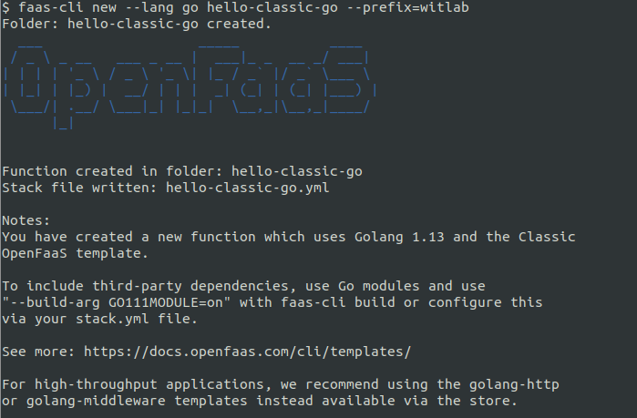
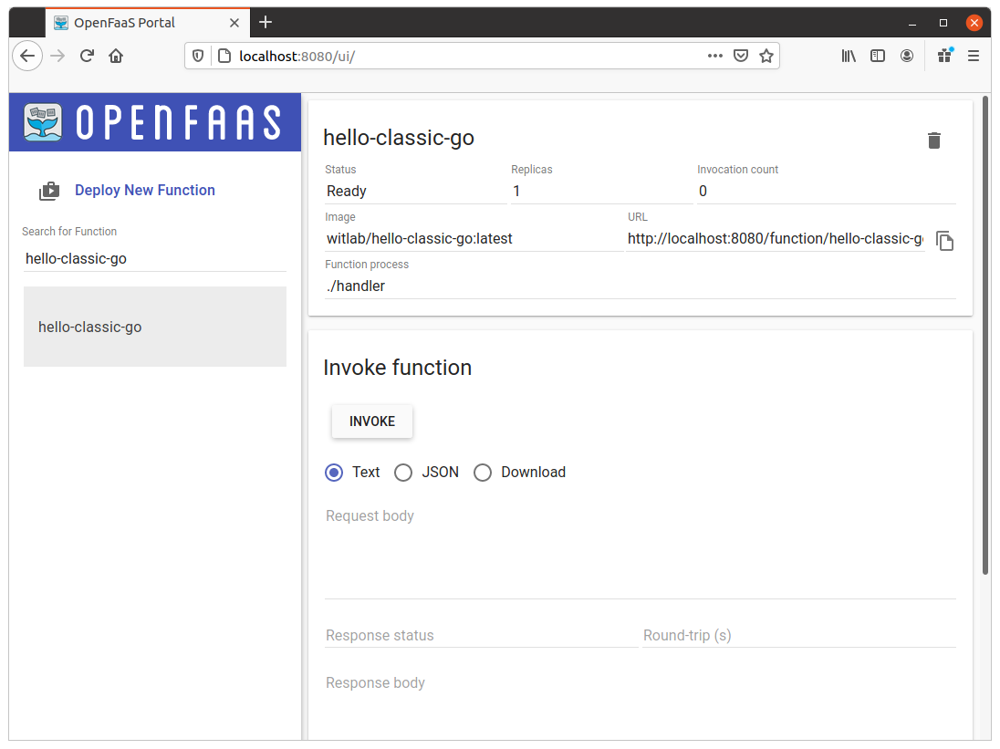
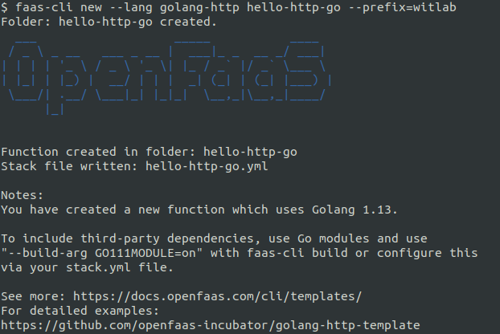
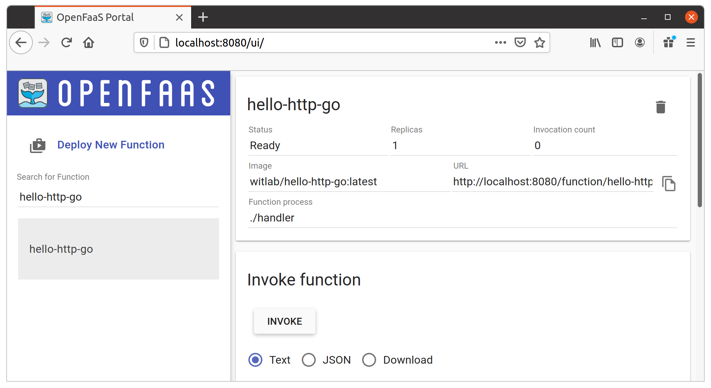
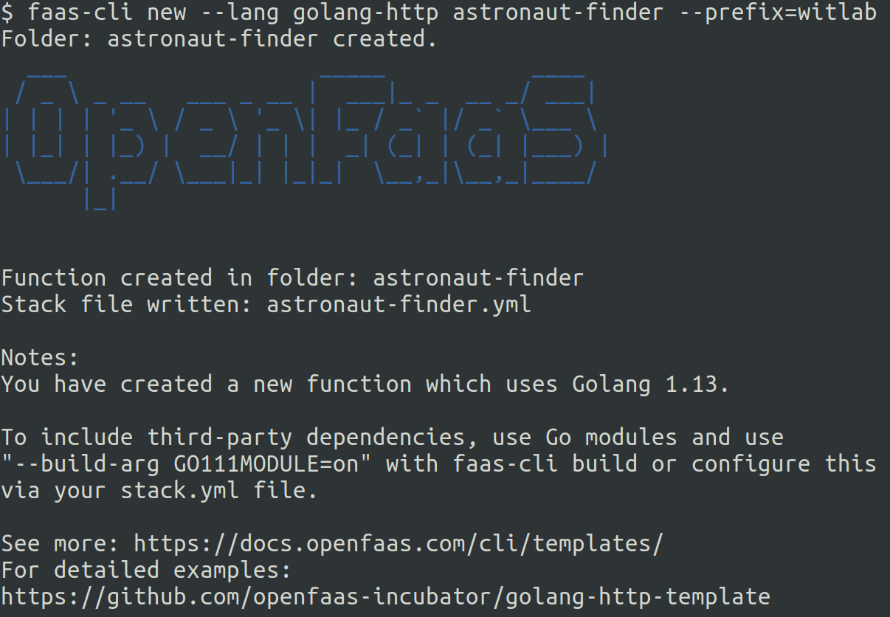
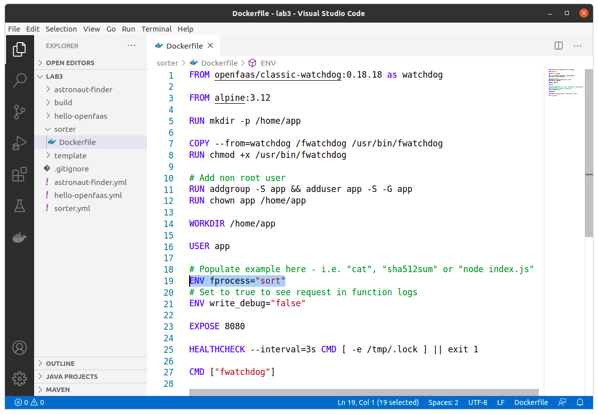

# Lab 3 - Introduction to functions

[English version](lab3.md)

</img>

</img>

在開始這個lab之前，請為lab3在本機上創建一個新文件夾:

```sh
$ mkdir -p lab3 \
   && cd lab3
```

## Creating a new function

有兩種創建新function的方法:

* 使用內置或社群程式碼模板來搭建function（預設）
* 使用現有的binary function並將封裝進OpenFaas的function裡（進階）

### Scaffold or generate a new function

在通過模板創建新function之前，請預先從[templates from GitHub](https://github.com/openfaas/templates)中提取模板:

```sh
$ faas-cli template pull

Fetch templates from repository: https://github.com/openfaas/templates.git at master
Attempting to expand templates from https://github.com/openfaas/templates.git
Fetched 12 template(s) : [csharp dockerfile go java11 java11-vert-x node node12 php7 python python3 python3-debian ruby] from https://github.com/openfaas/templates.git

```

如果要找出可用來開發的語言模板，請輸入:

```sh
$ faas-cli new --list

Languages available as templates:
- csharp
- dockerfile
- go
- java11
- java11-vert-x
- node
- node12
- php7
- python
- python3
- python3-debian
- ruby
```

或者創建一個包含`Dockerfile`的文件夾，然後在YAML文件中選擇“Dockerfile”　lang類型。

如果你對這些模板的工作方式感到好奇，則可以在從Github提取模板後去檢查目錄:`template`。

```sh
template
    ├── csharp
    ├── dockerfile
    ├── go
    ├── java11
    ├── java11-vert-x
    ├── node
    ├── node12
    ├── php7
    ├── python
    ├── python3
    ├── python3-debian
    └── ruby

```

查看`template`每個語言子文件夾，通過每個語言的模板可快速了解`faas-cli`如何幫忙快速產生一個新function的程式碼結構。

讓我們更深入地了解`template\go`文件夾:

```sh
go
├── Dockerfile
├── function
│   └── handler.go
├── go.mod
├── main.go
└── template.yml
```

* main.go - 以stdin作為輸入並分派給handler.go處理，然後將結果打印到stdout
* Dockerfile - 該function打包成Docker映像的定義

至此你可以為Python, Python 3, Ruby, Go, Node, CSharp等創建一個新function。

### Hello world in Go (classic template)

我們將使用Go(classic template)模版來創建一個hello-world函數，然後移至新版本更高效的Go模板(http template)。

* Scaffold the function

```sh
$ faas-cli new --lang go hello-classic-go --prefix="<your-docker-username-here>"
```


`--prefix`引數將修改hello-openfaas.yml中的`image:`的設定值，這個前綴應該是你的Docker Hub帳戶。對於[OpenFaaS](https://hub.docker.com/r/functions)，這是決定Docker映像名稱`image: functions/hello-classic-go`，這個引數的設定方法為`--prefix="functions"`。

如果在創建function時未指定prefix，請在使用faas-cli創建新的function後編輯YAML文件來進行修正。

上述命令將創建兩個文件和一個目錄:

```sh
hello-classic-go
└── handler.go

hello-classic-go.yml
```

YAML(.yml)文件用於配置CLI，構建，推送和部署你開發的function。

> 注意：每當你需要在Kubernetes或遠端OpenFaaS實例上部署function時，都必須在構建function映像後推送到Docker映像倉庫，最後趨動OpenFaaS來部署function。在這種情況下，你可以使用環境變量來覆蓋預設的OpenFaaS網關URL`127.0.0.1:8080`: 比如 `export OPENFAAS_URL=xxx.xxx.xxx.xxx:8080`。

下面是YAML文件(`hello-classic-go.yml`)的內容:

```yaml
version: 1.0
provider:
  name: openfaas
  gateway: http://127.0.0.1:8080
functions:
  hello-classic-go:
    lang: go
    handler: ./hello-classic-go
    image: <your-docker-username>/hello-classic-go:latest
```

* function的名稱由`functions:`下的鍵值表示，例如: `hello-classic-go`
* 程式語言由`lang`欄位來定義
* 用於定義新function的文件夾稱為`handler`，該文件夾必須是文件夾而不是文件
* 新function被打包的Docker映像名稱由`image`欄位來定義

請記住，你可以在YAML文件中覆蓋`gateway` URL（通過編輯`provider:`下的`gateway:`值）或在CLI上（通過使用`--gateway`或設置`OPENFAAS_URL`環境變數） 。

這是`handler.go`文件的內容:

```golang
package function

import (
	"fmt"
)

// Handle a serverless request
func Handle(req []byte) string {
	return fmt.Sprintf("Hello, Go. You said: %s", string(req))
}

```

這個function會使用字串模版`Hello, Go. You said: %s`來把輸入的資料內嵌成一句歡迎語句。

這是function的本機開發的工作流程(build, push & deploy):

```sh
$ faas-cli up -f hello-classic-go.yml

[0] > Building hello-classic-go.
Clearing temporary build folder: ./build/hello-classic-go/
Preparing: ./hello-classic-go/ build/hello-classic-go/function
Building: witlab/hello-classic-go:latest with go template. Please wait..
Sending build context to Docker daemon  8.704kB
Step 1/35 : FROM --platform=${TARGETPLATFORM:-linux/amd64} openfaas/classic-watchdog:0.18.18 as watchdog
 ---> 8aa8fb60b8b9
Step 2/35 : FROM --platform=${BUILDPLATFORM:-linux/amd64} golang:1.13-alpine3.12 as builder
 ---> 5863598a981a
...
...
Step 35/35 : CMD ["./fwatchdog"]
 ---> Using cache
 ---> 2506ebf6ef4c
Successfully built 2506ebf6ef4c
Successfully tagged witlab/hello-classic-go:latest
Image: witlab/hello-classic-go:latest built.
[0] < Building hello-classic-go done in 11.17s.
[0] Worker done.

Total build time: 11.17s

[0] > Pushing hello-classic-go [witlab/hello-classic-go:latest].
The push refers to repository [docker.io/witlab/hello-classic-go]
...
...
latest: digest: sha256:dc9e15dbd905c398879aba7efac4a4fe59bb98bbe7a6060936687e0d74a5b206 size: 1577
[0] < Pushing hello-classic-go [witlab/hello-classic-go:latest] done.
[0] Worker done.

Deploying: hello-classic-go.
WARNING! Communication is not secure, please consider using HTTPS. Letsencrypt.org offers free SSL/TLS certificates.

Deployed. 202 Accepted.
URL: http://127.0.0.1:8080/function/hello-classic-go.openfaas-fn
```

驗證是否已構建docker映像並將其推送到docker hub:


驗證`hello-classic-go` function是否已部署到OpenFaaS:



> 注意：在運行此命令之前，請確保已使用docker login命令登錄到Docker registry。

> 注意：`faas-cli up`命令在單個命令中組合了幾個子命令, 包括了構建，推送和部署function。

然後通過UI，CLI，`curl`或其他應用程序調用該function。

部署在OpenFaaS的每個function擁有一個可調用的它的固定路徑，例如:

```sh
$OPENFAAS_URL/function/<function_name>
$OPENFAAS_URL/function/figlet
$OPENFAAS_URL/function/hello-classic-go
```

> 提示：如果將YAML文件重命名為`stack.yml`，則無需將`-f`引數傳遞給`faas-cli`。

你只能通過`GET`或`POST`方法調用function。

* 調用你的function

用`faas-cli invoke`測試該function，檢查`faas-cli invoke --help`以獲得更多選項。

```sh
$ echo "try me!" | faas-cli invoke hello-classic-go

Hello, Go. You said: try me!
```


### Hello world in Go (HTTP template)

`hello-classic-go`使用經典的Golang模板進行function構建。OpenFaaS的經典Golang模板為每個傳入請求派生一個進程，這意味著在不同的調用之間不保留狀態。這是與cgi-bin相似的模型，並使用UNIX STDIO管道將請求發送到function並取得響應。

一個更新的Golang模板被重新開發出來，以提供對底層HTTP請求和響應的完全訪問和控制權，從而使OpenFaaS能夠支持以下功能:

* 通過使用HTTP的手法來保持function進程持續保持的容器裡運行以降低延遲/緩存/持久連接的功能
* 提高OpenFaaS能夠支撐大量的呼叫

要使用此模板，只需將其從模板庫中拉回即可。

```sh
$ faas-cli template store pull golang-http
```


* Scaffold the function

```sh
$ faas-cli new --lang golang-http hello-http-go --prefix="<your-docker-username-here>"
```


上述命令將創建兩個文件和一個目錄:

```sh
hello-http-go
└── handler.go

hello-http-go.yml
```

下面是YAML文件(`hello-http-go.yml`)的內容:

```yaml
version: 1.0
provider:
  name: openfaas
  gateway: http://127.0.0.1:8080
functions:
  hello-http-go:
    lang: golang-http
    handler: ./hello-http-go
    image: <your-docker-username>/hello-http-go:latest
```

* function的名稱由`functions:`下的鍵值表示，例如: `hello-http-go`
* 程式語言由`lang`欄位來定義
* 用於定義新function的文件夾稱為`handler`，該文件夾必須是文件夾而不是文件
* 新function被打包的Docker映像名稱由`image`欄位來定義

這是`handler.go`文件的內容:

```golang
package function

import (
	"fmt"
	"net/http"

	handler "github.com/openfaas/templates-sdk/go-http"
)

// Handle a function invocation
func Handle(req handler.Request) (handler.Response, error) {
	var err error

	message := fmt.Sprintf("Hello world, input was: %s", string(req.Body))

	return handler.Response{
		Body:       []byte(message),
		StatusCode: http.StatusOK,
	}, err
}
```

這個function會使用字串模版`Hello world, input was: %s`來把輸入的資料內嵌成一句歡迎語句。

要了解`go-http`模板的更多詳細信息，請查看以下目錄:

```sh
template/golang-http/
├── Dockerfile
├── function
│   └── handler.go
├── go.mod
├── go.sum
├── main.go
├── template.yml
└── vendor
    ├── github.com
    │   └── openfaas
    │       └── templates-sdk
    │           ├── go-http
    │           │   ├── handler.go
    │           │   └── README.md
    │           └── LICENSE
    └── modules.txt
```

這是function的本機開發的工作流程(build, push & deploy):

```sh
$ faas-cli up -f hello-http-go.yml
```



* 調用你的function

用`faas-cli invoke`調用該function:

```sh
$ echo "try me again!" | faas-cli invoke hello-http-go

Hello world, input was: try me again!
```


### Example function: astronaut-finder

我們將創建一個名為`astronaut-finder`的function，該function會隨機提取待在國際太空站（ISS）上某個太空人的名字。

```sh
$ faas-cli new --lang golang-http astronaut-finder --prefix="<your-docker-username-here>"
```



這將為我們產生下列的文件:

```sh
astronaut-finder
└── handler.go

astronaut-finder.yml
```

* 編寫function的程式碼：

我們將從以下位置取得數據: http://api.open-notify.org/astros.json

這是取回結果的範例：

```json
{
  "message": "success",
  "number": 7,
  "people": [
    {
      "craft": "ISS",
      "name": "Sergey Ryzhikov"
    },
    {
      "craft": "ISS",
      "name": "Kate Rubins"
    },
    {
      "craft": "ISS",
      "name": "Sergey Kud-Sverchkov"
    },
    {
      "craft": "ISS",
      "name": "Mike Hopkins"
    },
    {
      "craft": "ISS",
      "name": "Victor Glover"
    },
    {
      "craft": "ISS",
      "name": "Shannon Walker"
    },
    {
      "craft": "ISS",
      "name": "Soichi Noguchi"
    }
  ]
}
```

編輯 `handler.go`:

```golang
package function

import (
	"encoding/json"
	"fmt"
	"io/ioutil"
	"math/rand"
	"net/http"
	"time"

	handler "github.com/openfaas/templates-sdk/go-http"
)

// Handle a function invocation
func Handle(req handler.Request) (handler.Response, error) {
	var err error

	resp, err := http.Get("http://api.open-notify.org/astros.json")
	if err != nil {
		return handler.Response{
			StatusCode: http.StatusInternalServerError,
		}, err
	}

	defer resp.Body.Close()
	body, err := ioutil.ReadAll(resp.Body)

	if err != nil {
		return handler.Response{
			StatusCode: http.StatusInternalServerError,
		}, err
	}

	var jsonObj map[string]interface{}
	json.Unmarshal(body, &jsonObj)

	people := jsonObj["people"].([]interface{})

	rand.Seed(time.Now().UnixNano())
	index := rand.Intn(len(people) - 1)

	astronut := people[index].(map[string]interface{})
	message := fmt.Sprintf("%v is in space", astronut["name"])

	return handler.Response{
		Body:       []byte(message),
		StatusCode: http.StatusOK,
	}, err
}
```


> 注意：在此範例中，雖然我們沒有使用到參數`req`，但還是必須將其保留在handle的參數中。

現在你可開始構建function了:

```sh
$ faas-cli build -f ./astronaut-finder.yml

[0] > Building astronaut-finder.
Clearing temporary build folder: ./build/astronaut-finder/
Preparing: ./astronaut-finder/ build/astronaut-finder/function
Building: witlab/astronaut-finder:latest with golang-http template. Please wait..
Sending build context to Docker daemon  30.72kB
Step 1/30 : FROM --platform=${TARGETPLATFORM:-linux/amd64} openfaas/of-watchdog:0.8.0 as watchdog
 ---> 1ebcac6b156c
...
...
tep 30/30 : CMD ["./fwatchdog"]
 ---> Using cache
 ---> f8637c76a329
Successfully built f8637c76a329
Successfully tagged witlab/astronaut-finder:latest
Image: witlab/astronaut-finder:latest built.
[0] < Building astronaut-finder done in 0.17s.
[0] Worker done.

Total build time: 0.17s
```

你應該能夠使用下列的命令來找到新的docker映像:

```sh
$ docker image list | grep astronaut-finder

witlab/astronaut-finder      latest              de571855eba5        5 minutes ago       68.4MB
```


> 提示：你也可嘗試將`astronaut-finder.yml`重命名為`stack.yml`並僅調用`faas-cli build`。`stack.yml`是CLI的預設文件名。

推送function映像到Docker hub:

```sh
$ faas-cli push -f ./astronaut-finder.yml

[0] > Pushing astronaut-finder [witlab/astronaut-finder:latest].
The push refers to repository [docker.io/witlab/astronaut-finder]
21874e45fbdb: Layer already exists 
41052086eb37: Layer already exists 
1c0df9d1c402: Layer already exists 
dc25f0b71808: Layer already exists 
1eb02d25b546: Layer already exists 
3e207b409db3: Layer already exists 
latest: digest: sha256:4aa40f16f4488f6acf34b7239db232a64f0bd467191e43fdc1b8d36e406b01cf size: 1579
[0] < Pushing astronaut-finder [witlab/astronaut-finder:latest] done.
[0] Worker done.
```


部署function到ＯpenFaaS:

```sh
$ faas-cli deploy -f ./astronaut-finder.yml

Deploying: astronaut-finder.

Deployed. 202 Accepted.
URL: http://127.0.0.1:8080/function/astronaut-finder.openfaas-fn
```


調用function:

```sh
$ echo | faas-cli invoke astronaut-finder

Kate Rubins is in space

$ echo | faas-cli invoke astronaut-finder

Sergey Ryzhikov is in space
```

## Troubleshooting: find the container's logs

你可以通過容器的日誌找到有關每次function被調用的high-level信息:

```sh
$ kubectl logs deployment/astronaut-finder -n openfaas-fn
```


### Managing multiple functions

CLI的YAML文件允許將多個function組合在一起成為堆棧，這在使用一組相關function時非常有用。

要查看其工作原理，請生成兩個function:

```sh
$ faas-cli new --lang golang-http first
```

對於第二個function，使用`--append`旗標:

```sh
$ faas-cli new --lang golang-http second --append=./first.yml
```

為了方便起見，讓我們將`first.yml`重命名為`example.yml`。

```sh
$ mv first.yml example.yml
```

現在看一下文件:

```yaml
provider:
  name: openfaas
  gateway: http://127.0.0.1:8080

functions:
  first:
    lang: golang-http
    handler: ./first
    image: <your-docker-username>/first
  second:
    lang: golang-http
    handler: ./second
    image: <your-docker-username>/second
```

這是一些在使用function堆棧時有幫助的旗標:

* 並行構建:

```sh
$ faas-cli build -f ./example.yml --parallel=2
```

* 僅構建/推送一個function:

```sh
$ faas-cli build -f ./example.yml --filter=second
```

花一些時間來探索`build`,`push`和`deploy`的選項。

* `faas-cli build --help`
* `faas-cli push --help`
* `faas-cli deploy --help`

要一起運行`faas-cli build && faas-cli push && faas-cli deploy`，請改用`faas-cli up`。

> 提示：`stack.yml`是faas-cli在你沒有傳遞`-f`參數時的預設YAML名稱。

你還可以使用以下命令通過HTTP(S)部署遠程function堆棧（yaml）文件: `faas-cli deploy -f https://....`

### Custom templates

如果你有自己的一組分支或自定義模板，則可以將其下拉來與CLI一起使用。

請參考一篇部落格："[Going Serverless with OpenFaaS and Golang - Building Optimized Templates](https://martinheinz.dev/blog/11)"來詳細瞭解如何創建自己的自定義模板。

#### Custom templates: Template Store

*Template Store*與*Function Store*類似，它使用戶可以通過共享模板來進行協作。模板存儲還意味著您不必記住任何URL，即可利用自己喜歡的社群或客製模板。

你可以使用以下兩個命令來搜索和發現模板:

```sh
$ faas-cli template store list
$ faas-cli template store list -v

NAME                     SOURCE             DESCRIPTION
csharp                   openfaas           Official C# template
dockerfile               openfaas           Official Dockerfile template
go                       openfaas           Official Golang template
...
```

要獲得更多詳細信息，可以使用`--verbose`旗標或`describe`命令。

讓我們獲取由Express.js框架提供支持的Node.js模板。

```sh
$ faas-cli template store describe node10-express

Name:              node10-express
Platform:          x86_64
Language:          NodeJS
Source:            openfaas-incubator
Description:       NodeJS 10 Express template
Repository:        https://github.com/openfaas-incubator/node10-express-template
Official Template: true
```

把模板拉下來:

```sh
$ faas-cli template store pull node10-express
```

你現在可以輸入 `faas-cli new --lang node10-express　--prefix="<your-docker-username-here>"`.

更多資訊: [Function & Template Store](https://github.com/openfaas/store/)

### Variable Substitution in YAML File (optional exercise)

用於配置CLI的.yml文件能夠進行*變數替換*，因此你可以將同一個`.yml`文件用於多種設定。

可能有用的一個範例是當用於開發和生產的function映像是落在不同Docker registry時。你可以使用*變數替換*，以便本機和測試環境使用預設帳戶，並且可以將CI服務器設置為使用生產帳戶。

> 這些功能是由[envsubst library](https://github.com/drone/envsubst)專案所引進來的。點擊鏈接查看*變數替換*的範例。

編輯你的`astronaut-finder.yml`以符合以下設定:

```yml
  astronaut-finder:
    lang: golang-http
    handler: ./astronaut-finder
    image: ${DOCKER_USER:-development}/astronaut-finder
```

你會注意到`image`屬性已更新為包含變數定義(`DOCKER_USER`)。該值將被具有相同名稱的環境變數的值替換。如果環境變數不存在或為空，則將使用預設值(`development`)。

該變量將被整個文件中的值替換。因此，如果你的`.yml`文件中包含多個function，則所有對`DOCKER_USER` 變數的引用都將被替換為該環境變數的值。

運行以下命令並觀察輸出:

`faas-cli build -f ./astronaut-finder.yml`

輸出應顯示生成的function映像標記為`development/astronaut-finder:latest`。

現在，將環境變數設置為你的Docker Hub帳戶名（例如，我們將使用OpenFaaS"functions"帳戶做示範）

```sh
export DOCKER_USER=functions
```

運行與之前相同的構建命令，並觀察輸出:

`faas-cli build -f ./astronaut-finder.yml`

現在輸出應顯示function映像是使用更新的標籤`functions/astronaut-finder:latest`所構建而成的。

### Custom binaries as functions (optional exercise)

你可以將自定義二進製命令或容器包裝成function，但是大多數時候使用語言模板應涵蓋大多數最常見的情況。

要使用自定義二進製命令或容器，請使用`dockerfile`語言模版來創建一個新function:

```sh
$ faas-cli new --lang dockerfile sorter --prefix="<your-docker-username-here>"
```


你會看到一個`sorter.yml`檔案與名為`sorter`的檔案夾。

編輯`sorter/Dockerfile`並更新設置`fprocess`。讓我們將其更改為`sort`的內置bash命令。我們可以使用它來按字母數字順序對字符串列表進行排序。

```dockerfile
ENV fprocess="sort"
```



構建，推送和部署功能:

```sh
$ faas-cli up -f sorter.yml
```

現在通過UI或CLI調用該function:

```sh
$ echo -n '
elephant
zebra
horse
aardvark
monkey'| faas-cli invoke sorter

aardvark
elephant
horse
monkey
zebra
```


在範例中，我們使用了內置於[BusyBox](https://busybox.net/downloads/BusyBox.html)中的`sort`。其實還有其他許多有用的命令，例如`sha512sum`，甚至是`bash`或shell腳本，但你應用的案例不僅限於這些內置命令。通過OpenFaaS的`watchdog`的幫助，你可以使用任何二進製命令或現有容器成為serverless function。

> 提示：你知道OpenFaaS也支持Windows二進製文件嗎? 像C＃，VB或PowerShell?

下一步 >> [Lab 4](lab4_zh-tw.md)