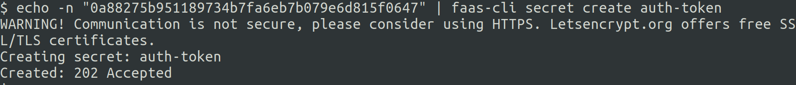
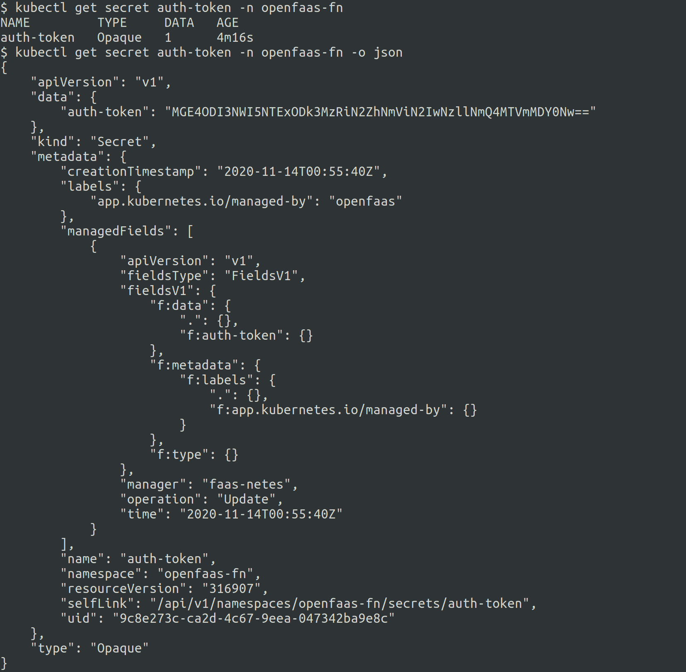

# Lab 10 - Advanced feature - Secrets

[Chinses version](lab10_zh-tw.md)

</img>

Before starting this lab, create a new folder for your files. As this lab builds on an earlier lab make a copy of lab5:

```
$ cp -r lab5 lab10 \
   && cd lab10
```

## Using Secrets

[Lab 5](./lab5.md) looked at how the `issue-bot` could obtain the GitHub *Personal Access Token* from an environment variable (`auth_token`).


An alternative approach is to use a **secret** to store sensitive information.

From the [Kubernetes secret documentation](https://kubernetes.io/docs/concepts/configuration/secret/):
> Kubernetes Secrets let you store and manage sensitive information, such as passwords, OAuth tokens, and ssh keys. Storing confidential information in a Secret is safer and more flexible than putting it verbatim in a Pod definition or in a container image. 

This is a more secure alternative to environmental variables. Environmental variables are easier to use but are best suited to non-confidential configuration items.  Seems a good fit for storing the `auth_token` value.  

### Create a secret

> Secret names must follow the [DNS-1123](https://tools.ietf.org/html/rfc1123) convention:
> * contain no more than 253 characters
> * contain only lowercase alphanumeric characters, '-' or '.'
> * start with an alphanumeric character
> * end with an alphanumeric character

From a terminal run the following command:

```
$ echo -n <auth_token> | faas-cli secret create auth-token
```



c88ae00f2b251e5ff032080895cbbbff13041991

Test that the secret was created:

```
$ faas-cli secret ls
```


> Note: Remember that the `-g` flag enables easy switching between gateways.  This works for secrets too.

Check secret creation using `kubectl`:

```
kubectl get secret auth-token -n openfaas-fn -o json
```



> Note: If you are deploying your function on a remote gateway make sure you create your secret on the virtual machine you use for the gateway.

When the secret is mounted by a function it will be presented as a file under `/var/openfaas/secrets/auth-token`. This can be read by `handler.py` to obtain the GitHub *Personal Access Token*.

### Update issue-bot.yml

Replace the reference to `env.yml` with an instruction to make the `auth-token` secret available to the function:

```yml
provider:
  name: openfaas
  gateway: http://127.0.0.1:8080

functions:
  issue-bot:
    lang: python3
    handler: ./issue-bot
    image: <your-username>/issue-bot
    environment:
      write_debug: true
      gateway_hostname: "gateway.openfaas"
      positive_threshold: 0.25
    secrets:
      - auth-token

```


### Update the `issue-bot` function

The function handler requires changing in order to cause it to read the `auth-token` secret, rather than the environment variable.  This is a single line change where:

```python
g = Github(os.getenv("auth_token"))
``` 
is replaced with 
```python
with open("/var/openfaas/secrets/auth-token","r") as authToken:  
    g = Github(authToken.read())
```


> The full source code is  available at [issue-bot-secrets/bot-handler/handler.py](https://github.com/openfaas/workshop/blob/master/issue-bot-secrets/bot-handler/handler.py)

* Build and deploy

Use the CLI to build and deploy the function:

```
$ faas-cli up -f issue-bot.yml
```

You can reference [Lab 5](./lab5.md) to do the testing.

Now move onto [Lab 11](lab11.md).