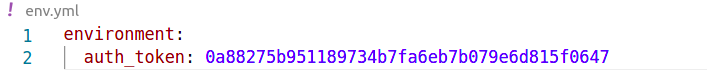
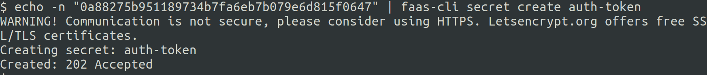
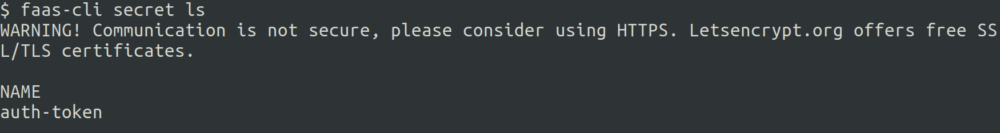
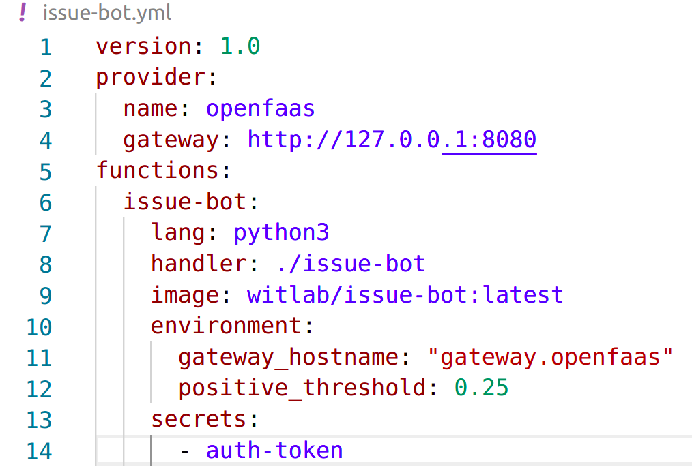
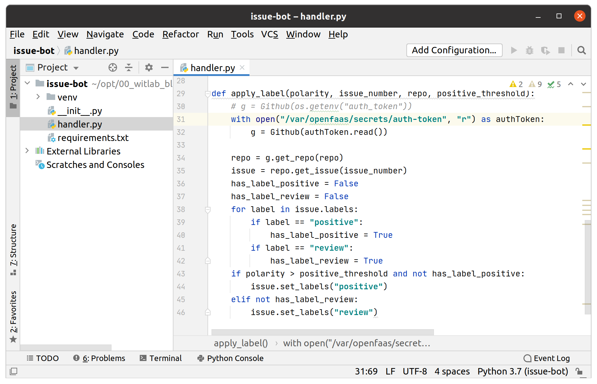

# Lab 10 - Advanced feature - Secrets

[English version](lab10.md)

</img>

在開始本lab之前，請為你的文件創建一個新文件夾。由於這個lab是在較早的lab5基礎上延伸的，因此請複製之前lab5的範例:

```
$ cp -r lab5 lab10 \
   && cd lab10
```

## Using Secrets

你可回去[Lab 5](./lab5_zh-tw.md)研究`issue-bot`如何從環境變數(`auth_token`)獲得GitHub *Personal Access Token*。



另一種方法是使用**secret**物件來存儲機敏訊息。

> [Kubernetes secret 說明文件](https://kubernetes.io/docs/concepts/configuration/secret/):
> * Kubernetes Secrets可讓你存儲和管理敏感訊息，例如密碼，OAuth令牌和ssh密鑰。與把這些機敏訊息定義在Pod或容器映像中相比，將機敏訊息存儲在Secret中更安全，更靈活。

這是比`環境變數`更安全替代方案。雖然`環境變數`更易於使用，但並非最適合是敏感訊息的配置方法。看起來`Secret`似乎非常適合存儲`auth_token`值。

### Create a secret

> Secret的命名必需要遵循[DNS-1123](https://tools.ietf.org/html/rfc1123)規範:
> * 最多包含253個字符
> * 僅包含小寫字母字符, 與字符'-'或'.'
> * 以字母字符開頭
> * 以字母字符結尾

從終端運行以下命令:

```
$ echo -n <auth_token> | faas-cli secret create auth-token
```



測試是否成功創建了`secret`:

```
$ faas-cli secret ls
```



> 注意：請記住，`-g`旗標可以輕鬆切換不同的OpenFaaS網關。這也適用於`secret`。

使用`kubectl`檢查`secret`創建:

```
kubectl get secret auth-token -n openfaas-fn -o json
```


當一個function掛載了`Secret`時，它將這個`Secret`將以文件的形式出現在 "**`/var/openfaas/secrets/auth-token`**" 檔案路徑之下。可以由`handler.py`讀取，來取得GitHub *Personal Access Token*。

### Update issue-bot.yml

修改`issue-bot.yml`中對`env.yml`的引用，並指示function去掛載`Secrets: auth-token`如下所示:

```yml
provider:
  name: openfaas
  gateway: http://127.0.0.1:8080

functions:
  issue-bot:
    lang: python3
    handler: ./issue-bot
    image: <your-username>/issue-bot
    environment:
      write_debug: true
      gateway_hostname: "gateway.openfaas"
      positive_threshold: 0.25
    secrets:
      - auth-token

```



### Update the `issue-bot` function

修改原本function處理程序`handler.pyt`使其讀取`auth-token`的檔案，而不是從環境變數中取得。備註掉原本取得`auth-token`的程式碼:

```python
g = Github(os.getenv("auth_token"))
```

替換成:

```python
with open("/var/openfaas/secrets/auth-token","r") as authToken:  
    g = Github(authToken.read())
```



> 完整的範例程式碼可在以下位置取得:[issue-bot-secrets/bot-handler/handler.py](https://github.com/openfaas/workshop/blob/master/issue-bot-secrets/bot-handler/handler.py)

* 構建和部署

使用CLI來重新構建和部署:

```
$ faas-cli up -f issue-bot.yml
```

接下來你可參考[Lab 5](./lab5_zh-tw.md)的資訊來進行測試。

下一步 >>  [Lab 11](lab11_zh-tw.md)