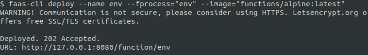
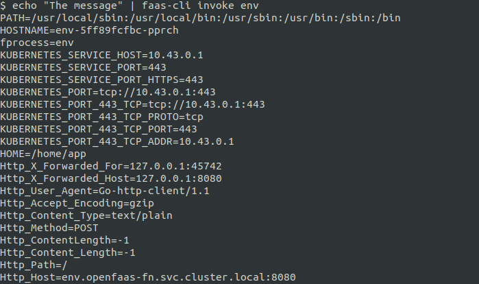
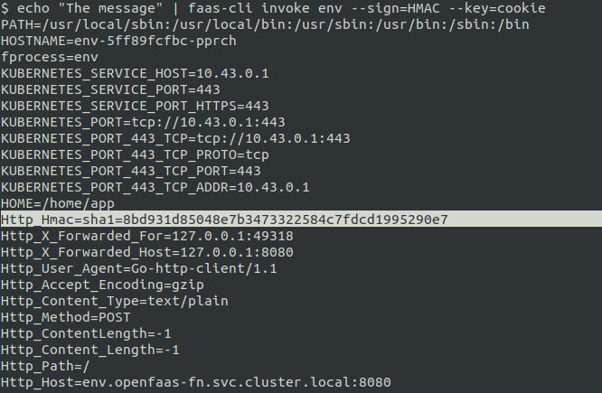
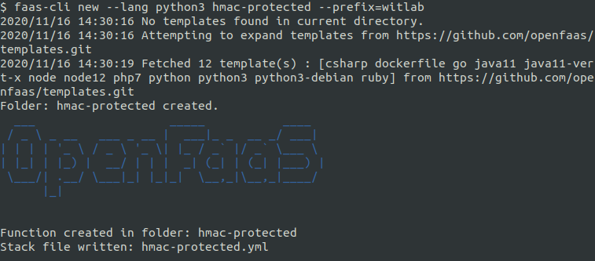
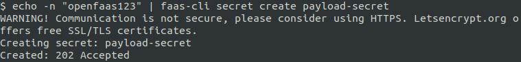
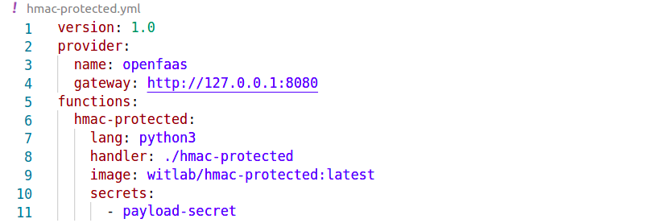
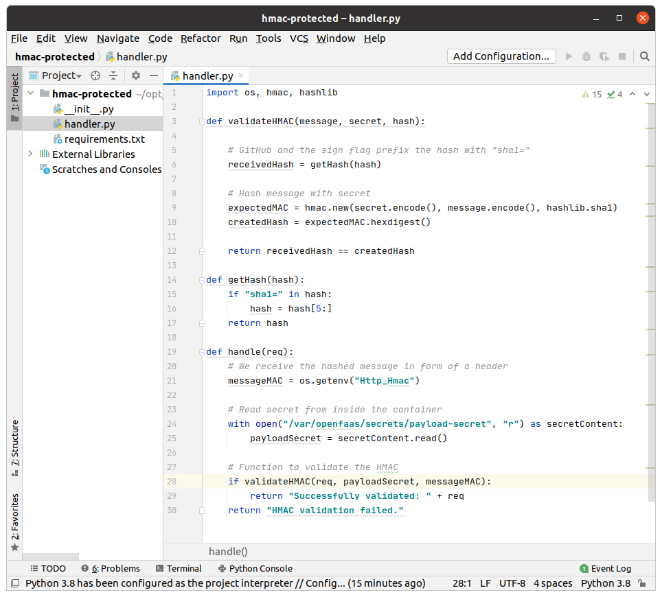
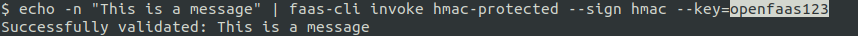
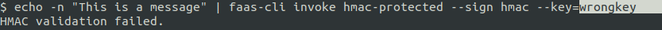

# Lab 11 - Advanced feature - Trust with HMAC

</img>

## Pre-amble

一般來說微服務使用的身份驗證策略是可被function的服務來採用, 因為功能與目的是完全相同。在本lab中，我們將討論使用共享密鑰和基於Hash的消息身份驗證代碼（HMAC）的方法。有關其他身份驗證策略和想法，請參見：[openfaas-function-auth](https://github.com/openfaas-incubator/openfaas-function-auth/blob/master/README.md)。

這絕不是一個詳盡的清單，安全性和身份驗證是一個複雜的領域，最好使用經過專家實踐檢驗的方法。

## Prepare your environment

在開始本lab之前，請在本機創建一個新檔案夾 `lab11`:

```bash
mkdir -p lab11 \
   && cd lab11
```

並使用以下命令確保你的faas-cli版本為0.7.4或更高版本:

```
$ faas-cli version
```

## What is HMAC

若是我們沒有在function的服務上進行任何形式的身份驗證或信任機制，我們的function可能會暴露給任何可以猜測其URL的人。如果我們的function可以在Internet或本地網絡上訪問，則可能被錯誤的參與者調用。預設的情況下，function服務會響應任何請求。但是，如果我們想控制對function的訪問，則可以使用基於Ｈash的消息認證代碼（HMAC）來驗證信息源。

HMAC使用對稱密鑰，發送者/接收者都必需提前共享這個密鑰。當要發送消息時，發送方將生成一個Hashcode-該數據與有效載荷一起發送。然後，接收者將使用共享密鑰對有效載荷進行簽名審核，如果Hashcode匹配，則假定該有效載荷來自發送者。

這樣，我們就保護了function，使其不會被無效甚至危險的人來調用。

## Using HMAC

我們將使用faas-cli提供的`--sign`旗標來發送包含由共享密鑰創建的Hash消息的標頭，並使用`--key`旗標發送該共享密鑰。

> 注意：`--sign`和`--key`都必須存在。

首先，我們通過部署`env`函數來檢查這些旗標的作用，該function將打印該function內部所有可訪問的環境變數:

```bash
$ faas-cli deploy --name env --fprocess="env" --image="functions/alpine:latest"
```



* 調用function(不使用`--sign`旗標):

```
$ echo "The message" | faas-cli invoke env
PATH=/usr/local/sbin:/usr/local/bin:/usr/sbin:/usr/bin:/sbin:/bin
HOSTNAME=d2c1a2cb20c2
fprocess=env
HOME=/root
Http_X_Call_Id=b84947c6-2970-4fcf-ba3b-66dde6943999
Http_X_Forwarded_For=10.255.0.2:34974
Http_X_Forwarded_Host=127.0.0.1:8080
Http_Content_Length=0
Http_Accept_Encoding=gzip
Http_Content_Type=text/plain
Http_User_Agent=Go-http-client/1.1
Http_X_Start_Time=1538725657952768349
...
```



* 調用function(使用`--sign`旗標):

```
$ echo -n "The message" | faas-cli invoke env --sign=HMAC --key=cookie
PATH=/usr/local/sbin:/usr/local/bin:/usr/sbin:/usr/bin:/sbin:/bin
HOSTNAME=d2c1a2cb20c2
fprocess=env
HOME=/root
Http_User_Agent=Go-http-client/1.1
Http_Content_Length=0
Http_Accept_Encoding=gzip
...
Http_Hmac=sha1=9239edfe20185eafd7a5513c303b03d207d22f64
...
```



我們看到OpenFaaS將HMAC作為環境變數`Http_Hmac`提供給程式去取用。生成的值是使用密鑰`cookie`簽名後的`The message`的哈希值，通常會在這個哈希值前面使用Hash的方法`sha1`作為前綴。

## HMAC in action

為了驗證目的，我們將創建一個新的Python 3的function。我們稱其為`hmac-protected`:

```bash
$ faas-cli new --lang python3 hmac-protected --prefix="<your-docker-username>"
```



添加一個`payload-secret`的物件，它將作為ＨMAC有效負載的密鑰。

像在[lab10](https://github.com/openfaas/workshop/blob/master/lab10.md)中一樣的手法來創建`payload-secret`物件:

```bash
$ echo -n "<your-secret>" | faas-cli secret create payload-secret
```



> 注意：請記住你放置在`<your-secret>`處的字串密碼

我們的`hmac-protected.yml`應該看起來像:

```yml
provider:
  name: openfaas
  gateway: http://127.0.0.1:8080

functions:
  hmac-protected:
    lang: python3
    handler: ./hmac-protected
    image: <your-docker-username>/hmac-protected:latest
    secrets:
      - payload-secret
```



用以下程式碼替換`handler.py`的內容:

```python
import os, hmac, hashlib

def validateHMAC(message, secret, hash):

    # GitHub and the sign flag prefix the hash with "sha1="
    receivedHash = getHash(hash)

    # Hash message with secret
    expectedMAC = hmac.new(secret.encode(), message.encode(), hashlib.sha1)
    createdHash = expectedMAC.hexdigest()

    return receivedHash == createdHash

def getHash(hash):
    if "sha1=" in hash:
        hash=hash[5:]
    return hash

def handle(req):
    # We receive the hashed message in form of a header
    messageMAC = os.getenv("Http_Hmac")

    # Read secret from inside the container
    with open("/var/openfaas/secrets/payload-secret","r") as secretContent:
        payloadSecret = secretContent.read()

    # Function to validate the HMAC
    if validateHMAC(req, payloadSecret, messageMAC):
        return "Successfully validated: " + req
    return "HMAC validation failed."
```



> 可以在以下位置取得源始碼[hmac-protected/hmac-protected/handler.py](https://github.com/openfaas/workshop/blob/master/hmac-protected/hmac-protected/handler.py)

* 使用`faas-cli up`來構建，推送和部署function:

```
$ faas-cli up -f ./hmac-protected.yml

...
...
d3a size: 4282
[0] < Pushing hmac-protected [witlab/hmac-protected:latest] done.
[0] Worker done.

Deploying: hmac-protected.
WARNING! Communication is not secure, please consider using HTTPS. Letsencrypt.org offers free SSL/TLS certificates.

Deployed. 202 Accepted.
URL: http://127.0.0.1:8080/function/hmac-protected.openfaas-fn

```

### Invoke function

我們將通過額外發送兩個旗標來調用該function:

* 普通請求消息

* 帶有相同消息哈希值的標頭(當使用`--key`旗標的值來簽名)

收到請求後，該function將使用`payload-secret`以與發送方相同的方式對請求的消息進行簽名。這將創建第二個`HMAC`，並將其與傳輸的標頭值`Http-Hmac`進行比較。

在這裡，我們比較生成和接收的哈希值:

```python
...
    if hmacDigest == cleanHash:
        return True
    return False
...
```

* 調用函數(並給予旗標):

```bash
$ echo -n "This is a message" | faas-cli invoke hmac-protected --sign hmac --key=<your-secret>
```

檢查響應並確認它與傳達的消息匹配。在我們的情況下，我們應該得到:

```
Successfully validated: This is a message
```



* 調用函數(並給予錯誤的旗標值`--key`)並檢查回應:

```
$ echo -n "This is a message" | faas-cli invoke hmac-protected --sign hmac --key=wrongkey
HMAC validation failed.
```



作為本次學習的延伸，你可以試著應用HMAC的手法來保護[lab 5](lab5.md)實作的`issue-bot`。

至此你已完成OpenFaas基礎的labs，現在你可以返回到[Ｗorkshop說明主頁](README_zh-tw.md)。