# Lab 3 - Introduction to functions

[English version](lab3.md)

</img>

在開始這個lab之前，請為lab3在本機上創建一個新文件夾:

```sh
$ mkdir -p lab3 \
   && cd lab3
```

## Creating a new function

有兩種創建新function的方法:

* 使用內置或社群程式碼模板來搭建function（預設）
* 使用現有的binary function並將封裝進OpenFaas的function裡（進階）

### Scaffold or generate a new function

在通過模板創建新function之前，請預先從[templates from GitHub](https://github.com/openfaas/templates)中提取模板:

```sh
$ faas-cli template pull

Fetch templates from repository: https://github.com/openfaas/templates.git at master
Attempting to expand templates from https://github.com/openfaas/templates.git
Fetched 12 template(s) : [csharp dockerfile go java11 java11-vert-x node node12 php7 python python3 python3-debian ruby] from https://github.com/openfaas/templates.git

```

如果要找出可用來開發的語言模板，請輸入:

```sh
$ faas-cli new --list

Languages available as templates:
- csharp
- dockerfile
- go
- java11
- java11-vert-x
- node
- node12
- php7
- python
- python3
- python3-debian
- ruby
```

或者創建一個包含`Dockerfile`的文件夾，然後在YAML文件中選擇“Dockerfile”　lang類型。

如果你對這些模板的工作方式感到好奇，則可以在從Github提取模板後去檢查目錄:`template`。

```sh
template
    ├── csharp
    ├── dockerfile
    ├── go
    ├── java11
    ├── java11-vert-x
    ├── node
    ├── node12
    ├── php7
    ├── python
    ├── python3
    ├── python3-debian
    └── ruby

```

查看`template`每個語言子文件夾，通過每個語言的模板可快速了解`faas-cli`如何幫忙快速產生一個新function的程式碼結構。

讓我們更深入地了解`template\python3`文件夾:

```sh
python3
├── Dockerfile
├── function
│   ├── handler.py
│   ├── __init__.py
│   └── requirements.txt
├── index.py
├── requirements.txt
└── template.yml
```
* index.py - 以stdin作為輸入並分派給handler.py處理，然後將結果打印到stdout
* Dockerfile - 該function打包成Docker映像的定義

至此你可以為Python, Python 3, Ruby, Go, Node, CSharp等創建一個新function。

> 關於我們的範例的說明:
>
> OpenFaaS社群已使用*Python 3*對本次workshop的所有範例進行了全面測試，但也應與*Python 2.7*兼容。
>
> 如果你希望使用Python 2.7而不是Python 3，則替換`faas-cli new --lang python3`成`faas-cli new --lang python`。

### Hello world in Python

我們將使用Python創建一個hello-world的function，然後在這個基礎下延伸去使用其他依賴項。

* Scaffold the function

```sh
$ faas-cli new --lang python3 hello-openfaas --prefix="<your-docker-username-here>"
```
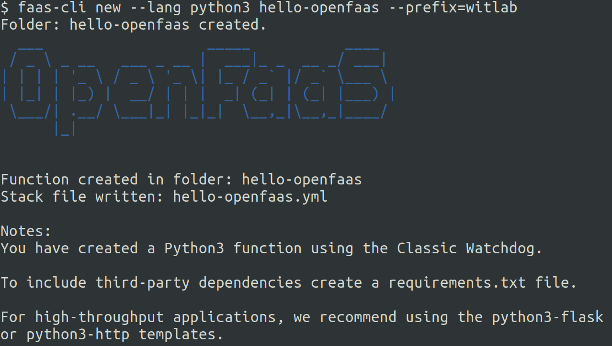

`--prefix`引數將修改hello-openfaas.yml中的`image:`的設定值，這個前綴應該是你的Docker Hub帳戶。對於[OpenFaaS](https://hub.docker.com/r/functions)，這是決定Docker映像名稱`image: functions/hello-openfaas`，這個引數的設定方法為`--prefix="functions"`。

如果在創建function時未指定prefix，請在使用faas-cli創建新的function後編輯YAML文件來進行修正。

上述命令將創建三個文件和一個目錄:

```sh
./hello-openfaas.yml
./hello-openfaas
./hello-openfaas/handler.py
./hello-openfaas/requirements.txt
```

YAML(.yml)文件用於配置CLI，構建，推送和部署你開發的function。

> 注意：每當你需要在Kubernetes或遠端OpenFaaS實例上部署function時，都必須在構建function映像後推送到Docker映像倉庫，最後趨動OpenFaaS來部署function。在這種情況下，你可以使用環境變量來覆蓋預設的OpenFaaS網關URL`127.0.0.1:8080`: 比如 `export OPENFAAS_URL=xxx.xxx.xxx.xxx:8080`。

下面是YAML文件(`hello-openfaas.yml`)的內容：

```yaml
provider:
  name: openfaas
  gateway: http://127.0.0.1:8080

functions:
  hello-openfaas:
    lang: python3
    handler: ./hello-openfaas
    image: <your-docker-username>/hello-openfaas
```

* function的名稱由`functions:`下的鍵值表示，例如: `hello-openfaas`
* 程式語言由`lang`欄位來定義
* 用於定義新function的文件夾稱為`handler`，該文件夾必須是文件夾而不是文件
* 新function被打包的Docker映像名稱由`image`欄位來定義

請記住，你可以在YAML文件中覆蓋`gateway` URL（通過編輯`provider:`下的`gateway:`值）或在CLI上（通過使用`--gateway`或設置`OPENFAAS_URL`環境變數） 。

這是`handler.py`文件的內容:

```python
def handle(req):
    """handle a request to the function
    Args:
        req (str): request body
    """

    return req
```

這個function只會輸入原封不動地返回輸入，因此實際上它是一個`echo`函數。

編輯`handler.py`，使其返回`Hello OpenFaaS`:

```sh
    return "Hello OpenFaaS"
```

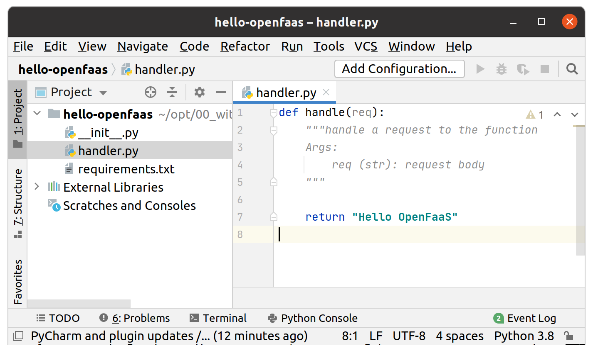

返回到stdout的任何值將隨後返回到調用程序。替代地，你也可以使用`print()`，該語句將表現出與調用程序類似的流程。

這是function的本機開發的工作流程(build, push & deploy):

```sh
$ faas-cli up -f hello-openfaas.yml

[0] > Building hello-openfaas.
Clearing temporary build folder: ./build/hello-openfaas/
Preparing: ./hello-openfaas/ build/hello-openfaas/function
Building: witlab/hello-openfaas:latest with python3 template. Please wait..
Sending build context to Docker daemon  18.43kB
Step 1/29 : FROM openfaas/classic-watchdog:0.18.18 as watchdog
 ---> 8aa8fb60b8b9
Step 2/29 : FROM python:3-alpine
 ---> 55d14c2b2fc1
...
...
Step 29/29 : CMD ["fwatchdog"]
 ---> Using cache
 ---> c87d8334beeb
Successfully built c87d8334beeb
Successfully tagged witlab/hello-openfaas:latest
Image: witlab/hello-openfaas:latest built.
[0] < Building hello-openfaas done in 0.19s.
[0] Worker done.

Total build time: 0.19s

[0] > Pushing hello-openfaas [witlab/hello-openfaas:latest].
The push refers to repository [docker.io/witlab/hello-openfaas]
...
...
latest: digest: sha256:ef9624d8a7e00ae714a678594bd42cc4807a571e9492527aa0019e32f6c25fb1 size: 4282
[0] < Pushing hello-openfaas [witlab/hello-openfaas:latest] done.
[0] Worker done.

Deploying: hello-openfaas.
WARNING! Communication is not secure, please consider using HTTPS. Letsencrypt.org offers free SSL/TLS certificates.

Deployed. 202 Accepted.
URL: http://127.0.0.1:8080/function/hello-openfaas.openfaas-fn
```

驗證是否已構建docker 映像並將其推送到docker hub:

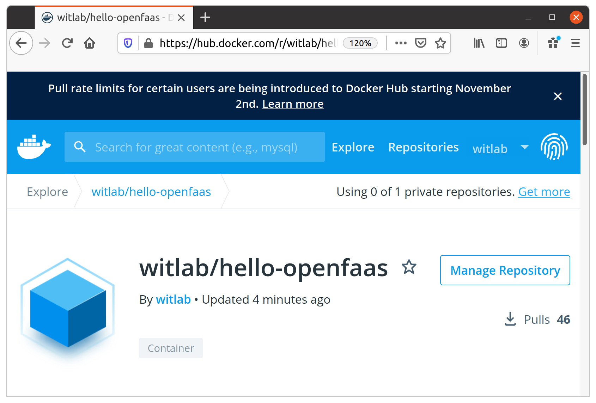

驗證`hello-openfaas` function是否已部署到OpenFaaS:

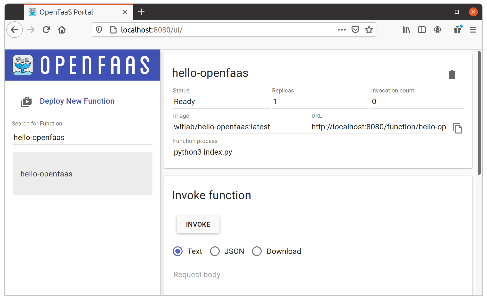

> 注意：在運行此命令之前，請確保已使用docker login命令登錄到Docker registry。

> 注意：`faas-cli up`命令在單個命令中組合了幾個子命令, 包括了構建，推送和部署function。

然後通過UI，CLI，`curl`或其他應用程序調用該function。

部署在OpenFaaS的每個function擁有一個可調用的它的固定路徑，例如:

```sh
$OPENFAAS_URL/function/<function_name>
$OPENFAAS_URL/function/figlet
$OPENFAAS_URL/function/hello-openfaas
```
> 提示：如果將YAML文件重命名為`stack.yml`，則無需將`-f`引數傳遞給`faas-cli`。

你只能通過`GET`或`POST`方法調用function。

* 調用你的function

用`faas-cli invoke`測試該function，檢查`faas-cli invoke --help`以獲得更多選項。

```sh
$ echo "" | faas-cli invoke hello-openfaas

Hello OpenFaaS
```

### Example function: astronaut-finder

我們將創建一個名為`astronaut-finder`的function，該function會隨機提取待在國際太空站（ISS）上某個太空人的名字。

```sh
$ faas-cli new --lang python3 astronaut-finder --prefix="<your-docker-username-here>"
```

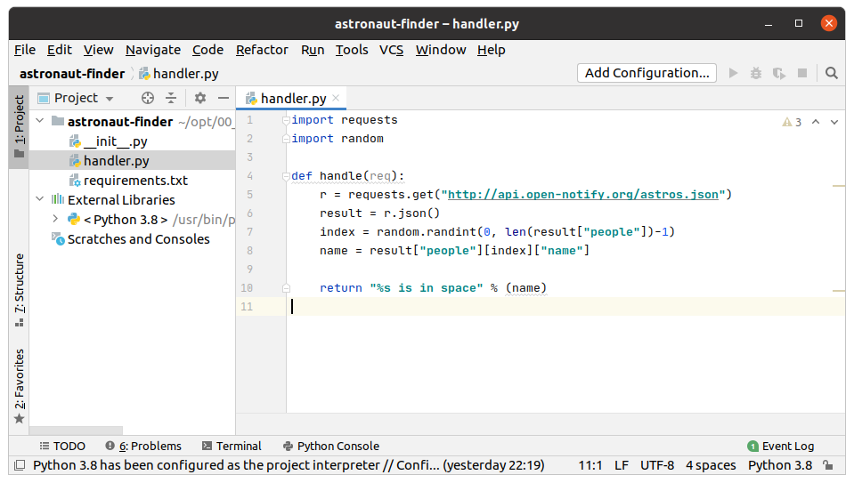

這將為我們產生三個文件:

```sh
./astronaut-finder/handler.py
```

Function的處理主邏輯-你將獲得帶有原始請求的`req`對象，並且可以將function的結果打印到控制台。

```sh
./astronaut-finder/requirements.txt
```

使用此文件列出你要安裝的所有`pip`模組，例如`requests`或`urllib`

```sh
./astronaut-finder.yml
```

該文件用於管理function-它具有function的名稱，Docker映像和所需的任何其他自定義的設定。

* 修改 `./astronaut-finder/requirements.txt`

```sh
requests
```

這說明該function需要使用名為[requests](http://docs.python-requests.org/en/master/)的第三方模組來通過HTTP訪問特定網站。

* 編寫function的程式碼：

我們將從以下位置取得數據: http://api.open-notify.org/astros.json

這是取回結果的範例：

```json
{
  "message": "success",
  "people": [
    {
      "name": "Sergey Ryzhikov",
      "craft": "ISS"
    },
    {
      "name": "Kate Rubins",
      "craft": "ISS"
    },
    {
      "name": "Sergey Kud-Sverchkov",
      "craft": "ISS"
    }
  ],
  "number": 3
}
```

更新 `handler.py`:

```python
import requests
import random

def handle(req):
    r = requests.get("http://api.open-notify.org/astros.json")
    result = r.json()
    index = random.randint(0, len(result["people"])-1)
    name = result["people"][index]["name"]

    return "%s is in space" % (name)
```


> 注意：在此範例中，雖然我們沒有使用到參數`req`，但還是必須將其保留在handle的參數中。

現在你可開始構建function了:

```sh
$ faas-cli build -f ./astronaut-finder.yml

[0] > Building astronaut-finder.
Clearing temporary build folder: ./build/astronaut-finder/
Preparing: ./astronaut-finder/ build/astronaut-finder/function
Building: witlab/astronaut-finder:latest with python3 template. Please wait..
Sending build context to Docker daemon  18.94kB
Step 1/29 : FROM openfaas/classic-watchdog:0.18.18 as watchdog
 ---> 8aa8fb60b8b9
Step 2/29 : FROM python:3-alpine
 ---> 55d14c2b2fc1
Step 3/29 : ARG ADDITIONAL_PACKAGE
...
...
Successfully built de571855eba5
Successfully tagged witlab/astronaut-finder:latest
Image: witlab/astronaut-finder:latest built.
[0] < Building astronaut-finder done in 7.75s.
[0] Worker done.

Total build time: 7.75s
```

你應該能夠使用下列的命令來找到新的docker映像:

```sh
$ docker image list | grep astronaut-finder

witlab/astronaut-finder      latest              de571855eba5        5 minutes ago       68.4MB
```

> 提示：嘗試將`astronaut-finder.yml`重命名為`stack.yml`並僅調用`faas-cli build`。 `stack.yml`是CLI的預設文件名。

推送function到Docker hub:

```sh
$ faas-cli push -f ./astronaut-finder.yml

[0] > Pushing astronaut-finder [witlab/astronaut-finder:latest].
The push refers to repository [docker.io/witlab/astronaut-finder]
4a627f133970: Pushed 
2677a3734478: Pushed 
...
...
f54730c4d0af: Layer already exists 
408e53c5e3b2: Layer already exists 
50644c29ef5a: Layer already exists 
latest: digest: sha256:358c68414b9c3fa7e691924951e0f88f4ba1c7b9362214111bb7a444903865ce size: 4289
[0] < Pushing astronaut-finder [witlab/astronaut-finder:latest] done.
[0] Worker done.
```

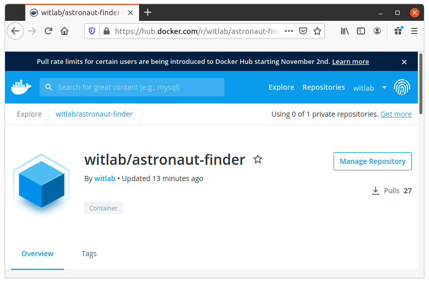

部署function到ＯpenFaaS:

```sh
$ faas-cli deploy -f ./astronaut-finder.yml

Deploying: astronaut-finder.

Deployed. 202 Accepted.
URL: http://127.0.0.1:8080/function/astronaut-finder.openfaas-fn
```

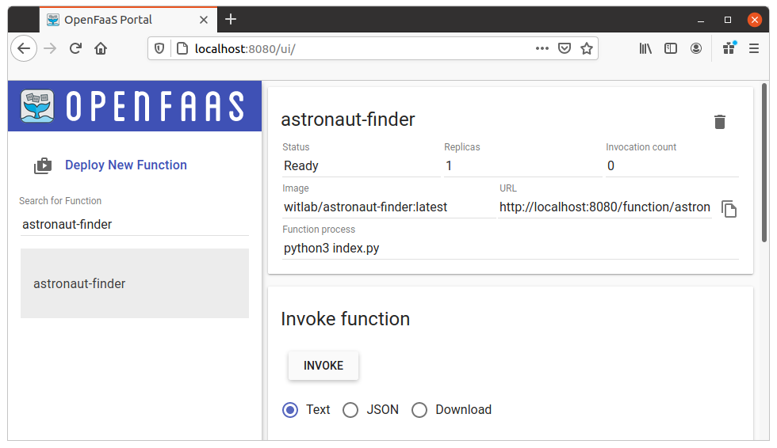

調用function:

```sh
$ echo | faas-cli invoke astronaut-finder

Kate Rubins is in space

$ echo | faas-cli invoke astronaut-finder

Sergey Ryzhikov is in space
```

## Troubleshooting: find the container's logs

你可以通過容器的日誌找到有關每次function被調用的high-level信息:

```sh
$ kubectl logs deployment/astronaut-finder -n openfaas-fn
```

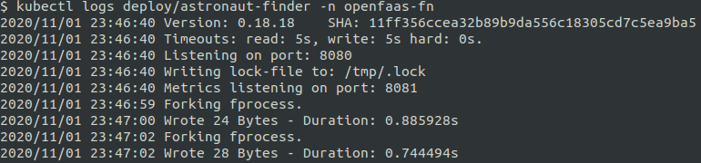

## Troubleshooting: verbose output with `write_debug`

讓我們把function詳細輸出的功能打開。此功能預設是處於關閉狀態，因此我們不會在函數日誌中充滿著許多運行結果的數據-這一點尤其在處理二進制數據結果產出時（在日誌中沒有什麼意義）特別重要。

這是標準的YAML設定:

```yaml
provider:
  name: openfaas
  gateway: http://127.0.0.1:8080

functions:
  astronaut-finder:
    lang: python3
    handler: ./astronaut-finder
    image: <your-docker-username>/astronaut-finder
```

編輯該function的YAML文件，並添加"environment"的區塊。

```yaml
  astronaut-finder:
    lang: python3
    handler: ./astronaut-finder
    image: <your-docker-username>/astronaut-finder
    environment:
      write_debug: true
```

現在，使用`faas-cli deploy -f ./astronaut-finder.yml`來部署你的function。

調用該function，然後再一次檢查日誌以查看function的響應:

```sh
$ kubectl logs deployment/astronaut-finder -n openfaas-fn
```

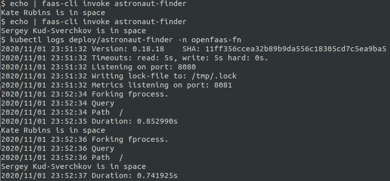

### Managing multiple functions

CLI的YAML文件允許將多個function組合在一起成為堆棧，這在使用一組相關function時非常有用。

要查看其工作原理，請生成兩個function:

```sh
$ faas-cli new --lang python3 first　--prefix="<your-docker-username-here>"
```

對於第二個function，使用`--append`旗標:

```sh
$ faas-cli new --lang python3 second --prefix="<your-docker-username-here>"　--append=./first.yml　
```

為了方便起見，讓我們將`first.yml`重命名為`example.yml`。

```sh
$ mv first.yml example.yml
```

現在看一下文件:

```yaml
provider:
  name: openfaas
  gateway: http://127.0.0.1:8080

functions:
  first:
    lang: python3
    handler: ./first
    image: <your-docker-username>/first
  second:
    lang: python3
    handler: ./second
    image: <your-docker-username>/second
```

這是一些在使用function堆棧時有幫助的旗標:

* 並行構建:

```sh
$ faas-cli build -f ./example.yml --parallel=2
```

* 僅構建/推送一個function:

```sh
$ faas-cli build -f ./example.yml --filter=second
```

花一些時間來探索`build`,`push`和`deploy`的選項。

* `faas-cli build --help`
* `faas-cli push --help`
* `faas-cli deploy --help`

要一起運行`faas-cli build && faas-cli push && faas-cli deploy`，請改用`faas-cli up`。

> 提示：`stack.yml`是faas-cli在你沒有傳遞`-f`參數時的預設YAML名稱。

你還可以使用以下命令通過HTTP(S)部署遠程function堆棧（yaml）文件: `faas-cli deploy -f https://....`

### Custom templates

如果你有自己的一組分支或自定義模板，則可以將其下拉來與CLI一起使用。

這是獲取使用Debian Linux的Python 3模板的範例。

使用`git` URL來拉取自定義模板:

```sh
$ faas-cli template pull https://github.com/openfaas-incubator/python3-debian
```

現在輸入： `faas-cli new --list`

```sh
$ faas-cli new --list | grep python
- python
- python3
- python3-debian
```

這些新模板保存在你當前的工作目錄`./templates/`中。

#### Custom templates: Template Store

*Template Store*與*Function Store*類似，它使用戶可以通過共享模板來進行協作。模板存儲還意味著您不必記住任何URL，即可利用自己喜歡的社群或客製模板。

你可以使用以下兩個命令來搜索和發現模板:

```sh
$ faas-cli template store list
$ faas-cli template store list -v

NAME                     SOURCE             DESCRIPTION
csharp                   openfaas           Official C# template
dockerfile               openfaas           Official Dockerfile template
go                       openfaas           Official Golang template
...
```

要獲得更多詳細信息，可以使用`--verbose`旗標或`describe`命令。

讓我們獲取由Express.js框架提供支持的Node.js模板。

```sh
$ faas-cli template store describe node10-express

Name:              node10-express
Platform:          x86_64
Language:          NodeJS
Source:            openfaas-incubator
Description:       NodeJS 10 Express template
Repository:        https://github.com/openfaas-incubator/node10-express-template
Official Template: true
```

把模板拉下來:

```sh
$ faas-cli template store pull node10-express
```

你現在可以輸入 `faas-cli new --lang node10-express　--prefix="<your-docker-username-here>"`.

更多資訊: [Function & Template Store](https://github.com/openfaas/store/)

### Variable Substitution in YAML File (optional exercise)

用於配置CLI的.yml文件能夠進行*變數替換*，因此你可以將同一個`.yml`文件用於多種設定。

可能有用的一個範例是當用於開發和生產的function映像是落在不同Docker registry時。你可以使用*變數替換*，以便本機和測試環境使用預設帳戶，並且可以將CI服務器設置為使用生產帳戶。

> 這些功能是由[envsubst library](https://github.com/drone/envsubst)專案所引進來的。點擊鏈接查看*變數替換*的範例。

編輯你的`astronaut-finder.yml`以符合以下設定:

```yml
  astronaut-finder:
    lang: python3
    handler: ./astronaut-finder
    image: ${DOCKER_USER:-development}/astronaut-finder
    environment:
      write_debug: true
```

你會注意到`image`屬性已更新為包含變數定義(`DOCKER_USER`)。該值將被具有相同名稱的環境變數的值替換。如果環境變數不存在或為空，則將使用預設值(`development`)。

該變量將被整個文件中的值替換。因此，如果你的`.yml`文件中包含多個function，則所有對`DOCKER_USER` 變數的引用都將被替換為該環境變數的值。

運行以下命令並觀察輸出:

`faas-cli build -f ./astronaut-finder.yml`

輸出應顯示生成的function映像標記為`development/astronaut-finder:latest`。

現在，將環境變數設置為你的Docker Hub帳戶名（例如，我們將使用OpenFaaS"functions"帳戶做示範）

```sh
export DOCKER_USER=functions
```

運行與之前相同的構建命令，並觀察輸出:

`faas-cli build -f ./astronaut-finder.yml`

現在輸出應顯示function映像是使用更新的標籤`functions/astronaut-finder:latest`所構建而成的。
 
### Custom binaries as functions (optional exercise)

你可以將自定義二進製命令或容器包裝成function，但是大多數時候使用語言模板應涵蓋大多數最常見的情況。

要使用自定義二進製命令或容器，請使用`dockerfile`語言模版來創建一個新function:

```sh
$ faas-cli new --lang dockerfile sorter --prefix="<your-docker-username-here>"
```

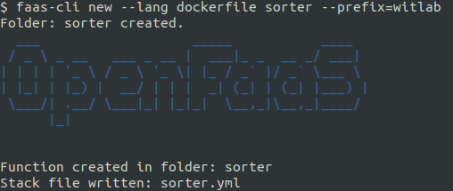

你會看到一個`sorter.yml`檔案與名為`sorter`的檔案夾。

編輯`sorter/Dockerfile`並更新設置`fprocess`。讓我們將其更改為`sort`的內置bash命令。我們可以使用它來按字母數字順序對字符串列表進行排序。

```dockerfile
ENV fprocess="sort"
```

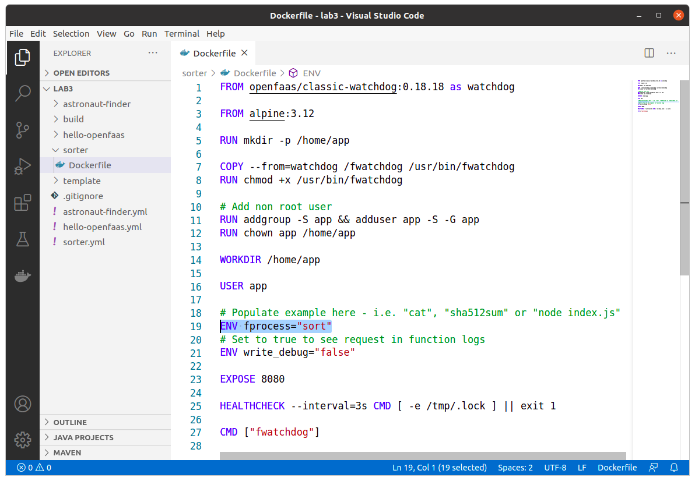

構建，推送和部署功能:

```sh
$ faas-cli up -f sorter.yml
```

現在通過UI或CLI調用該function:

```sh
$ echo -n '
elephant
zebra
horse
aardvark
monkey'| faas-cli invoke sorter

aardvark
elephant
horse
monkey
zebra
```


在範例中，我們使用了內置於[BusyBox](https://busybox.net/downloads/BusyBox.html)中的`sort`。其實還有其他許多有用的命令，例如`sha512sum`，甚至是`bash`或shell腳本，但你應用的案例不僅限於這些內置命令。通過OpenFaaS的`watchdog`的幫助，你可以使用任何二進製命令或現有容器成為serverless function。

> 提示：你知道OpenFaaS也支持Windows二進製文件嗎? 像C＃，VB或PowerShell?

下一步 >> [Lab 4](lab4_zh-tw.md)