# Lab 4 - Go deeper with functions

[English version](lab4.md)

</img>

在開始本lab之前，請為在本機創建一個新檔案夾。由於本lab是在較早的lab的基礎上進行的，因此請複製lab3:

```
$ cp -r lab3 lab4 \
   && cd lab4
```

## Inject configuration through environmental variables

能夠控制function在運行時的行為非常有用，我們可以通過下述兩種方式做到這一點:

### At deployment time

* 在部署時設置環境變數

我們在lab3中使用`write_debug`示範這一點-你也可以利用這個方法來自定義環境變數-例如，如果你想為`hello world` function配置動態語言回應，則可以設計一個像`spoken_language`這樣的變數來幫忙判斷要轉換的語言。

### Use HTTP context - querystring / headers

* 使用 querystring 與 HTTP headers

另一個更具動態性且可以在每個請求級別更改的選項是使用*querystring*和*HTTP標頭*，二者都可以通過`faas-cli`或`curl`傳遞。

這些headers通過環境變數被公開，因此很容易在function中取得這樣資訊與在邏輯中使用。因此，任何header都以會經由OpenFaas的watchdog程式把這些headers的變數名稱都加上了`Http_`開頭，而原本header變數名稱中所有`-`連字符都用`_`下劃線進行了替換。

讓我們使用一個function來測試querystring和打印出所有環境變數。

* 使用內置的BusyBox命令來部署一個打印環境變數的function:
```
$ faas-cli deploy --name env --fprocess="env" --image="functions/alpine:latest"

Deployed. 202 Accepted.
URL: http://127.0.0.1:8080/function/env
```

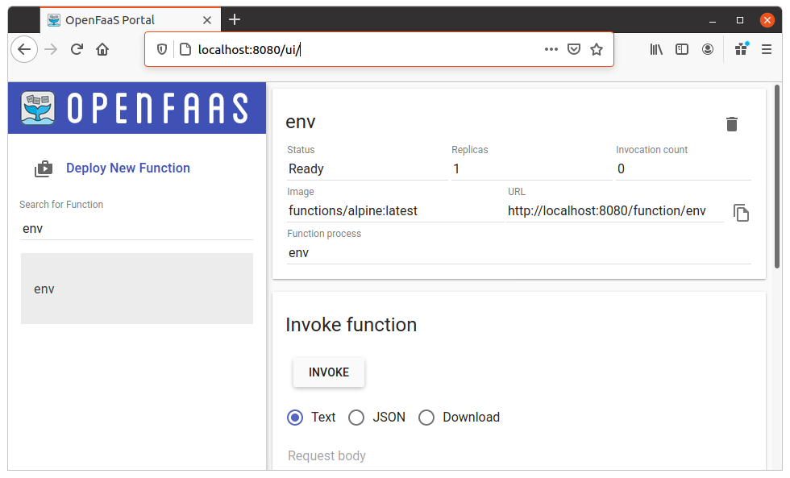

* 使用querystring調用該function:

```
$ echo "" | faas-cli invoke env --query workshop=1
PATH=/usr/local/sbin:/usr/local/bin:/usr/sbin:/usr/bin:/sbin:/bin
HOSTNAME=05e8db360c5a
fprocess=env
HOME=/root
Http_Connection=close
Http_Content_Type=text/plain
Http_X_Call_Id=cdbed396-a20a-43fe-9123-1d5a122c976d
Http_X_Forwarded_For=10.255.0.2
Http_X_Start_Time=1519729562486546741
Http_User_Agent=Go-http-client/1.1
Http_Accept_Encoding=gzip
Http_Method=POST
Http_ContentLength=-1
Http_Path=/
...
Http_Query=workshop=1
...
```

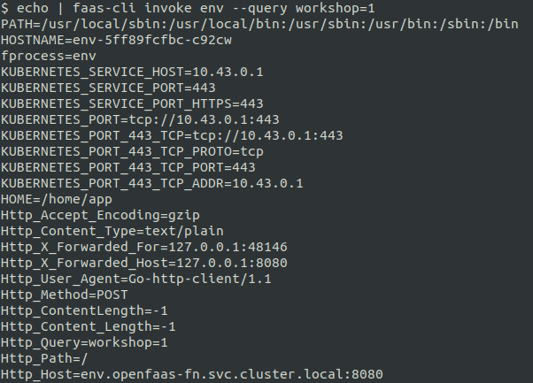

> 注意：觀察打印出來的環境變數`Http_Query=workshop=1`

在Python程式碼，你可以使用`os.getenv("Http_Query")`提取querystring的信息。

* 將額外路徑附加到你的function的網址上

使用`curl`調用`env` function:

```
$ curl -X GET $OPENFAAS_URL/function/env/some/path -d ""
PATH=/usr/local/sbin:/usr/local/bin:/usr/sbin:/usr/bin:/sbin:/bin
HOSTNAME=fae2ac4b75f9
fprocess=env
HOME=/root
Http_X_Forwarded_Host=127.0.0.1:8080
Http_X_Start_Time=1539370471902481800
Http_Accept_Encoding=gzip
Http_User_Agent=curl/7.54.0
Http_Accept=*/*
Http_X_Forwarded_For=10.255.0.2:60460
Http_X_Call_Id=bb86b4fb-641b-463d-ae45-af68c1aa0d42
Http_Method=GET
Http_ContentLength=0
...
Http_Path=/some/path
...
```

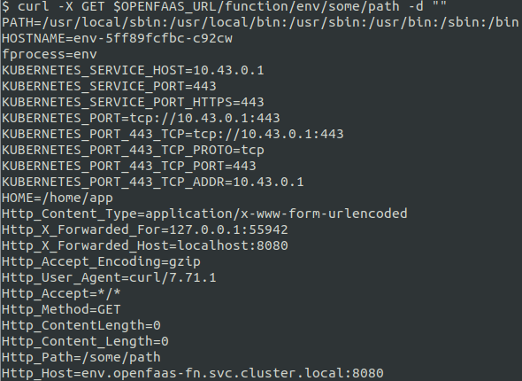

> 注意：觀察打印出來的環境變數`Http_Path=/some/path`, 它帶出來一些*額外路徑*訊息

如你所見，`Http_Path`標頭包含呼叫function的URL部份路徑。
如果你想在程式碼中使用它，只需通過`os.getenv("Http_Path")`來獲取。

* 再來我們隨附一個自定標頭來調用`env` function:

```
$ curl $OPENFAAS_URL/function/env --header "X-Output-Mode: json" -d ""
PATH=/usr/local/sbin:/usr/local/bin:/usr/sbin:/usr/bin:/sbin:/bin
HOSTNAME=05e8db360c5a
fprocess=env
HOME=/root
Http_X_Call_Id=8e597bcf-614f-4ca5-8f2e-f345d660db5e
Http_X_Forwarded_For=10.255.0.2
Http_X_Start_Time=1519729577415481886
Http_Accept=*/*
Http_Accept_Encoding=gzip
Http_Connection=close
Http_User_Agent=curl/7.55.1
Http_Method=GET
Http_ContentLength=0
Http_Path=/
...
Http_X_Output_Mode=json
...
```

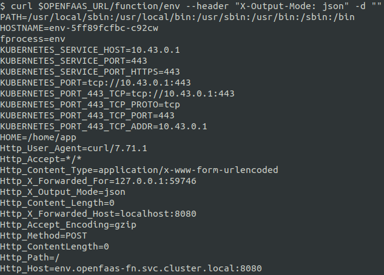

> 注意：觀察打印出來的環境變數`Http_X_Output_Mode=json`, 變數名稱加上了`Http_`開頭，而原本header變數名稱中所有`-`連字符都用`_`下劃線進行了替換

如果你想在Ｐython程式碼中使用它，只需通過`os.getenv("Http_X_Output_Mode")`來獲取。

你可以看到當`Http_Method`是`POST`時，function的環境變數裡還提供了其他所有HTTP上下文，例如`Content-Length`，`User_Agent`，Cookies以及你希望從HTTP請求中看到的其他內容。

## Security: read-only filesystems

OpenFaaS可以使用的容器的安全性功能之一就是能夠將執行環境的root filesystem設為唯讀。如果function有漏洞或受到損害，這個功能可以減少攻擊面。

讓我們構建一個新function來將文件保存到function的檔案系統中:

```sh
faas-cli new --lang python3 ingest-file --prefix="<your-docker-username-here>"
```

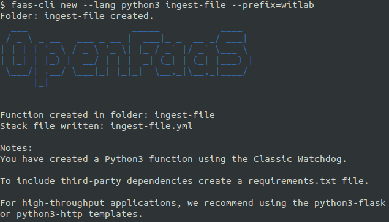

修改`handler.py`程式碼:

```python
import os
import time

def handle(req):
    # Read the path or a default from environment variable
    path = os.getenv("save_path", "/home/app/")

    # generate a name using the current timestamp
    t = time.time()
    file_name = path + str(t)

    # write a file
    with open(file_name, "w") as f:
        f.write(req)
        f.close()

    return file_name
```

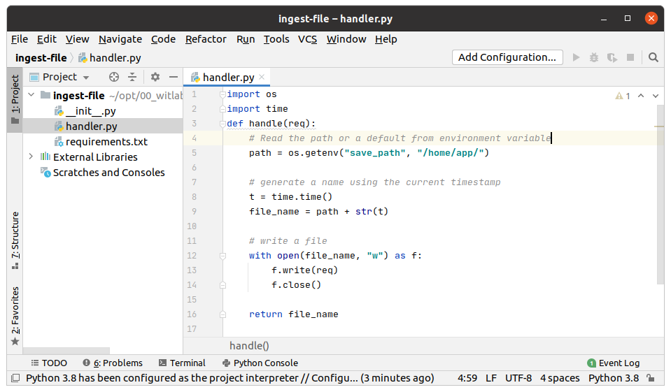

構建範例:

```sh
faas-cli up -f ingest-file.yml

[0] > Building ingest-file.
Clearing temporary build folder: ./build/ingest-file/
Preparing: ./ingest-file/ build/ingest-file/function
Building: witlab/ingest-file:latest with python3 template. Please wait..
Sending build context to Docker daemon  16.38kB
Step 1/29 : FROM openfaas/classic-watchdog:0.18.18 as watchdog
 ---> 8aa8fb60b8b9
Step 2/29 : FROM python:3-alpine
 ---> 55d14c2b2fc1
...
...
Successfully built 4c7bc2754447
Successfully tagged witlab/ingest-file:latest
Image: witlab/ingest-file:latest built.
[0] < Building ingest-file done in 2.11s.
[0] Worker done.

Total build time: 2.11s

[0] > Pushing ingest-file [witlab/ingest-file:latest].
The push refers to repository [docker.io/witlab/ingest-file]
624a1596b528: Pushed 
...
...
[0] < Pushing ingest-file [witlab/ingest-file:latest] done.
[0] Worker done.

Deploying: ingest-file.
WARNING! Communication is not secure, please consider using HTTPS. Letsencrypt.org offers free SSL/TLS certificates.

Deployed. 202 Accepted.
URL: http://localhost:8080/function/ingest-file.openfaas-fn
```

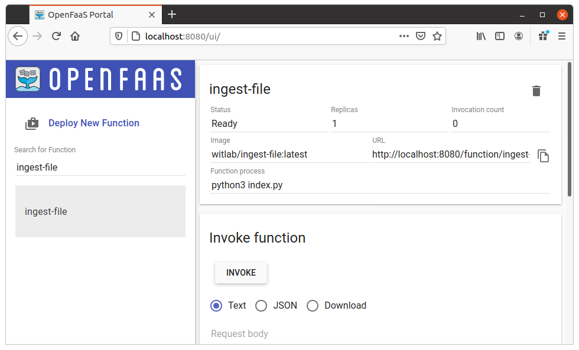

調用範例:

```sh
echo "Hello function" > message.txt

cat message.txt | faas-cli invoke -f ingest-file.yml ingest-file
```
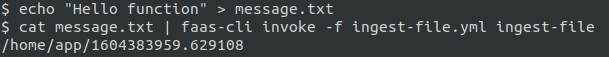

該文件將被寫入到`/home/app`路徑。

現在編輯`ingest-file.yml`，並使該function運上在唯讀root filesystem。

```yaml
...
functions:
  ingest-file:
    lang: python3
    handler: ./ingest-file
    image: <your-docker-username>/ingest-file:latest
    readonly_root_filesystem: true
```

> See also: [YAML reference](https://docs.openfaas.com/reference/yaml/#function-read-only-root-filesystem)

再次部署:

```sh
faas-cli up -f ingest-file.yml
```

讓我們再次執行相同的請求:

```sh
echo "Hello function" > message.txt

cat message.txt | faas-cli invoke ingest-file
```

檢視錯誤訊息:

```sh
Server returned unexpected status code: 500 - exit status 1
Traceback (most recent call last):
  File "/home/app/index.py", line 19, in <module>
    ret = handler.handle(st)
  File "/home/app/function/handler.py", line 12, in handle
    with open(file_name, "w") as f:
OSError: [Errno 30] Read-only file system: '/home/app/1604406354.5945504'
```

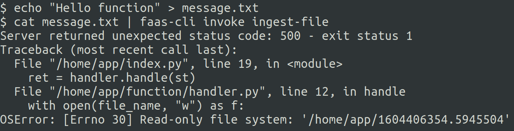

為了可動態設定可臨時讀寫檔案系統區域，設置環境變數`save_path`。

```yaml
...
functions:
  ingest-file:
    lang: python3
    handler: ./ingest-file
    image: <your-docker-username>/ingest-file:latest
    readonly_root_filesystem: true
    environment:
        save_path: "/tmp/"
```

現在，你可以通過再次運行`faas-cli up -f ingest-file.yml`來測試這個相較安全的function，然後文件被寫入到指定的`/tmp/`檔案目錄。

現在，我們可以鎖定function的程式碼，以使其不會意外地被更改或惡意更新。

## Making use of logging

OpenFaaS `watchdog`程序通過傳入HTTP請求並通過標準I/O串流`stdin`和讀取`stdout`來返回HTTP響應的模式來進行操作。這意味著作為function運行的進程不需要了解有關Web或HTTP的任何信息。

一個有趣的情況是，當function以非零退出代碼退出程序且`stderr`不為空時。預設情況下，會將function的`stdout/stderr`合併在一起返回，並且`stderr`不會打印到日誌中。

讓我們使用[Lab 3](./lab3.md#hello-world-in-python)的`hello-openfaas` function來進行驗證。

將`handler.py`程式碼更改為:

```python
import sys
import json

def handle(req):
    # simulate some error message write out to console
    sys.stderr.write("This should be an error message.\n")
    return json.dumps({"Hello": "OpenFaaS"})
```

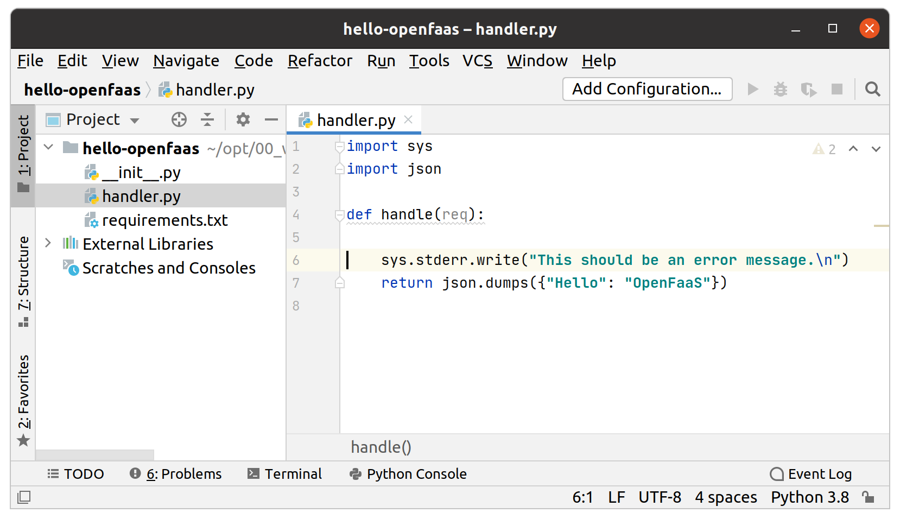

構建和部署:

```sh
$ faas-cli up -f hello-openfaas.yml
```

呼叫function:

```sh
$ echo | faas-cli invoke hello-openfaas
```

你應該看到`stdout/stderr`合併在一起的輸出:

```
This should be an error message.
{"Hello": "OpenFaaS"}
```

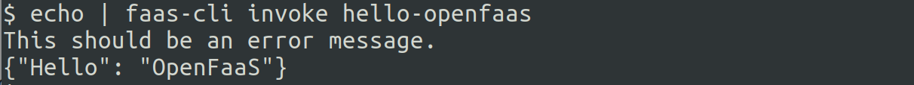

> 注意：如果你檢查容器日誌`kubectl logs deployment/hello-openfaas -n openfaas-fn`，則應該看不到stderr輸出。

在範例中，我們需要該function返回可以解析的有效JSON物件。不幸的是，`stderr`日誌消息使輸出變成無效的JSON，因此我們需要將`stderr`重定向到容器的日誌。

OpenFaaS提供了一個解決方案，因此你可以將錯誤消息打印到日誌並保持function響應有效的JSON物件。

為此，你應該使用`combine_output`旗標。

讓我們嘗試一下。編輯`hello-openfaas.yaml`文件並添加以下行:

```yaml
    environment:
      combine_output: false
```

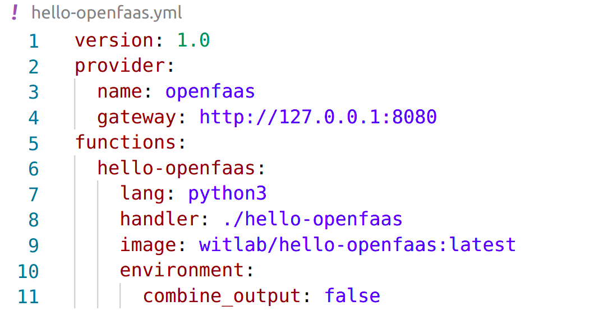

部署並調用該function:

```sh
$ faas-cli up -f hello-openfaas.yml

$ echo | faas-cli invoke hello-openfaas
```

輸出應該是:
```
{"Hello": "OpenFaaS"}
```

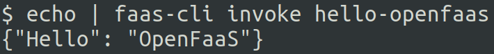

檢查容器日誌中的`stderr`。你應該看到類似以下的消息:

```
$ kubectl logs deploy/hello-openfaas -n openfaas-fn

2020/11/03 12:45:00 Version: 0.18.18	SHA: 11ff356ccea32b89b9da556c18305cd7c5ea9ba5
2020/11/03 12:45:00 Timeouts: read: 5s, write: 5s hard: 0s.
2020/11/03 12:45:00 Listening on port: 8080
2020/11/03 12:45:00 Writing lock-file to: /tmp/.lock
...
2020/11/03 12:45:09 stderr: This should be an error message.
...
```

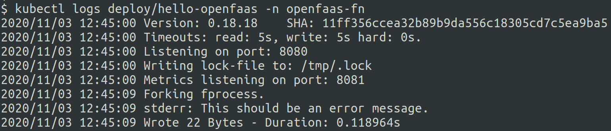

## Create Workflows

在某些情況下，採用一個function的輸出並將其用作另一個function的輸入會很有用。這種作法均可在客戶端和通過API網關實現。
### Chaining functions on the client-side

你可以使用`curl`，`faas-cli`或你自己的一些程式碼將一個function的結果傳遞給另一個function。

Pros:

* 不需要額外寫程式碼, 可以通過CLI程序來完成串接
* 快速進行開發和測試
* 易於在程式碼中建立模型

Cons:

* 額外的延遲, 每個功能都得要在服務器上來回呼叫
* 太囉嗦（更多訊息往復）

範例:

* 使用UI從*Function Store*來部署`NodeInfo` function

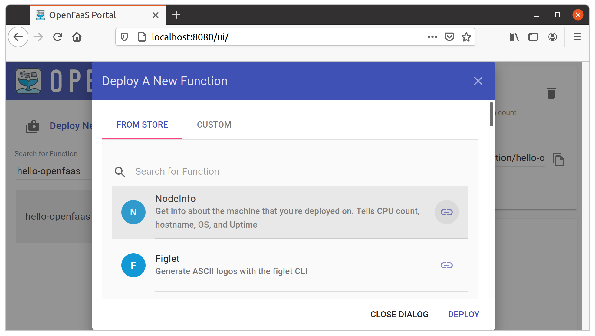

* 調用`NodeInfo` function：

```sh
$ echo "" | faas-cli invoke nodeinfo
```
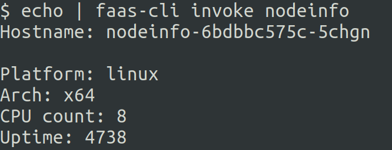

* 然後通過Markdown轉換器來處理來自NodeInfo的輸出

```sh
$ echo "" | faas-cli invoke nodeinfo | faas-cli invoke markdown

<p>Hostname: nodeinfo-6bdbbc575c-5chgn</p>

<p>Platform: linux
Arch: x64
CPU count: 8
Uptime: 4811</p>
```

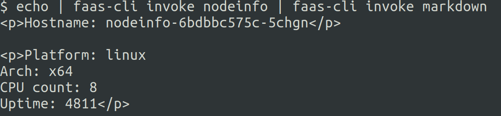

現在，你將看到用HTML標記`<p>`修飾過的NodeInfo函數的輸出。

客戶端function串鏈的另一個範例可以是調用生成圖像的function，然後將該圖像發送到添加浮水印的另一個function中。

### Call one function from another

從另一個function調用一個function的最簡單方法是通過OpenFaaS *API Gateway*進行HTTP調用。該調用不需要知道外部域名或IP地址，只需通過DNS條目來指定API網關即可。

從function訪問服務（例如API網關）時，最佳實踐是使用環境變數來配置主機名，這很重要，原因有兩個：名稱可能會更改，並且在Kubernetes中有時需要後綴。

Pros:

* 函數可以直接相互利用疊加
* 延遲低，因為功能可以在同一網絡上互相訪問

Cons:

* 需要一個額外函式庫來發出HTTP請求

範例:

在[Lab 3](./lab3.md)中，我們引入了`requests`模組，並使用它來調用遠程API以獲取國際太空站上太空人的姓名。我們可以使用相同的技術來調用部署在OpenFaaS上的另一個function。

* 使用UI界面*Function Store*來部署*Sentiment Analysis* function。

或者使用CLI來佈署:
```
$ faas-cli store deploy SentimentAnalysis

Deployed. 202 Accepted.
URL: http://127.0.0.1:8080/function/sentimentanalysis
```

情緒分析function將告訴你任何句子的主觀性和極性（積極性等級）。根據以下範例，該function的結果採用JSON格式來返回:

```sh
$ echo -n "California is great, it's always sunny there." | faas-cli invoke sentimentanalysis
{"polarity": 0.8, "sentence_count": 1, "subjectivity": 0.75}
```
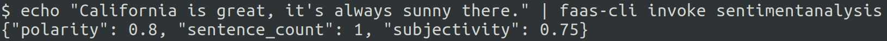

使用ui來調用:

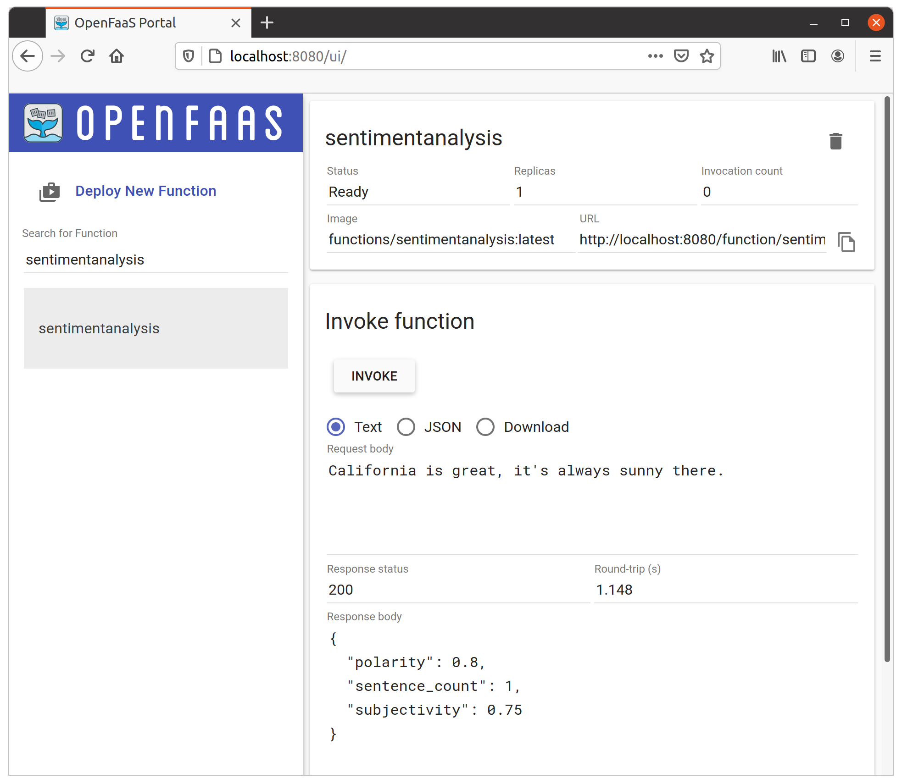

結果表明我們的測試句子既主觀(75%)又正面積極(80%)。這兩個判斷的值始終落在`-1.00`和`1.00`之間。

以下程式碼可用於調用*情感分析*function或任何其他function:

```python
    r = requests.get("http://localhost:8080/function/sentimentanalysis", text= test_sentence)
```

或通過環境變數:

```python
    gateway_hostname = os.getenv("gateway_hostname", "gateway") # uses a default of "gateway" for when "gateway_hostname" is not set
    test_sentence = "California is great, it's always sunny there."
    r = requests.get("http://" + gateway_hostname + ":8080/function/sentimentanalysis", data= test_sentence)
```

由於結果始終為JSON格式，因此我們可以使用輔助函數`.json()`來轉換響應:

```python
    result = r.json()
    if result["polarity"] > 0.45:
       return "That was probably positive"
    else:
        return "That was neutral or negative"
```

現在在Python中創建一個新function並將其整合在一起:

```sh
$ faas-cli new --lang python3 detect-sentiment --prefix="<your-docker-username-here>"
```

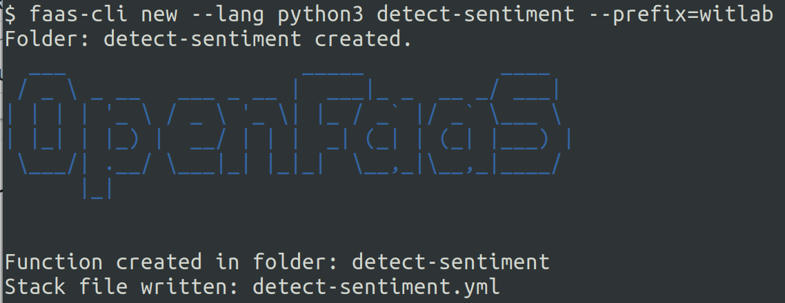

修改`handler.py`以調用另一個API:

```python
import os
import requests
import sys

def handle(req):
    # uses a default of "localhost" for when "gateway_hostname" is not set
    gateway_hostname = os.getenv("gateway_hostname", "localhost") 

    test_sentence = req

    r = requests.post("http://" + gateway_hostname + ":8080/function/sentimentanalysis", data= test_sentence)

    if r.status_code != 200:
        sys.exit("Error with sentimentanalysis, expected: %d, got: %d\n" % (200, r.status_code))

    result = r.json()
    if result["polarity"] > 0.45:
        return "That was probably positive"
    else:
        return "That was neutral or negative"
```

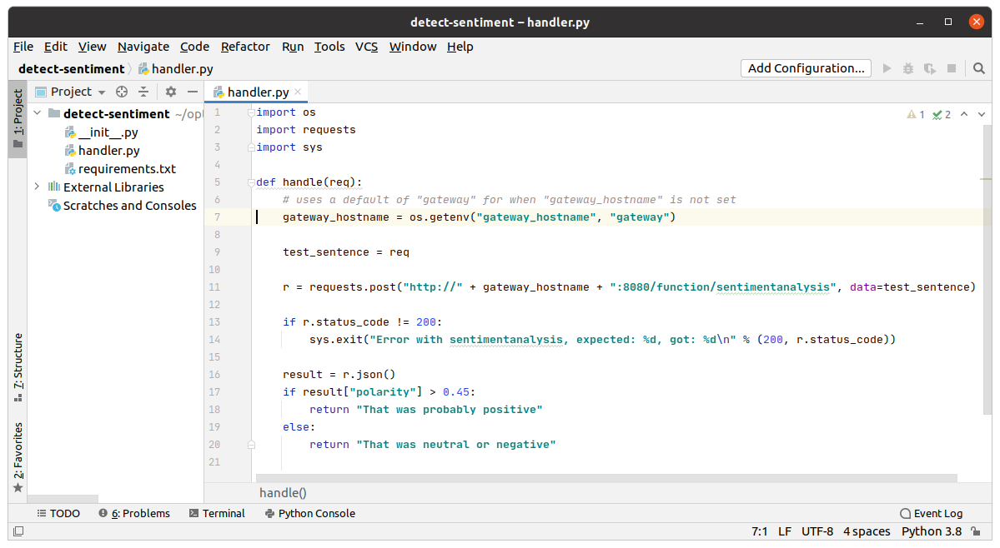

* 請記住將`requests`添加到你的`requirements.txt`文件中

修改`detect-sentiment.yml`添加環境變數:

```yaml
version: 1.0
provider:
  name: openfaas
  gateway: http://127.0.0.1:8080
functions:
  detect-sentiment:
    lang: python3
    handler: ./detect-sentiment
    image: witlab/detect-sentiment:latest
    environment:
      gateway_hostname: {YOUR_REMOTE_API_URL}
```

注意：我們使用了`gateway.openfaas.svc.cluster.local`來進行測試，它是Kubernetes內部OpenFaaS`gateway`服務的內部DNS名稱。

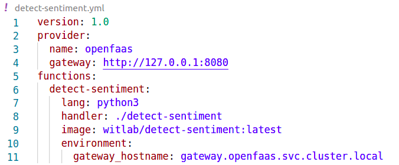

現在構建函數:

```sh
$ faas-cli up -f detect-sentiment.yml
```
現在通過UI或CLI調用該函數:
```sh
$ echo -n "California is great, it's always sunny there." | faas-cli invoke detect-sentiment

That was probably positive
```

注意：你不需要修改或更改`SentimentAnalysis`函數的程式碼，我們在前幾個步驟已經在OpenFaaS部署了它，而這個範例是模擬其它function通過API網關來訪問它。

下一步 >> [Lab 5](lab5_zh-tw.md)
