# Lab 6 - HTML for your functions

[English version](lab6.md)

</img>

在開始本lab之前，請在本機創建一個新檔案夾 `lab6`:

```
$ mkdir -p lab6 \
   && cd lab6
```

## Generate and return basic HTML from a function

OpenFaas的function可以返回HTML內容，也可以將`Content-Type`設置為`text/html`。因此，可以通過瀏覽器呈現函數返回的HTML。讓我們創建一個簡單的function，該function生成並返回基本的HTML。

```
$ faas-cli new --lang python3 show-html --prefix="<your-docker-username-here>"
```

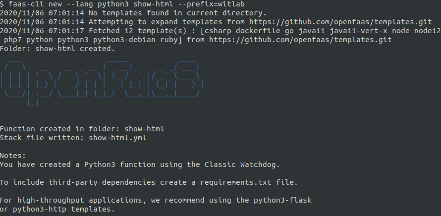

編輯 `handler.py`:

```python
def handle(req):
    """handle a request to the function
    Args:
        req (str): request body
    """

    html = '<html><h2>Hi, from your function!</h2></html>'

    return html
```

> Pro-tip: It is also possible to use another function as the `X-Callback-Url` - this would be great for notifying yourself over Slack or Email when an asynchronous workload has been processed. To call another function with the result set the `X-Callback-Url` to `http://gateway.openfaas:8080/function/<function_name>`.

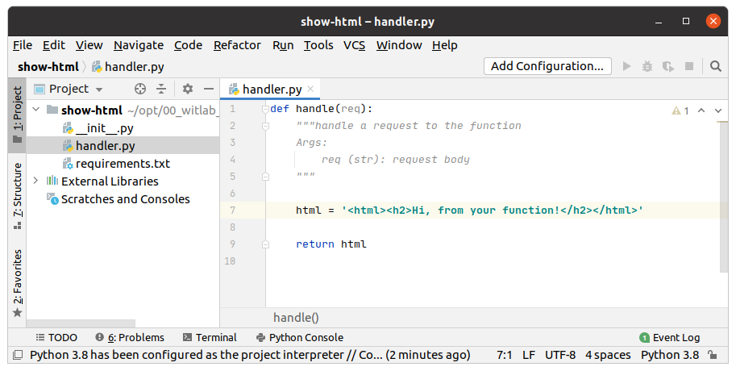

這個function會將HTML返回給調用方。我們要做的另一件事是設置響應的`Content-Type`。我們必需要確保此function將返回HTML內容，因此`Content-Type` 應該始終為`text/html`。我們可以利用`show-html.yml`文件的`environment`區塊來進行設置。

編輯 `show-html.yml`:

```yaml
provider:
  name: openfaas
  gateway: http://127.0.0.1:8080

functions:
  show-html:
    lang: python3
    handler: ./show-html
    image: <your-docker-username-here>/show-html
    environment:
      content_type: text/html

```

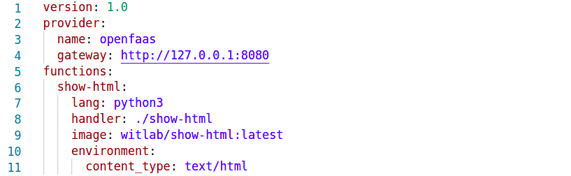

在`environment`下的`content_type`是用來設定function回應給呼叫端的`Content-Type`。

現在構建，推送和部署function:

```sh
$ faas-cli up -f show-html.yml

[0] > Building show-html.
Clearing temporary build folder: ./build/show-html/
Preparing: ./show-html/ build/show-html/function
Building: witlab/show-html:latest with python3 template. Please wait..
Sending build context to Docker daemon   16.9kB
Step 1/29 : FROM openfaas/classic-watchdog:0.18.18 as watchdog
 ---> 8aa8fb60b8b9
...
...
Successfully tagged witlab/show-html:latest
Image: witlab/show-html:latest built.
[0] < Building show-html done in 2.10s.
[0] Worker done.

Total build time: 2.10s

[0] > Pushing show-html [witlab/show-html:latest].
The push refers to repository [docker.io/witlab/show-html]
9a4f076214de: Pushed 
...
...
[0] < Pushing show-html [witlab/show-html:latest] done.
[0] Worker done.

Deploying: show-html.

Deployed. 202 Accepted.
URL: http://127.0.0.1:8080/function/show-html.openfaas-fn
```

Run the following to get the function URL:

```sh
faas-cli describe -f show-html.yml show-html

URL: http://127.0.0.1:8080/function/show-html
```

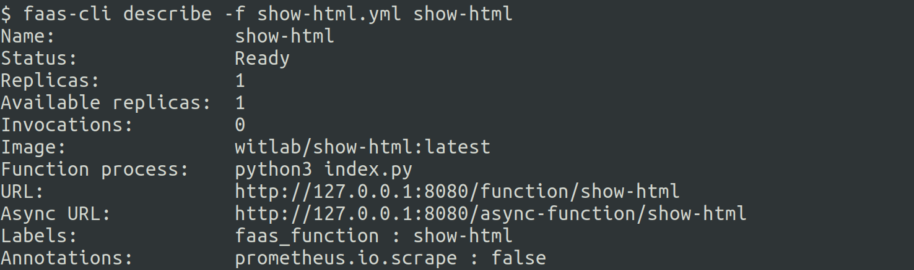

使用瀏覽器打開URL:

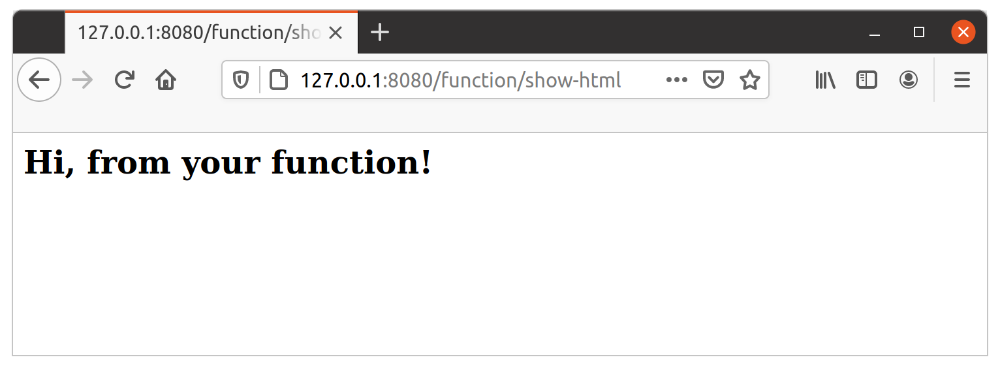

HTML應該正確呈現。

## Read and return a static HTML file from disk

通常，在提供HTML時，你會預先從指定的檔案夾中取得一個靜態HTML文件。讓我們看看如何將HTML文件打包到function中並提供HTML的內容。

首先，讓我們創建一個HTML文件:

創建一個名為`html`的目錄，並放置一個名為`new​​.html`的文件，function專案目錄結構如下所示:

```
├── show-html
│   ├── __init__.py
│   ├── handler.py
│   ├── html
│   │   └── new.html
│   └── requirements.txt
└── show-html.yml
```

編輯 `new.html` :

```html
<!DOCTYPE html>
<html lang='en'>
<head>
  <meta charset='UTF-8'>
  <title>OpenFaaS</title>
</head>
<body>
  <h2>Here's a new page!</h2>
</body>
</html>
```

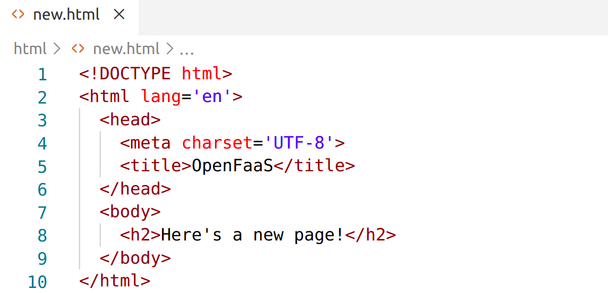

現在將你的`handler.py`更改為以下內容:

```python
import os

def handle(req):
    """handle a request to the function
    Args:
        req (str): request body
    """

    dirname = os.path.dirname(__file__)
    path = os.path.join(dirname, 'html', 'new.html')

    with(open(path, 'r')) as file:
        html = file.read()

    return html

```

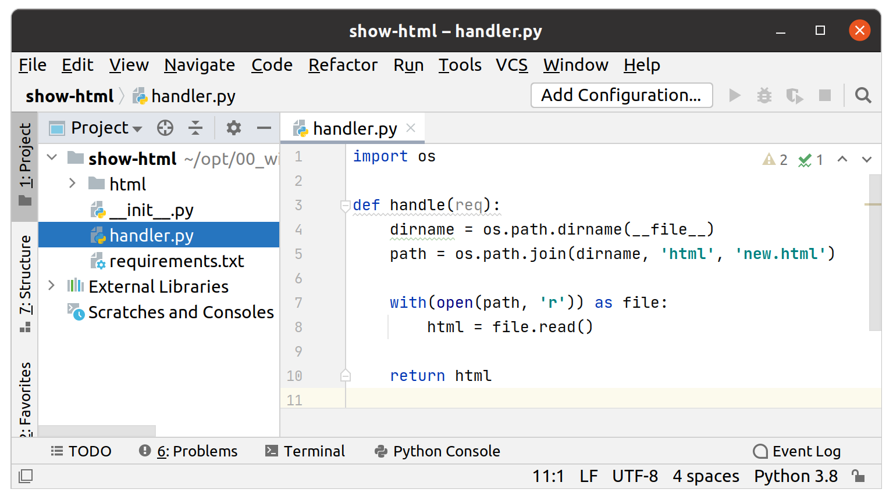

現在構建，推送和部署function:

```
$ faas-cli up -f show-html.yml
```

打開瀏覽器並訪問`http://127.0.0.1:8080/function/show-html`。你應該看到"Here's a new page!"在瀏覽器中呈現的HTML頁面。

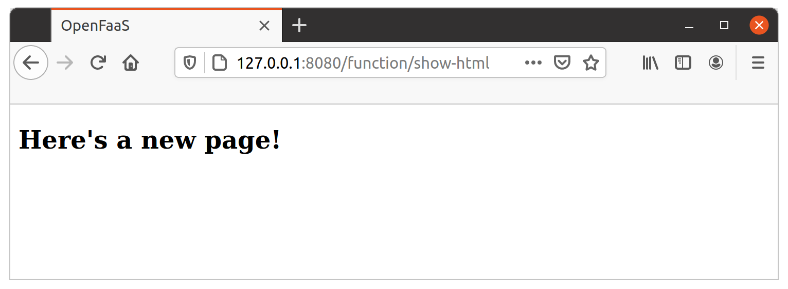

現在，我們將使用函數URL的路徑來判斷要回覆的網頁。

在`html`文件夾中添加具有以下內容的新`list.html`文件:

```html
<!DOCTYPE html>
<html lang='en'>
<head>
  <meta charset='UTF-8'>
  <title>OpenFaaS</title>
</head>
<body>
  <h2>This is a list!</h2>
  <ul>
    <li>One</li>
    <li>Two</li>
    <li>Three</li>
  </ul>
</body>
</html>
```

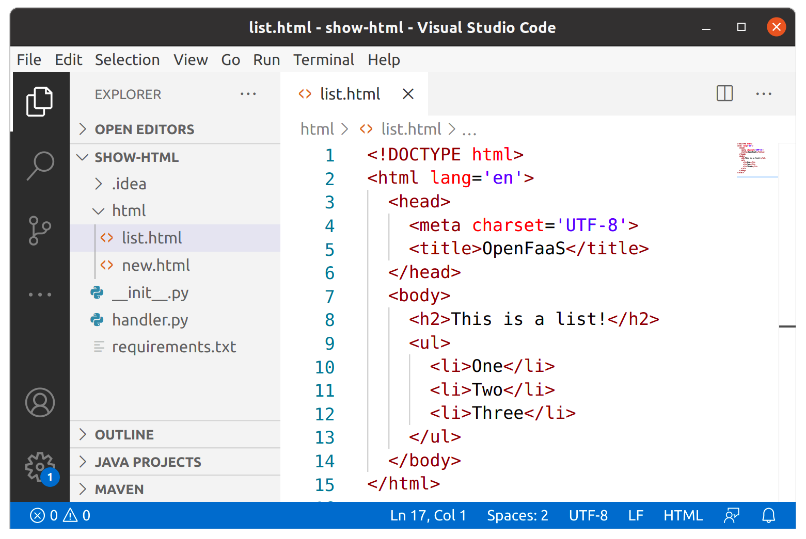

編輯你的`handler.py`為以下內容:

```python
import os

def handle(req):
    
    path = os.environ['Http_Path']
    pathArr = path.split("/")
    pageName = pathArr[1]
    
    dirname = os.path.dirname(__file__)
    page = os.path.join(dirname, 'html', pageName + '.html')

    with(open(page, 'r')) as file:
        html = file.read()

    return html
```


構建，推送和部署function:

```
$ faas-cli up -f show-html.yml
```
現在，打開你的網頁`http://127.0.0.1:8080/function/show-html/new`或`http://127.0.0.1:8080/function/show-html/list`。

你應該看到網頁輸出:

```html
<h2>Here's a new page!</h2>
```

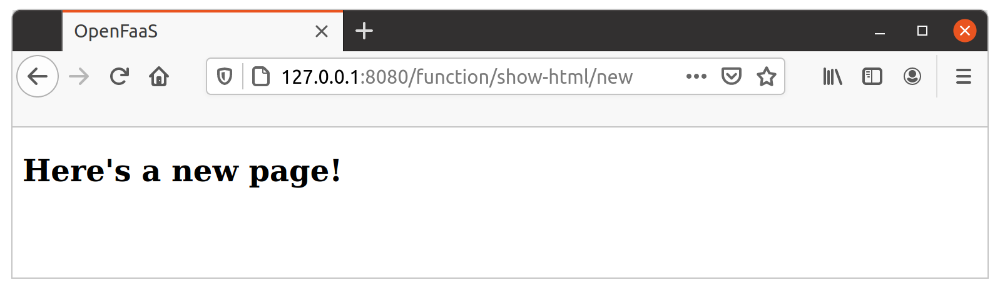

或是:

```html
<h2>This is a list!</h2>
  <ul>
    <li>One</li>
    <li>Two</li>
    <li>Three</li>
  </ul>
```


## Read the query string and return different HTML

現在，我們已經了解瞭如何通過function提供html，讓我們通過query string來動態地提供HTML。正如我們在[Lab 4](./lab4_zh-tw.md)中所了解的那樣，query string可以通過名為`Http_Query`的環境變數來檢索。假設我們想進行如下查詢:

 http://127.0.0.1:8080/function/show-html?action=new

query string是`action=new`, 因此`Http_Query`的值將是`action=new`。我們也可以使用`urllib.parse`包中的`parse_qs`函數來輕鬆解析該query string。

我們function的目錄結構如下:

```
├── show-html
│   ├── __init__.py
│   ├── handler.py
│   ├── html
│   │   ├── list.html
│   │   └── new.html
│   └── requirements.txt
└── show-html.yml
```

修改你的`handler.py`: 

```python
import os
from urllib.parse import parse_qs

def handle(req):
    """handle a request to the function
    Args:
        req (str): request body
    """

    query = os.environ['Http_Query']
    params = parse_qs(query)
    action = params['action'][0]

    dirname = os.path.dirname(__file__)
    path = os.path.join(dirname, 'html', action + '.html')

    with(open(path, 'r')) as file:
        html = file.read()

    return html
```

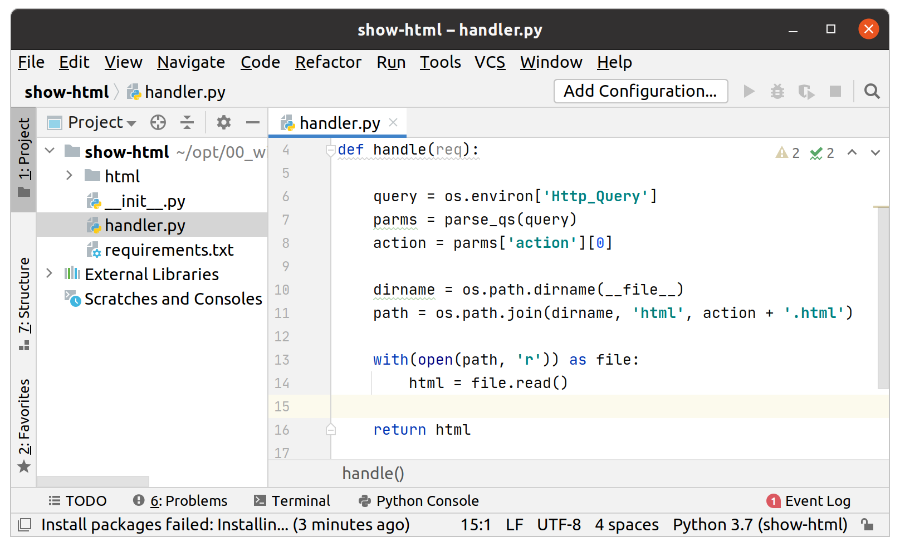

現在構建，推送和部署function:

```
$ faas-cli up -f show-html.yml
```

打開瀏覽器並進行訪問:

http://127.0.0.1:8080/function/show-html?action=new

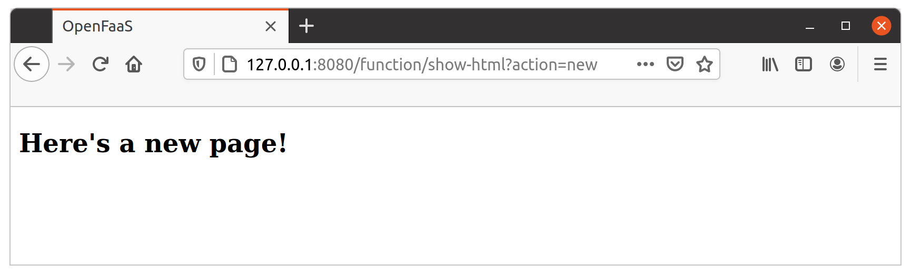

你應該看到"Here's a new page!"如你在上一節中看到的。現在訪問:

http://127.0.0.1:8080/function/show-html?action=list

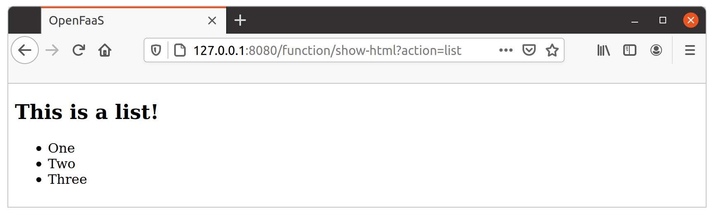

你應該看到顯示一個簡表列表的HTML。

## Collaborate with other functions

最後，讓我們看看如何利用JavaScript和Ajax與另一個function（例如 *figlet* function）進行協作。

首先，讓我們創建另一個名為`figlet.html`的HTML文件。因此，檔案結構現在應如下所示:

```
├── show-html
│   ├── __init__.py
│   ├── handler.py
│   ├── html
│   │   ├── figlet.html
│   │   ├── list.html
│   │   └── new.html
│   └── requirements.txt
└── show-html.yml
```

編輯 `figlet.html`:

```html
<!DOCTYPE html>
<html lang='en'>
<head>
  <meta charset='UTF-8'>
  <title>OpenFaaS</title>
  <script
  src="https://code.jquery.com/jquery-3.3.1.min.js"
  integrity="sha256-FgpCb/KJQlLNfOu91ta32o/NMZxltwRo8QtmkMRdAu8="
  crossorigin="anonymous"></script>
  <style>
    .result {
        font-family: 'Roboto Mono', monospace;
    }
    </style>
</head>
<body>
  <h2>Figlet</h2>
  <p>
    Text: <input type="text" name="text" id="text"> 
    <button id="generate">Generate</button>
  </p>
  
  <textarea class="result" cols="80" rows="10"></textarea>

  <script type="text/javascript">
    $(function(){
      // Generate button click
      $('#generate').on('click', function() {
        // Execute ajax request
        $.ajax({
          url:'./figlet',
          type:'POST',
          data:$('#text').val()
        })
        .done(function(data) {
          // ajax success
          $('.result').val(data);
          console.log(data);
        })
        .fail(function(data) {
          // ajax failure
          $('.result').val(data);
          console.log(data);
        });
      });
    });
  </script>
</body>
</html>
```

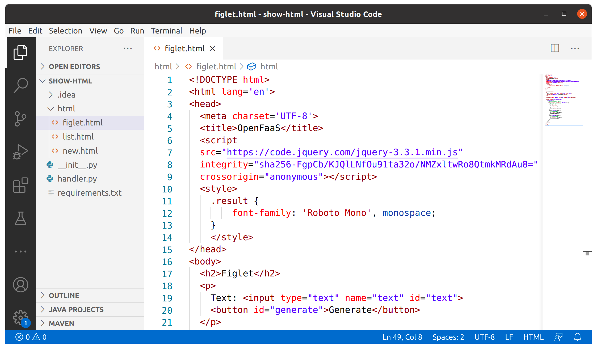

如果你不太了解JavaScript，請不要擔心。該頁面所做的全部是:

* 在`input`中輸入文字
* 按下`Generate`按鈕
* 創建對*figlet* function端點(`/function/figlet`)的Ajax請求
* 將結果展現於`textarea`

無需更改`handler.py`，因為它可以動態地經由query string來指定要回應的HTML。儘管沒有更改`handler.py`，但我們仍需要構建並推送function映像，因為我們需要將新的`figlet.html`包裝在function容器中。

現在構建，推送和部署function:

```
$ faas-cli up -f show-html.yml
```

本節假定你已經在[Lab 2](./lab2.md)部署了*figlet* function。

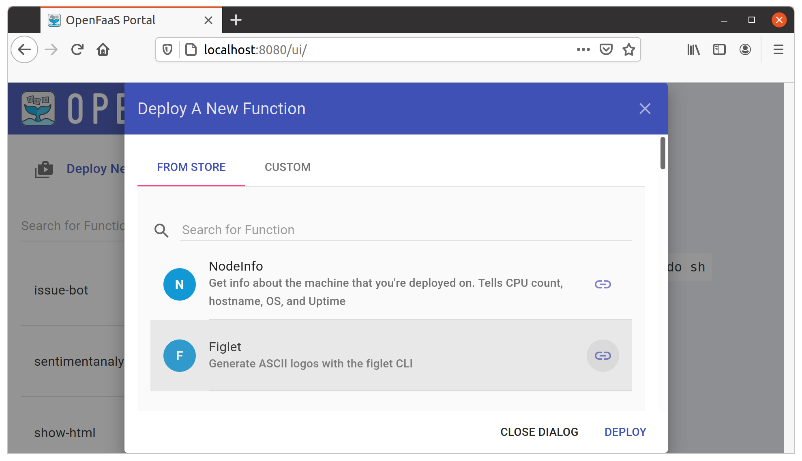

打開瀏覽器並進行訪問:

http://127.0.0.1:8080/function/show-html?action=figlet

你應該看到"Figlet"頁面，並且應該看到一個輸入。你可輸入想要的任何文本，然後點擊`Generate`按鈕。如果請求成功，則`textarea`應包含你在`input`中鍵入的figlet。這是一個簡單的範例，但是通過使用這種技術，你甚至還可以創建具有功能的強大SPA（單頁應用程序）。

讓我們在輸入欄中輸入“hello”，然後點擊`Generate`按鈕：

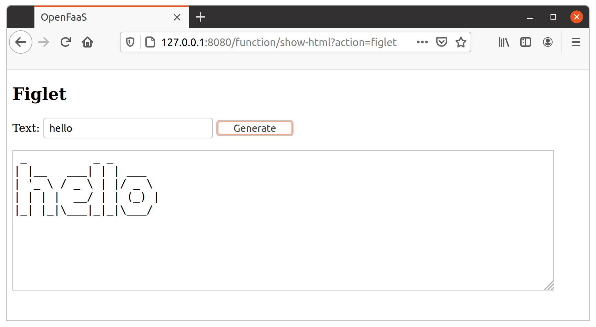

在本實驗中，你學習到如何從function提供HTML並設置響應內容的`Content-Type`。此外，你還學習瞭如何使用HTML + JavaScript調用其他function以及如何使用function創建動態頁面。

下一步 >>  [Lab 7](lab7_zh-tw.md)