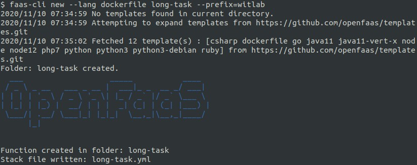
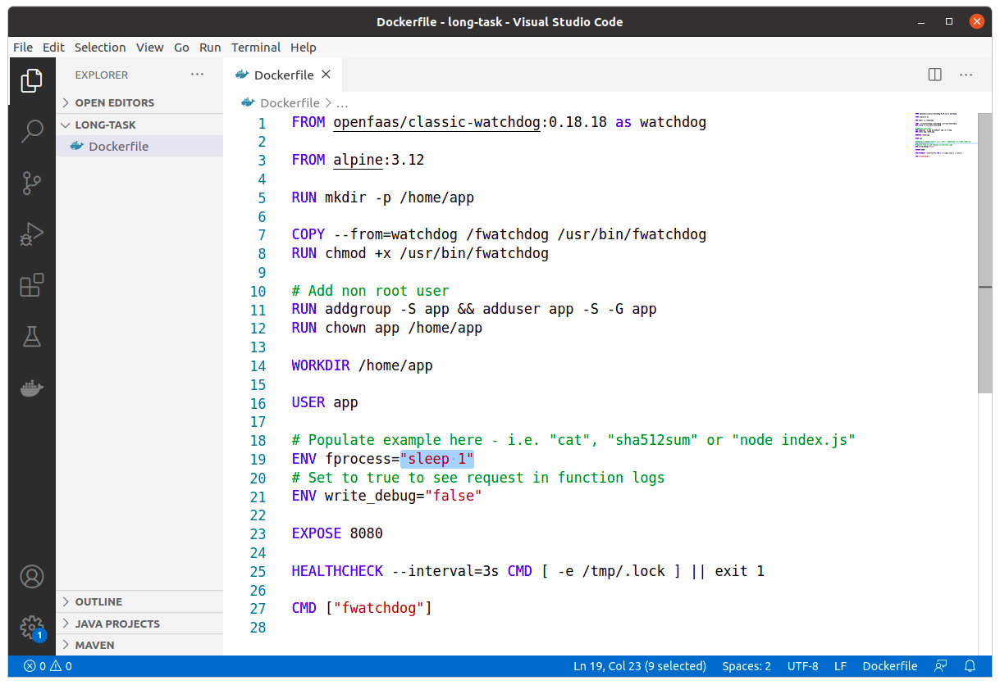
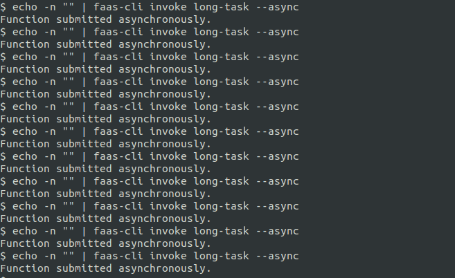
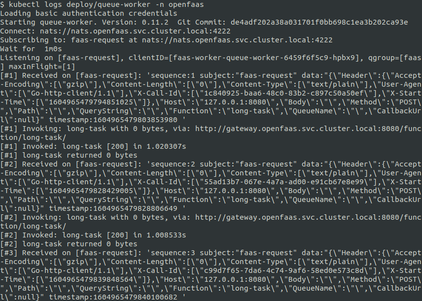
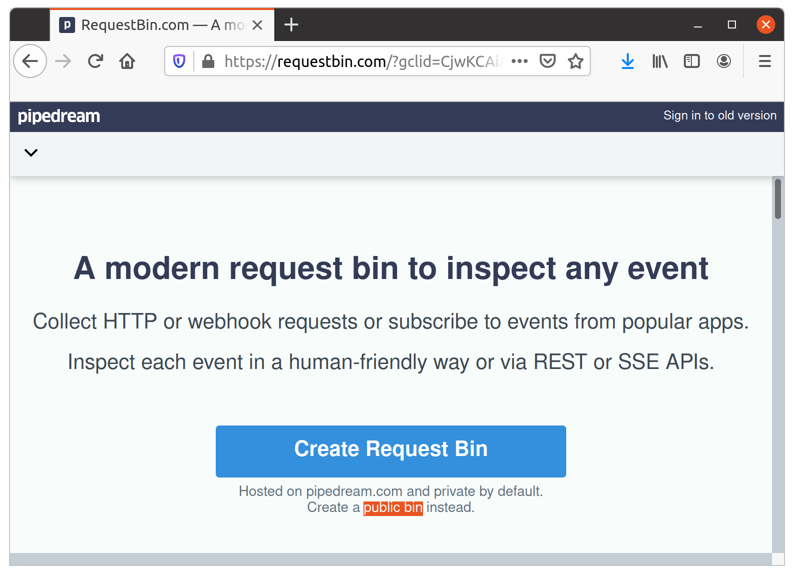
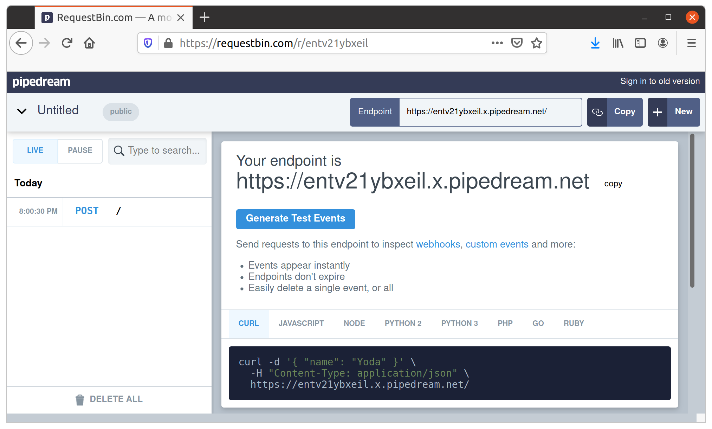
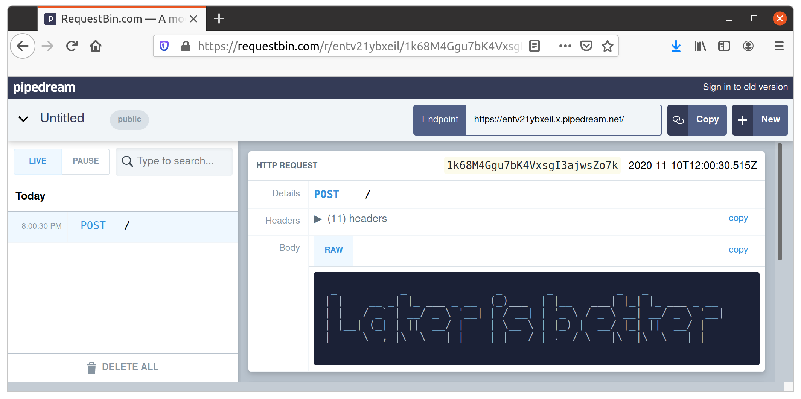

# Lab 7 - Asynchronous functions

[Chinses version](lab7_zh-tw.md)

</img>

Before starting this lab, create a new folder for your files:

```
$ mkdir -p lab7 \
   && cd lab7
```

## Call a function synchronously vs asynchronously

When you call a function synchronously a connection is made to the gateway through to your function and is held open for the whole execution time. Synchronous calls are *blocking* so you should see your client pause and become inactive until the function has completed its task. 

* The gateway uses a route of: `/function/<function_name>`
* You have to wait until it has finished
* You get the result after the call
* You know if it passed or failed

Asynchronous tasks run in a similar way with a few differences: 

* The gateway uses a different route: `/async-function/<function_name>`
* The client gets an immediate response of *202 Accepted* from the gateway
* The function is invoked later using a queue-worker
* By default the result is discarded

Let's try a quick demo.

```
$ faas-cli new --lang dockerfile long-task --prefix="<your-docker-username-here>"
```



Edit `long-task/Dockerfile` and change the fprocess to `sleep 1`.



> `sleep` is a command in Unix, Unix-like and other operating systems that suspends program execution for a specified time. 

Now build, push and deploy the function:

```
$ faas-cli up -f long-task.yml

...
...
Deploying: long-task.

Deployed. 202 Accepted.
URL: http://127.0.0.1:8080/function/long-task.openfaas-fn
```

Invoke your function 10 times synchronously like this:

```
echo -n "" | faas-cli invoke long-task
echo -n "" | faas-cli invoke long-task
echo -n "" | faas-cli invoke long-task
echo -n "" | faas-cli invoke long-task
echo -n "" | faas-cli invoke long-task
echo -n "" | faas-cli invoke long-task
echo -n "" | faas-cli invoke long-task
echo -n "" | faas-cli invoke long-task
echo -n "" | faas-cli invoke long-task
echo -n "" | faas-cli invoke long-task
```

Now invoke the function 10 times asynchronously:

```
echo -n "" | faas-cli invoke long-task --async
echo -n "" | faas-cli invoke long-task --async
echo -n "" | faas-cli invoke long-task --async
echo -n "" | faas-cli invoke long-task --async
echo -n "" | faas-cli invoke long-task --async
echo -n "" | faas-cli invoke long-task --async
echo -n "" | faas-cli invoke long-task --async
echo -n "" | faas-cli invoke long-task --async
echo -n "" | faas-cli invoke long-task --async
echo -n "" | faas-cli invoke long-task --async
echo -n "" | faas-cli invoke long-task --async
```



What did you observe? The first example should have taken 10 seconds where as the second example would have returned to your prompt within around a second or less. The work will still take 10x1 seconds to complete, but that is now going to be placed on a queue for deferred execution.

Asynchronous function calls are well-suited to tasks where you can defer the execution until a later time, or you don't need the result on the client.

> A good example of this may be when receiving webhooks from GitHub - there may be a maximum processing time which GitHub will allow your connection to remain open for, an asynchronous call accepts the work and returns immediately.

## View the queue-worker's logs

The default stack for OpenFaaS uses [NATS Streaming](https://docs.nats.io/nats-streaming-concepts/intro) for queueing and deferred execution. You can view the logs with the following command:

```
kubectl logs deployment/queue-worker -n openfaas
```



## Use an `X-Callback-Url` with requestbin

If you need a result from a function called asynchronously you have two options:

1. Alter its code to notify an endpoint or messaging system with its result
2. Make use of the built-in behaviour of callbacks

The first option may not be suitable in all circumstances and involves writing additional code.
The second option using the `built-in callbacks` allow a call to a function to provide a URL where the queue-worker will automatically report the success or failure of a function along with the result.

Some additional request headers are sent to the callback, for a complete list see [Callback request headers](https://docs.openfaas.com/reference/async/#callback-request-headers)

To simulate a webhook service for async function, we are going to using [requestbin](https://requestbin.com/) service which let us to inspect our result.

Head over to [requestbin](https://requestbin.com/) and click "Create a [public bin](https://requestbin.com/r) instead" which under the button of "Create Request Bin" to create a new "bin".



This will show a URL on the public internet that can receive your function's result. For example: `https://entv21ybxeil.x.pipedream.net`


> For the purpose of this lab, be sure to click "Create a [public bin](https://requestbin.com/r) instead" as this will save you from needing to log in.

Now copy the "Bin URL" and set "X-Callback-Url" header info:

```
$ echo -n "LaterIsBetter" | faas-cli invoke figlet --async --header "X-Callback-Url=https://entv21ybxeil.x.pipedream.net"
```

Now check the page on the requestbin and you will see the result via webhook from `figlet`:

```
 _          _           ___     ____       _   _            
| |    __ _| |_ ___ _ _|_ _|___| __ )  ___| |_| |_ ___ _ __ 
| |   / _` | __/ _ \ '__| |/ __|  _ \ / _ \ __| __/ _ \ '__|
| |__| (_| | ||  __/ |  | |\__ \ |_) |  __/ |_| ||  __/ |   
|_____\__,_|\__\___|_| |___|___/____/ \___|\__|\__\___|_|   
                                                            
```



Click "POST /" from left menu bar:



> Pro-tip: It is also possible to use another function as the `X-Callback-Url` - this would be great for notifying yourself over Slack or Email when an asynchronous workload has been processed. To call another function with the result set the `X-Callback-Url` to `http://gateway.openfaas:8080/function/<function_name>`.

Now move onto [Lab 8](lab8.md)