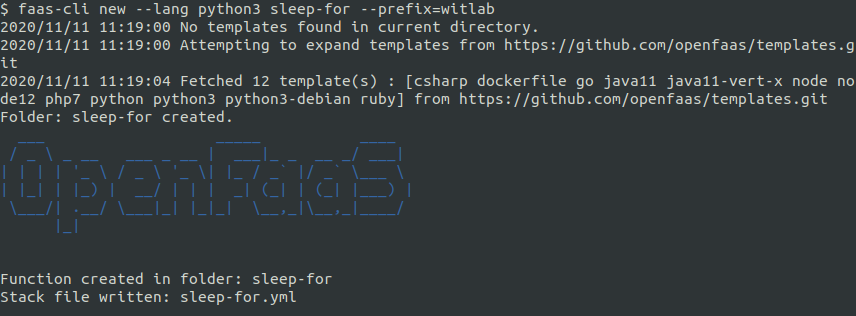
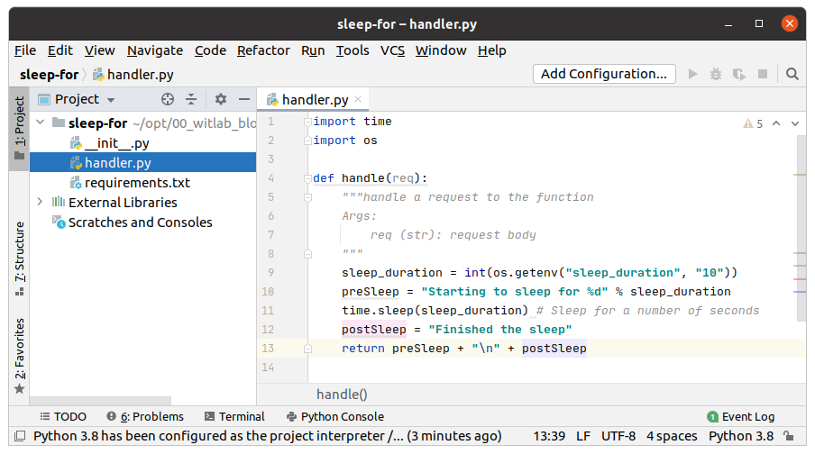
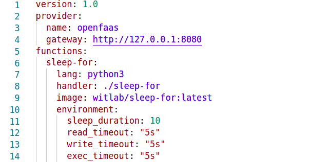
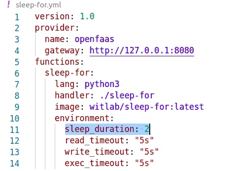
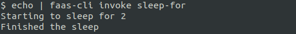

# Lab 8 - Advanced feature - Timeouts

[English version](lab8.md)

</img>

在開始本lab之前，請在本機創建一個新檔案夾 `lab8`:

```
$ mkdir -p lab8 \
   && cd lab8
```

## Extend timeouts with `read_timeout`

*read_timeout* 的設定是對應於function在執行之前可以運行多長時間。這對於防止在分佈式系統中一個function是否正確的被設計與運行來說是很重要功能。

在OpenFaaS的設計中,有幾個地方可以讓你去對function配置超時，基本手法就是通過使用`環境變數`來完成。

### Function timeout

* `read_timeout` - function通過HTTP讀取請求資料所允許的時間長度
* `write_timeout` - function通過HTTP構建響應物件所允許的時間長度
* `exec_timeout` - function在被強迫終止之前可以運行的最長時間長度

OpenFaaS API網關的預設值為20秒，因此讓我們測試一下如何在function上設置更短的超時時間。

先構建一個新的function:

```
$ faas-cli new --lang python3 sleep-for --prefix="<your-docker-username-here>"
```



編輯 `handler.py`:

```python
import time
import os

def handle(req):
    """handle a request to the function
    Args:
        req (str): request body
    """

    sleep_duration = int(os.getenv("sleep_duration", "10"))
    preSleep = "Starting to sleep for %d" % sleep_duration
    time.sleep(sleep_duration)  # Sleep for a number of seconds
    postSleep = "Finished the sleep"
    return preSleep + "\n" + postSleep
```



接著編輯`sleep-for.yml`文件並添加以下環境變數:

```yaml
provider:
  name: openfaas
  gateway: http://127.0.0.1:8080

functions:
  sleep-for:
    lang: python3
    handler: ./sleep-for
    image: <your-docker-username-here>/sleep-for:0.1
    environment:
      sleep_duration: 10
      read_timeout: "5s"
      write_timeout: "5s"
      exec_timeout: "5s"
```



使用CLI構建，推送和部署:

```
$ faas-cli up -f sleep-for.yml

...
...
Deploying: sleep-for.

Deployed. 202 Accepted.
URL: http://127.0.0.1:8080/function/sleep-for.openfaas-fn
```

調用該function:

```
$ echo | faas-cli invoke sleep-for
Server returned unexpected status code: 502 -
```


你應該看到它在沒有打印出最後結果的情況下就終止了，這是因為`sleep_duration`高於`exec_timeout: "5s"`的超時值。

現在將`sleep_duration`設置為一個較小的數字，例如`2`，然後再重新部署一次`faas-cli deploy`。在重新編輯function的YAML文件之後，你無需重建函數(因為容器映像並沒有改變)。



```
$ faas-cli deploy -f sleep-for.yml
```

重新調用該function:

```
$ echo | faas-cli invoke sleep-for
Starting to sleep for 2
Finished the sleep
```

結果順利的回傳了!



### OpenFaaS API Gateway

OpenFaaS API Gateway上還設置了最大超時時間長度，它將覆蓋function超時的設定。預設的最大超時配置為"20s"，但可以通過配置更長或更短的值。

要配置gateway的超時, 請在[values.yaml](https://github.com/openfaas/faas-netes/blob/master/chart/openfaas/values.yaml)檔案中使用`gateway.readTimeout`與`gateway.writeTimeout`來設定, 如果是便使用Helm參數的話, 請使用`--set gateway.readTimeout=value`與`--set gateway.writeTimeout=value`。

下一步 >>  [Lab 9](lab9_zh-tw.md)
