# Lab 9 - Advanced feature - Auto-scaling

</img>

## Auto-scaling in action

如[documentation](http://docs.openfaas.com/architecture/autoscaling/)所述，OpenFaaS附帶自動縮放功能。在本lab中，我們將了解自動縮放的工作原理。

### Pre-requisites:

* 當你完成了在[Lab 1](./lab1.md)中完成OpenFaaS的設置後，你就擁有觸發自動縮放所需的能力。
* 可以使用多種工具來創建足夠的流量來觸發自動縮放-在本範例中，將使用`curl`，因為它可以輕鬆地用於Mac，Linux與Windows的平台上。

你可以嘗試多次調用`figlet`函數來進行度量(metric)觀察。

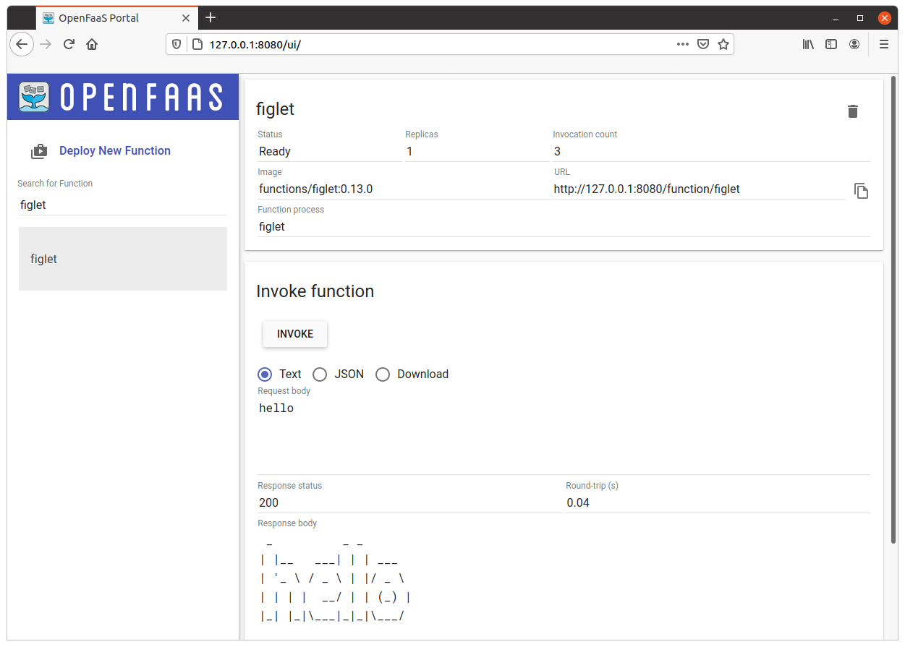

### Background on auto-scaling

OpenFaaS內置了自動縮放的功能，它可根據通過Prometheus測得的`request per seconds`度量來觸發自動縮放的機制。當有function被呼叫的流量通過API網關時會在Prometheus中持續取得此度量。如果這個度量值超過了定義的每秒請求閾值(`request per seconds`)，則AlertManager將被觸發。你可值重新配置閾值來適合你的生產環境。因為出於演示目的，在此範例中將其設置為較低的值。

> 在[OpenFaaS的說明文檔](http://docs.openfaas.com/architecture/autoscaling/)中可找到有關自動縮放的更多信息

每次AlertManager觸發警報時，API網關都會將一定數量的功能副本添加到群集中。 OpenFaaS有兩個配置選項，它們可以指定副本的開始/最小數量，也可以限制最大副本數:

你可以通過設置`com.openfaas.scale.min`來控制函數的最小副本數，當前預設值為`1`。

你可以通過設置`com.openfaas.scale.max`來控制可以為某個函數產生的最大副本數，當前預設值為20。

> 注意：如果將`com.openfaas.scale.min`和`com.openfaas.scale.max`設置為相同的值，則將停用自動縮放功能。

### Check out Prometheus

在瀏覽器中打開Prometheus:

你將需要執行port-forwarding命令才能訪問到在`http://127.0.0.1:9090`的Prometheus:
```
$ kubectl port-forward deployment/prometheus 9090:9090 -n openfaas
```

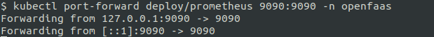

在Ｐrometheus添加一個`graph`，其中包含所有已成功調用已部署function的信息。我們可以通過執行`rate( gateway_function_invocation_total{code="200"} [20s])`作為查詢來實現。生成的頁面如下所示：

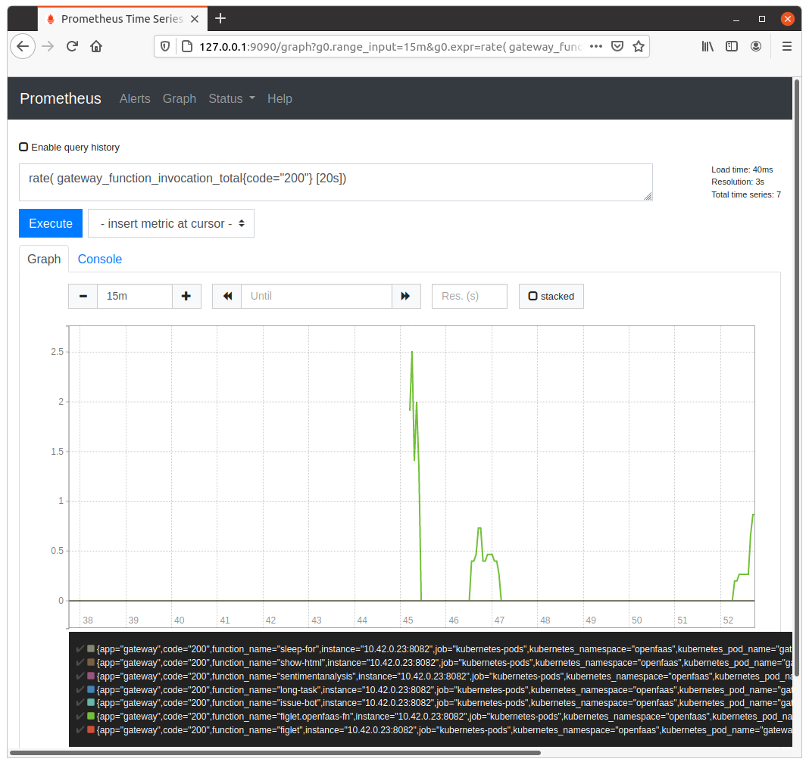

 Go ahead an open a new tab in which you navigate to the alert section using `http://127.0.0.1:9090/alerts`. On this page, you can later see when the threshold for the `request per seconds` is exceeded.

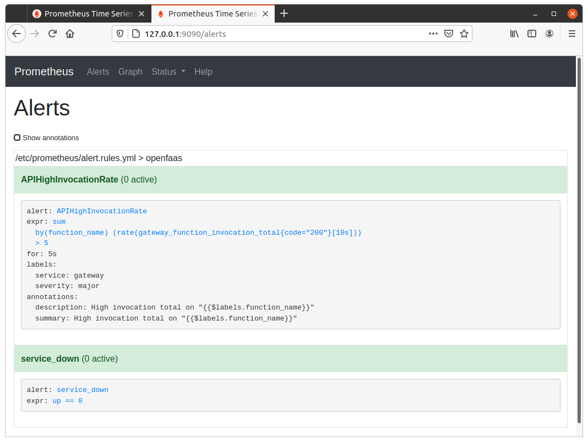

### Trigger scaling of a python3-flask function

Let pulling the `python3-flask` function template from store:

```bash
$ faas-cli template store pull python3-flask
```

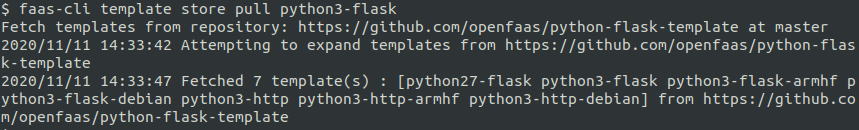

Create a new function "echo-fn":

```bash
$ faas-cli new echo-fn --lang python3-flask --prefix="<your-docker-username-here>
```

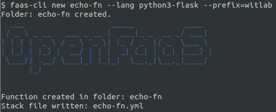

The default behavior of function is echoing the input to the output:

```python
def handle(req):
    """handle a request to the function
    Args:
        req (str): request body
    """

    return req

```

Use the CLI to build, push, deploy with **auto-scaling labelling**:

```
$ faas-cli up -f echo-fn.yml \
  --label com.openfaas.scale.max=10 \
  --label com.openfaas.scale.min=1


[0] > Building echo-fn.
Clearing temporary build folder: ./build/echo-fn/
Preparing: ./echo-fn/ build/echo-fn/function
Building: witlab/echo-fn:latest with python3-flask template. Please wait..
Sending build context to Docker daemon  9.728kB
Step 1/32 : FROM openfaas/of-watchdog:0.7.7 as watchdog
 ---> d0f9fd4de119
Step 2/32 : FROM python:3.7-alpine
3.7-alpine: Pulling from library/python
...
...
uccessfully built a3e69c7e2b55
Successfully tagged witlab/echo-fn:latest
Image: witlab/echo-fn:latest built.
[0] < Building echo-fn done in 27.21s.
[0] Worker done.

Total build time: 27.21s

[0] > Pushing echo-fn [witlab/echo-fn:latest].
The push refers to repository [docker.io/witlab/echo-fn]
...
...
latest: digest: sha256:50fd34db44840c99b3fadc4ac93aa939b2a68bd2117375e70391db4b4beab6d4 size: 4287
[0] < Pushing echo-fn [witlab/echo-fn:latest] done.
[0] Worker done.

Deploying: echo-fn.

Deployed. 202 Accepted.
URL: http://127.0.0.1:8080/function/echo-fn.openfaas-fn
```

Let's inspect the pod using `kubectl`:

```
kubectl describe pods/echo-fn -n openfaas-fn
```

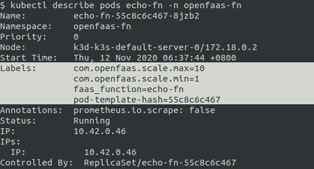

You can also check this with `faas-cli describe echo-fn`

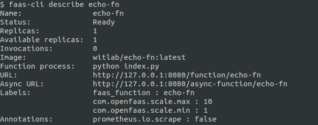

Use below script to invoke the `echo-fn` function over and over until you see the replica count go from 1 to 5 and so on. You can monitor this value in Prometheus by adding a graph for `gateway_service_count` or by viewing the API Gateway with the function selected.

 ```bash
$ for i in {0..10000};
do
    echo -n "Post $i" | faas-cli invoke echo-fn && echo;
done;
 ```

### Monitor for alerts

You should now be able to see an increase in invocations of the `echo-fn` function in the graph that was created earlier. 

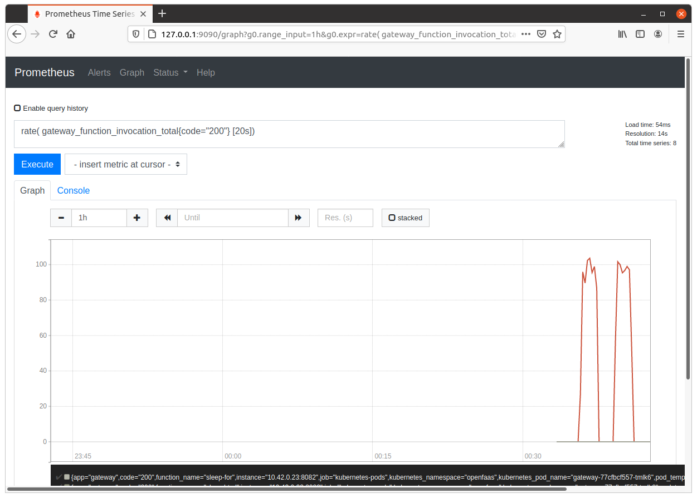

Move over to the tab where you have open the alerts page. After a time period, you should start seeing that the `APIHighInvocationRate` state (and colour) changes to `Pending` before then once again changing to `Firing`. 

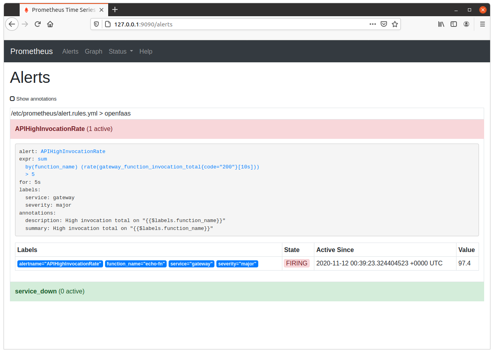

You are also able to see the auto-scaling using the `$ faas-cli list` or over the [ui](http://127.0.0.1:8080)

The status at the beginning of massive function invokings:

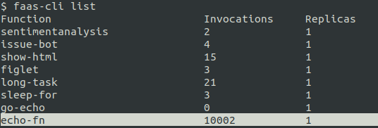

The status after scaling event is fired via Prometheus alert:

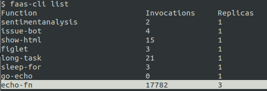

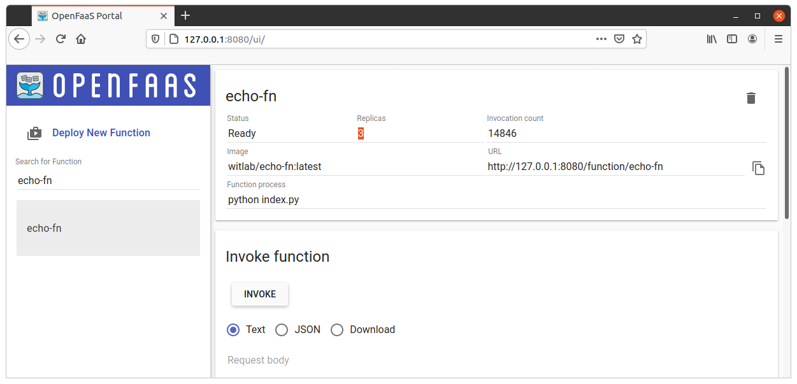

Now stop the bash script or wait for all the invokings completed. You will see the replica count return to 1 replica after a few seconds.

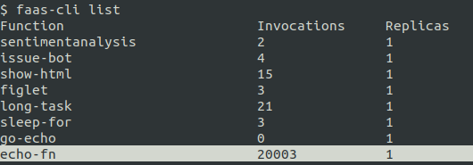

### Troubleshooting

If you believe that your auto-scaling is not triggering, then check the following:

* The Alerts page in Prometheus - this should be red/pink and say "FIRING" - i.e. at http://127.0.0.1:9090/alerts
* Check the logs of the core services i.e. the gateway, Prometheus / AlertManager

### Load-testing (optional)

It is important to note that there is a difference between applying a scientific method and tooling to a controlled environment and running a Denial Of Service attack on your own laptop. Your laptop is not suitable for load-testing because generally you are running OpenFaaS in a Linux VM on a Windows or Mac host which is also a single node. This is not representative of a production deployment.

See the documentation on [constructing a proper performance test](https://docs.openfaas.com/architecture/performance/).

If `curl` is not generating enough traffic for your test, or you'd like to get some statistics on how things are broken down then you can try the [**hey**](https://github.com/rakyll/hey) tool. `hey` can generate a structured load by requests per second or a given duration.

Follow the [https://github.com/rakyll/hey](https://github.com/rakyll/hey) github instruction to install it:

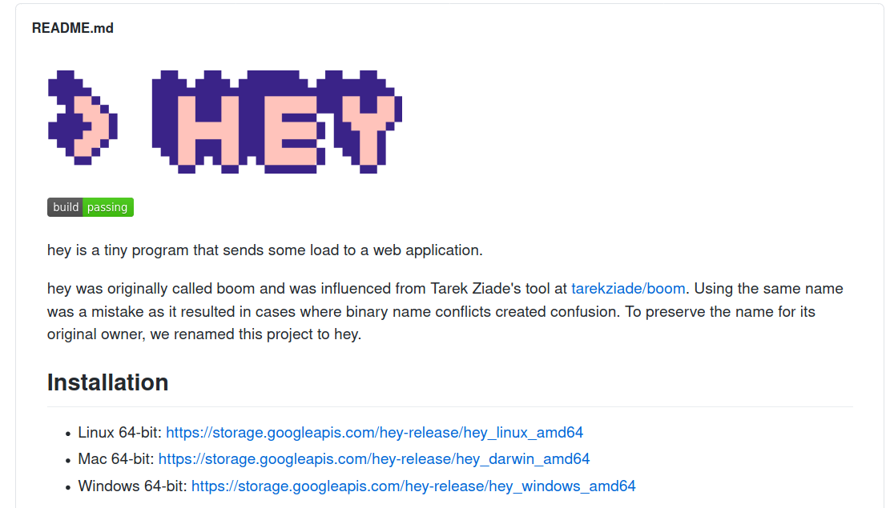

Here's an example of running on a 1.6GHz 2019 ThinkPad T15 with Ubuntu 20.04, in the setting we ask `hey` to call `echo-fn` 100000 times with 3 worker thread.

```bash
$ hey -n 100000 -c 3 -m POST -d=TEST http://127.0.0.1:8080/function/echo-fn

Summary:
  Total:	98.2133 secs
  Slowest:	0.0358 secs
  Fastest:	0.0015 secs
  Average:	0.0029 secs
  Requests/sec:	1018.1821
  
  Total data:	399996 bytes
  Size/request:	4 bytes

Response time histogram:
  0.002 [1]	|
  0.005 [98565]	|■■■■■■■■■■■■■■■■■■■■■■■■■■■■■■■■■■■■■■■■
  0.008 [953]	|
  0.012 [186]	|
  0.015 [137]	|
  0.019 [73]	|
  0.022 [51]	|
  0.026 [22]	|
  0.029 [6]	|
  0.032 [4]	|
  0.036 [1]	|


Latency distribution:
  10% in 0.0025 secs
  25% in 0.0026 secs
  50% in 0.0028 secs
  75% in 0.0031 secs
  90% in 0.0033 secs
  95% in 0.0036 secs
  99% in 0.0059 secs

Details (average, fastest, slowest):
  DNS+dialup:	0.0000 secs, 0.0015 secs, 0.0358 secs
  DNS-lookup:	0.0000 secs, 0.0000 secs, 0.0000 secs
  req write:	0.0000 secs, 0.0000 secs, 0.0009 secs
  resp wait:	0.0029 secs, 0.0015 secs, 0.0357 secs
  resp read:	0.0000 secs, 0.0000 secs, 0.0061 secs

Status code distribution:
  [200]	99999 responses

```

To use `hey` you must have Golang installed on your local computer.

See also: [hey on GitHub](https://github.com/rakyll/hey)

### Try scale from zero

If you scale down your function to 0 replicas, you can still invoke it. The invocation will trigger the gateway into scaling the function to a non-zero value.

Try it out with the following commands:

```
$ kubectl scale deployment --replicas=0 echo-fn -n openfaas-fn
```


Open the OpenFaaS UI and check that `echo-fn` has 0 replicas.


You can also use `kubectl` to verify:

```bash
$ kubectl get deployment echo-fn -n openfaas-fn
```

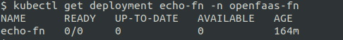

Now invoke the function and check back that it scaled to 1 replicas.

```bash
$ kubectl scale deployment --replicas=0 echo-fn -n openfaas-fn

deployment.apps/echo-fn scaled

$ faas-cli list

Function                      	Invocations    	Replicas
echo-fn                       	0              	0    

$ echo "hi hi" | faas-cli invoke echo-fn

hi hi

$ faas-cli list

Function                      	Invocations    	Replicas
echo-fn                       	1              	1 
```

Now move onto [Lab 10](lab10.md).