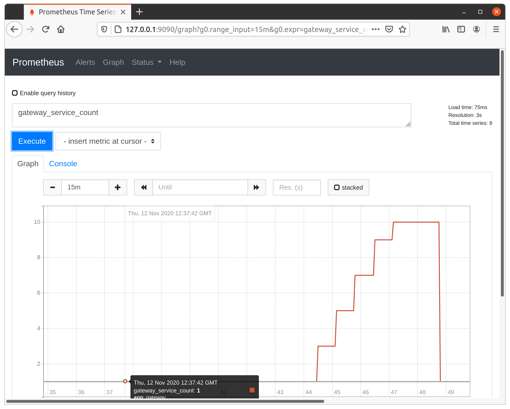

# Lab 9 - Advanced feature - Auto-scaling

[English version](lab9.md)

</img>

## Auto-scaling in action

如[documentation](http://docs.openfaas.com/architecture/autoscaling/)所述，OpenFaaS附帶自動縮放功能。在本lab中，我們將了解自動縮放的工作原理。

### Pre-requisites:

* 當你完成了在[Lab 1](./lab1.md)中完成OpenFaaS的設置後，你就擁有觸發自動縮放所需的能力。
* 可以使用多種工具來創建足夠的流量來觸發自動縮放-在本範例中，將使用`curl`，因為它可以輕鬆地用於Mac，Linux與Windows的平台上。

你可以嘗試多次調用`figlet`函數來進行度量(metric)觀察。


### Background on auto-scaling

OpenFaaS內置了自動縮放的功能，它可根據通過Prometheus測得的`request per seconds`度量來觸發自動縮放的機制。當有function被呼叫的流量通過API網關時會在Prometheus中持續取得此度量。如果這個度量值超過了定義的每秒請求閾值(`request per seconds`)，則AlertManager將被觸發。你可值重新配置閾值來適合你的生產環境。因為出於演示目的，在此範例中將其設置為較低的值。

> 在[OpenFaaS的說明文檔](http://docs.openfaas.com/architecture/autoscaling/)中可找到有關自動縮放的更多信息

每次AlertManager觸發警報時，API網關都會將一定數量的功能副本添加到群集中。 OpenFaaS有兩個配置選項，它們可以指定副本的開始/最小數量，也可以限制最大副本數:

你可以通過設置`com.openfaas.scale.min`來控制函數的最小副本數，當前預設值為`1`。

你可以通過設置`com.openfaas.scale.max`來控制可以為某個函數產生的最大副本數，當前預設值為20。

> 注意：如果將`com.openfaas.scale.min`和`com.openfaas.scale.max`設置為相同的值，則將停用自動縮放功能。

### Check out Prometheus

在瀏覽器中打開Prometheus:

你將需要執行port-forwarding命令才能訪問到在`http://127.0.0.1:9090`的Prometheus:
```
$ kubectl port-forward deployment/prometheus 9090:9090 -n openfaas
```


在Ｐrometheus添加一個`graph`，其中包含所有已成功調用已部署function的信息。我們可以通過執行`rate( gateway_function_invocation_total{code="200"} [20s])`作為查詢來實現。生成的頁面如下所示：


繼續打開一個新頁籤並連接到Prometheus告警的顯示頁面`http://127.0.0.1:9090/alerts`。你稍後可以在此頁面上查看超過`request per seconds`閾值的告警。


### Trigger scaling of a python3-flask function

讓我們從store中拉取`python3-flask`模板:

```bash
$ faas-cli template store pull python3-flask
```


創建一個function "echo-fn":

```bash
$ faas-cli new echo-fn --lang python3-flask --prefix="<your-docker-username-here>
```


這個function的預設邏輯是將輸入回覆到輸出:

```python
def handle(req):
    """handle a request to the function
    Args:
        req (str): request body
    """

    return req

```

使用CLI來構建，推送和部署(**auto-scaling labelling**):

```
$ faas-cli up -f echo-fn.yml \
  --label com.openfaas.scale.max=10 \
  --label com.openfaas.scale.min=1


[0] > Building echo-fn.
Clearing temporary build folder: ./build/echo-fn/
Preparing: ./echo-fn/ build/echo-fn/function
Building: witlab/echo-fn:latest with python3-flask template. Please wait..
Sending build context to Docker daemon  9.728kB
Step 1/32 : FROM openfaas/of-watchdog:0.7.7 as watchdog
 ---> d0f9fd4de119
Step 2/32 : FROM python:3.7-alpine
3.7-alpine: Pulling from library/python
...
...
uccessfully built a3e69c7e2b55
Successfully tagged witlab/echo-fn:latest
Image: witlab/echo-fn:latest built.
[0] < Building echo-fn done in 27.21s.
[0] Worker done.

Total build time: 27.21s

[0] > Pushing echo-fn [witlab/echo-fn:latest].
The push refers to repository [docker.io/witlab/echo-fn]
...
...
latest: digest: sha256:50fd34db44840c99b3fadc4ac93aa939b2a68bd2117375e70391db4b4beab6d4 size: 4287
[0] < Pushing echo-fn [witlab/echo-fn:latest] done.
[0] Worker done.

Deploying: echo-fn.

Deployed. 202 Accepted.
URL: http://127.0.0.1:8080/function/echo-fn.openfaas-fn
```

讓我們使用`kubectl`檢查pod:

```
kubectl describe pods/echo-fn -n openfaas-fn
```


你也可以使用`faas-cli describe echo-fn`來檢查:


使用下述的腳本來調用`echo-fn`函數一萬次，觀察副本數從1到10之間自動被調整。你可以在Prometheus中監控此指標，方法是添加`gateway_service_count`圖表，或者通過查看API網關上該function的副本數。


 ```bash
$ for i in {0..10000};
do
    echo -n "Post $i" | faas-cli invoke echo-fn && echo;
done;
 ```



### Monitor for alerts

現在，你應該可以在之前創建的圖中看到對`echo-fn`函數的調用有所增加。


移至打開警報頁面的頁籤。在一段時間之後，你應該開始看到`APIHighInvocationRate`狀態（和顏色）變為`Pending`，然後再次變為`Firing`。


你還可以使用`$ faas-cli list`或[ui](http://127.0.0.1:8080)查看自動縮放的功能在做動。

大規模function被調用開始時的狀態:


通過Prometheus警報觸發縮放事件後的狀態:


現在，停止bash腳本或等待所有調用完成。幾秒鐘後，你將看到副本計數返回到1個副本


### Troubleshooting

如果你認為自動縮放未被觸發，請檢查以下內容:

* Prometheus的“警報”(http://127.0.0.1:9090/alerts)頁面-應該為紅色/粉紅色，然後展示"FIRING"的狀態
* 查看Kubernetes服務日誌

### Load-testing (optional)

要注意的是在受控環境中應用科學方法和工具與在你自己的筆記本電腦上運行`Denial Of Service`攻擊是有區別的。你的筆記本電腦不適合進行負載測試，因為通常你是在Windows或Mac主機（也是單節點）上的Linux VM中運行OpenFaaS的。這不代表生產環境的部署。

請參閱以下文檔: [constructing a proper performance test](https://docs.openfaas.com/architecture/performance/)。

如果`curl`不能為你的測試生成足夠的調用流量，或者你想獲取有關的統計信息，則可以嘗試[**hey**](https://github.com/rakyll/hey)工具。`hey`可以通過每秒的請求或給定的持續時間生成結構化網絡負載。

按照[https://github.com/rakyll/hey](https://github.com/rakyll/hey)　github上的指示來進行安裝:


這是一個運行於1.6GHz 2019 ThinkPad T15 Notebook (Ubuntu 20.04)上的範例，在該設置中，我們要求`hey`使用3個工作線程將`echo-fn`調用100000次。

```bash
$ hey -n 100000 -c 3 -m POST -d=TEST http://127.0.0.1:8080/function/echo-fn

Summary:
  Total:	98.2133 secs
  Slowest:	0.0358 secs
  Fastest:	0.0015 secs
  Average:	0.0029 secs
  Requests/sec:	1018.1821
  
  Total data:	399996 bytes
  Size/request:	4 bytes

Response time histogram:
  0.002 [1]	|
  0.005 [98565]	|■■■■■■■■■■■■■■■■■■■■■■■■■■■■■■■■■■■■■■■■
  0.008 [953]	|
  0.012 [186]	|
  0.015 [137]	|
  0.019 [73]	|
  0.022 [51]	|
  0.026 [22]	|
  0.029 [6]	|
  0.032 [4]	|
  0.036 [1]	|


Latency distribution:
  10% in 0.0025 secs
  25% in 0.0026 secs
  50% in 0.0028 secs
  75% in 0.0031 secs
  90% in 0.0033 secs
  95% in 0.0036 secs
  99% in 0.0059 secs

Details (average, fastest, slowest):
  DNS+dialup:	0.0000 secs, 0.0015 secs, 0.0358 secs
  DNS-lookup:	0.0000 secs, 0.0000 secs, 0.0000 secs
  req write:	0.0000 secs, 0.0000 secs, 0.0009 secs
  resp wait:	0.0029 secs, 0.0015 secs, 0.0357 secs
  resp read:	0.0000 secs, 0.0000 secs, 0.0061 secs

Status code distribution:
  [200]	99999 responses

```

要使用`hey`，你必須在本地計算機上安裝Golang。

請參閱: [hey on GitHub](https://github.com/rakyll/hey)

### Try scale from zero

如果將function的複本數縮小成為`0`個副本，你仍然可以調用它。調用將觸動OpenFaaS網關來將function縮放到非零值。

使用以下命令嘗試一下:

```
$ kubectl scale deployment --replicas=0 echo-fn -n openfaas-fn
```


打開OpenFaaS UI並檢查`echo-fn`具有0個副本。


你也可以使用`kubectl`來驗證:

```bash
$ kubectl get deployment echo-fn -n openfaas-fn
```


現在調用該function，並檢查它是否縮放為1個副本。

```bash
$ kubectl scale deployment --replicas=0 echo-fn -n openfaas-fn

deployment.apps/echo-fn scaled

$ faas-cli list

Function                      	Invocations    	Replicas
echo-fn                       	0              	0    

$ echo "hi hi" | faas-cli invoke echo-fn

hi hi

$ faas-cli list

Function                      	Invocations    	Replicas
echo-fn                       	1              	1 
```

下一步 >>  [Lab 10](lab10_zh-tw.md)